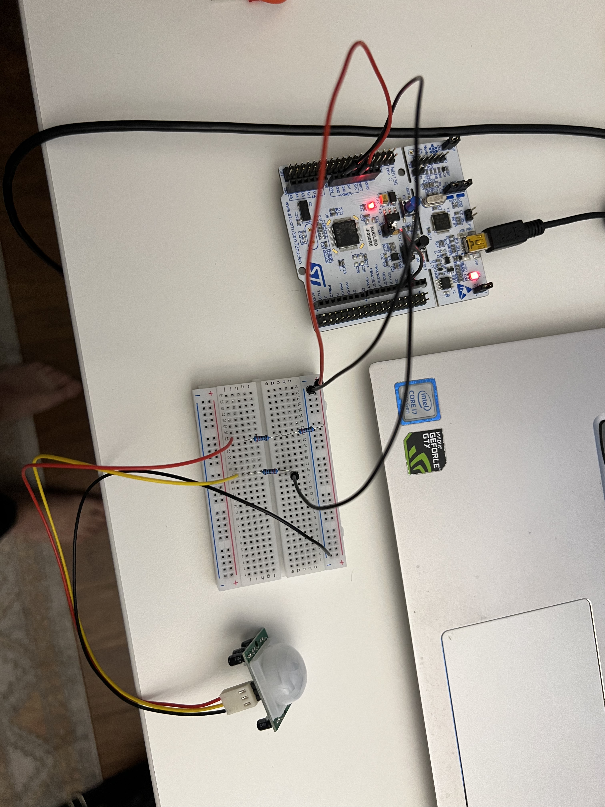
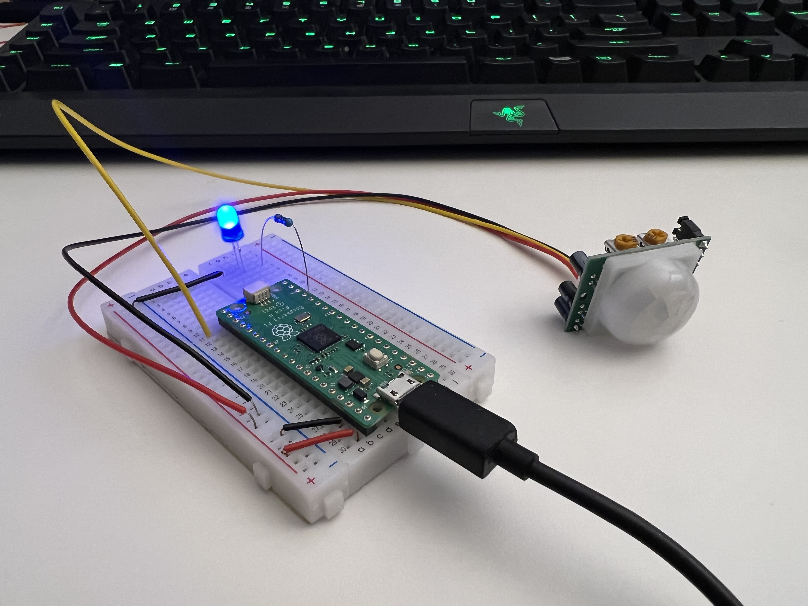
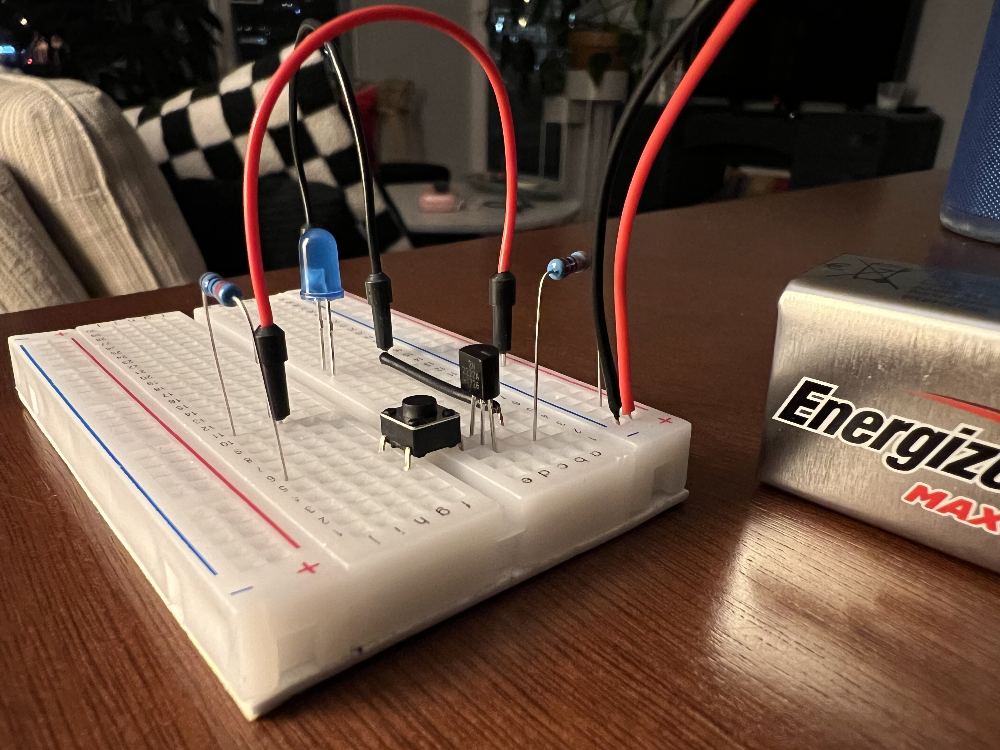

# Year: 2023

---
### Table of Contents
[January](#112023)  
[February](#212023)  
[March](#312023)  
[April](#472023)  
[May](#522023)  
[June](#612023)  
[July](#732023)  
[August](#812023)  
[September](#932023)  
[October](#1062023)  

### Resources
[C++ Initialization](https://stackoverflow.com/questions/18222926/what-are-the-advantages-of-list-initialization-using-curly-braces) *1/5/2023*  
[What is a Semiconductor?](https://www.techtarget.com/whatis/definition/semiconductor) *1/14/2023*  
[Static Variables in C](https://www.geeksforgeeks.org/static-variables-in-c/) *1/15/2023*  
[Memory Layout of C Programs](https://www.geeksforgeeks.org/memory-layout-of-c-program/) *1/15/2023*  
[What is constinit in C++](stackoverflow.com/questions/57845131/what-is-constinit-in-c20) *1/18/2023*  
[Understanding constexpr in C++](geeksforgeeks.org/understanding-constexper-specifier-in-cpp/) *1/18/2023*  
[Lecture on constexpr](youtube.com/watch?v=fZjYCQ8dzTc&t=6s) *1/19/2023*  
[C++ Graph Implementation](https://www.techiedelight.com/graph-implementation-c-without-using-stl/) *1/21/2023*  
[More on Graphs](https://www.geeksforgeeks.org/introduction-to-graphs-data-structure-and-algorithm-tutorials/?ref=lbp) *1/22/2023*  
[What is a Git SSH Key?](https://www.atlassian.com/git/tutorials/git-ssh) *1/22/2023*  
[GitHub SSH Key Fingerprints](https://docs.github.com/en/authentication/keeping-your-account-and-data-secure/githubs-ssh-key-fingerprints) *1/22/2023*  
[Character Strings in C](https://www.cs.uic.edu/~jbell/CourseNotes/C_Programming/CharacterStrings.html) *1/25/2023*  
[adafruit PIR Motion Sensor](https://learn.adafruit.com/pir-passive-infrared-proximity-motion-sensor/testing-a-pir) *1/25/2023*  
[Learn DSA](https://www.geeksforgeeks.org/learn-data-structures-and-algorithms-dsa-tutorial/?ref=shm) *1/27/2023*  
[Time Complexity Examples](https://stackoverflow.com/questions/1592649/examples-of-algorithms-which-has-o1-on-log-n-and-olog-n-complexities) *1/27/2023*  
[Circular Linked List Split](https://www.geeksforgeeks.org/split-a-circular-linked-list-into-two-halves/) *1/29/2023*  
[Sort a Matrix Problem](https://www.geeksforgeeks.org/sort-given-matrix/) *1/31/2023*  
[The Evolution of CPU Processing Power](https://www.youtube.com/watch?v=sK-49uz3lGg) *2/6/2023*  
[Programming a Raspberry Pi Pico with C or C++](https://www.youtube.com/watch?v=NCaL6tXAF0c) *2/6/2023*  
[Tips for Embedded Study](https://www.reddit.com/r/embedded/comments/w5pwab/comment/ihar2eb/) *2/10/2023*  
[Compute the Integer Absolute Value Without Branching](https://www.geeksforgeeks.org/compute-the-integer-absolute-value-abs-without-branching/) *2/14/2023*  
[Bit Twiddling Hacks](https://graphics.stanford.edu/~seander/bithacks.html#IntegerAbs) *2/14/2023*  
[madewithwebassembly.com](https://www.madewithwebassembly.com) *2/19/2023*  
[UART Protocol Explanation](https://www.analog.com/en/analog-dialogue/articles/uart-a-hardware-communication-protocol.html) *3/1/2023*  
[Magnetic Core Memory](https://youtu.be/FZjDBJUutRE) *3/6/2023*  
[How Transistors Work](https://www.build-electronic-circuits.com/how-transistors-work/) *3/6/2023*  
[7 Best Artificial Intelligence (AI) Courses for 2023](https://www.learndatasci.com/best-artificial-intelligence-ai-courses/) *4/10/2023*  
[Minimax With Alpha Beta Pruning](https://youtu.be/zp3VMe0Jpf8) *4/16/2023*  
[Alpha Beta Pruning / Cuts](https://youtu.be/TBsv34iNo1s) *4/16/2023*  
[Project CETI](https://youtu.be/hph9OeKjg3w) *4/25/2023*  
[ChatGPT Release Article](https://openai.com/blog/chatgpt) *5/2/2023*  
[Tree of Thoughts Academic Paper](https://arxiv.org/pdf/2305.10601.pdf) *5/20/2023*  
[Multi-Dimensional Data (as used in Tensors) - Computerphile](https://www.youtube.com/watch?v=DfK83xEtJ_k)  *6/4/2023*  
[Tensors for Neural Networks, Clearly Explained!!!](https://www.youtube.com/watch?v=L35fFDpwIM4) *6/4/2023*  
[How to implement KNN from scratch with Python](https://youtu.be/rTEtEy5o3X0) *7/8/2023*  
[IBM: What Is Gradient Descent?](https://www.ibm.com/topics/gradient-descent) *7/19/2023*  
[An Introduction to Linear Regression Analysis](https://youtu.be/zPG4NjIkCjc?si=STzAZJvU42kJxl-m) *7/19/2023*  
[How to Calculate Linear Regression Using Least Square method](https://youtu.be/JvS2triCgOY?si=LLgDrZSi5hAc5TXQ) *7/19/2023*  
[Gradient Descent Algorithm — A Deep Dive](https://towardsdatascience.com/gradient-descent-algorithm-a-deep-dive-cf04e8115f21) *7/19/2023*  
[Google Colab - 10 Tips](http://towardsdatascience.com/10-tips-for-a-better-google-colab-experience-33f8fe721b82)  *8/27/2023*  


### Programs
[adjacency_list1.cpp](files/graph_practice/adjacency_list1.cpp) *1/22/2023*  
[adjacency_matrix1.cpp](files/graph_practice/adjacency_matrix1.cpp) *1/22/2023*  
[circular linked list](files/circular/main.cpp) *1/28/2023*  
[Sort A Matrix](files/matrix/main.cpp) *2/1/2023*  
[Stack](files/stack/main.cpp) *2/2/2023*  
[func_ptr.c](files/func_ptr/func_ptr.c) *2/9/2023*  
[mergeSort1000](files/merge_sort/merge_sort/main.cpp) *2/11/2023*  
[sfmlPractice0](files/sfmlPractice0/main.cpp) *2/20/2023*  
[sfmlPractice1](files/sfmlPractice1/main.cpp) *2/22/2023*  

---
### 1/1/2023
#### Code - *Book*
Read more of chapter 17, “Automation”. I’m learning about how an array of “instructions” such as Load, Add, Store, and Halt can be applied to a data array in order to perform arithmetical operations. I can see where this is going: the book is barely scratching the surface of assembly code and showing how it interacts with data.

#### Linux Pocket Guide
Learned how to examine the permissions of a given file or directory: `ls -l myfile` the resulting line will look something like this `-rwxrwxrwx username username timestamp` the 10-char string at the beginning tells what type of list element it is with the first char and then the remaining nine chars show what permissions three different groups have. In the example above, all groups can read, write, and execute.

### 1/2/2023
#### Mastering Data Structures and Algorithms
I can see that this course would be very instructive, and I foresee that I will use it in the future, but I think it might be the wrong choice for the nonce. I realized I’d like to explore C++ more deeply before taking a course solely dedicated to data structures and algos.

#### C++20 Masterclass - *Udemy*
I’m excited about this course. I hope I can complete it in about 3.5 months, but we’ll see! I watched sections 1 through 4. The instructor advised us to watch the environment setup videos for every OS, even if we weren’t using a particular one. This way, we could learn how it is done on each. Ultimately, I got VSCode set up on my Linux machine. We used the terminal to check whether GCC and Clang were installed, then we installed them if they weren’t already installed, then we edited the tasks.json file in our project folder to allow us to easily build with either compiler, and finally we told VSCode to use the C++20 standard in a file called c_cpp_properties.json, which was created after accessing the command palette and entering C/C++:Edit Configurations (UI).

### 1/3/2023
#### Code - *Book*
Currently reading the section of Chapter 17 on making the adding machine more flexible. Now, we include 2 bytes with every instruction opcode to tell the CPU where to perform the instruction. This is more flexible than using two contiguous arrays (instruction array and data array) that must be always synchronized, instruction memory address to data memory address. I find all this very fascinating and I'm eager to make it all more intuitive as I continue studying!

#### C++20 Masterclass
Finished watching sections five and six. I'm glad I did because they helped solidify the VSCode setup process. I like the idea of having a template project folder that I can simply `cp template_project` and `mv template_project project_name`. I am eager to get fully underway with this course, but I'm trying to make sure I don't overwork myself. Slow and steady wins the race, and I'm racing myself.

#### Bare Metal C
I went through the earlier part of Chapter 3 and refreshed myself; key terms are HAL (Hardware Abstraction Layer) and GPIO (General Purpose Input Output). Since I had already written the demo program last time, I simply reviewed it to make sure I understood every part of it. I’m pleased that this book goes so in depth on the build process, compiling and linking. It’s possible that I will breeze through some parts of this book since it is geared toward beginner C programmers, but I know there will be many new concepts scattered throughout.

### 1/4/2023
#### C++20 Masterclass
I worked through all the videos in Section 8. Much of it was review for me, but I still sensed the value in it. Also, it helped to increase playback speed where I already completely understood what was being taught. My biggest takeway was the difference between Core Features, Standard Library and STL (Standard Template Library). The instructor did not go in depth, but I know these categorical distinctions will be useful later on. The demonstration of the `getline()` function was also useful. This is how we used it:  

```
std::string name;
getline(std::cin, name);
```

### 1/5/2022
#### C++20 Masterclass
Watched and worked through section 9 videos 39 and 40. Nearly all of this material is review, but once again, I just increase playback speed and skim through them. Occasionally, some simple new concepts have emerged, which is the main reason I don't want to skip anything.  

Yes! Video 41 presented some new material and it all checks out with stackoverflow. The main takeaway from this video was three types of initialization: braced, functional, and assignment. Braced initialization is the preferred method since it does not allow the data to be altered or truncated if the variable is mishandled. [This post](https://stackoverflow.com/questions/18222926/what-are-the-advantages-of-list-initialization-using-curly-braces) on stackoverflow.com explains the concept further - they call it list initialization.  
I also watched video 42 and it was also helpful. This is going to be a great course.

### 1/8/2022
#### Thoughts
I'm chipping away at this C++ course and really enjoying it! However, I've been feeling discouraged since I'm not working on any projects and I've been unsure of what I should be working on. Today I decided to do some research and find out what interests me. First, I looked at Socket Programming, but I think I found that it is merely a component of the larger topic of web programming, a field that I've thought about exploring more. The trouble is that web programming doesn't seem to excite me very much (of course that could change as my experience grows).  

After more browsing, I found the topic that sparked immediate interest IoT (Internet of Things). It includes all the things I think I like: embedded systems, working with C/C++, low-level programming, understanding how data is transmitted over networks via protocols, etc. I might look back at this and chuckle at my obvious inexperience. Anyhow, I need to find what I'm interested in and lean that direction. I need to not set up artificial barriers for myself!

#### C++20 Masterclass
I completed the video 43, fractional numbers. Then, I wrote a practice program, implementing a pythagorean theorem function using some of the principles (braced initialization, setprecision, default arguments) I've learned.  
Video 44, on boolean values, gave me the idea to store multiple boolean values in 1 byte. I wrote a program to do just that.  

I finished the rest of Section 8. I found the auto keyword the most significant: it allows us to use C++ in a more-or-less dynamically-typed fashion. I have yet to see where this keyword is most useful, but I'm sure I will in the coming lectures.    

#### Bare Metal C
I finished chapter 4. The main takeaways were from exploring the files created by the IDE at the creation of the project and from using GDB, the debugger. This chapter helped me appreciate just how much goes on under the hood, all the preliminary steps and initializations that must occur just so I can write my tiny LED-blinking program. HAL\_init() caught my attention the most since it has a catalog of hardware architectures from which it initializes the hardware with the appropriate data. If you can’t tell, I don’t fully understand it yet!

### 1/9/2023
#### Research
I'm exploring potential specializations in technology, and IoT and TinyML currently stand out the most. At the moment, I can't decide between the two!  

I went on LinkedIn to add my certificate from the C Programming Udemy class, create a profile summary that explains what my current job is and how I'm preparing for the future by studying Computer Science, and update my CS50x certification with the verified certificate, which I received a few days ago!

#### C++20 Masterclass
Completed lectures 49 through 51. This stuff was pretty basic! At the end of the lecture on Precedence and Associativity, the instructor explained that a programmer should not rely on the precedence table too much. That is to say, put parentheses in your expressions to make your intentions explicit. This will increase readability and decrease the potential of mishandling data.

#### Bare Metal C
Began working in chapter 4. The first part of the chapter is mainly about data types, so it is just review. Later in the chapter, I see that we’ll be getting to some content that should fill in some knowledge gaps for me.

### 1/10/2023
#### C++20 Masterclass
Sections 52 - 55. Topics covered: Increment Operators, postfix and prefix; Compound Assignment Operators (+=, -=, \*=, /=, %=); Relational Operators (<, >, <=, >=, ==, !=); Logical Operators (&&, ||, !). Once again, this is pretty much all review. I’m glad to go over it, but I’d really like to get into the new stuff more.

### 1/11/2023
#### C++20 Masterclass
Sections 56 - . Video 56 was quite long, but very useful. It covered output formatting with demonstrations of several functions and manipulators that can be applied to std::cout to alter how the data is displayed in the console.

57 was on the numeric\_limits class, which is found in the <limits> library. Once again, I found this very useful: it allows us to print out the range of storable values for a given data type. For instance, using `std::numeric_limits\<unsigned int\>::min()` and `std::numeric_limits<unsigned int>::max()`, we are able to see that the unsigned int data type indeed goes from 0 to over 4 billion.

The weird integral types lecture explained that the int data type is the smallest type with which we can perform arithmetical operations. This is due to the design of the processor. If we take two chars or two shorts and add them, the result will be automatically cast as an int; in order to do this, the compiler has to convert each variable to int beforehand.

With that, I've completed section 9! That's all for today with this course. 

#### Bare Metal C
I read a little more of chapter 4, and it was mostly review again. This is becoming a bit of a trend with my classes. Perhaps I need to be less of a completionist and know when to skim. I’m fine with being a completionist with the C++20 Masterclass, but with this book, I ought to start skimming ahead to content that is new.

The section Standard Integers in chapter 4 was actually very enlightening. The C standard only defines the integral types relative to each other (short is smaller than int is smaller than long). However, on some system, int is 2 bytes, and on others, it's 4 bytes (more common). To deal with this unpredictability, fixed-width data types were added with the stdint.h library (int32\_t). These guarantee a specific width (conditional compilation). However, we can still run into something called argument promotion, which is where a data type like int8\_t is promoted to int32\_t to accomodate a value which cannot be stored in the smaller width. In embedded programming, we don't want data types being manipulated under the hood. We want total control of their width, so that our program runs exactly as intended. Thus, it's better that the value overflow than get promoted.

### 1/12/2023
#### Bare Metal C
I definitely spoke too soon with yesterdays first entry for this book. I'm learning some awesome things now. Chapter 4, starting from Shorthand Operators, started to challenge me: it seems to explain that increment and decrement operators should only be used on their own lines of code, not like this `while (arr[++i]);`. This seems to be perfectly legal C; I'll have to investigate further. Then, we got into Memory-Mapped I/O Registers Using Bit Operations. Here the book introduced us to bitwise operators. I copied down the program on pages 73-74, and It found it probably the most elucidating part of the chapter. Finally, I answered all the questions at the end of the chapter. For question 2b, I found that I needed to clear any values that might be present in the parity bits before reassigning them to a different value:  

```
// clear Parity  
ledRegister &= ~Parity; // Parity is 0b00001100  
// set Parity to 2  
ledRegister |= 0b00001000;  
```

### 1/13/2023
#### C++20 Masterclass
Lecture 62 on Literals. I thought I knew exactly what literals were beforehand, but this lecture gave a more nuanced understanding: at the moment, I would describe a literal as any value that is stored in the program binaries after compilation. In other words, if I have a program that takes input from the user,  

```
int not_a_literal;
std::cout << "Enter an integer: ";
std::cin >> not_a_literal;

std::cout << "You entered " << not_a_literal << std::endl;
```

then I could use a non-literal (not\_a\_literal). This, `int literal;`, must be a literal. QUESTION: if a variable is uninitialized, does that make it a non-literal? I think the answer is yes.

[EDIT from 1/28/2023] My understanding here is incorrect. A literal is in fact simply the value used to initialize a variable.

### 1/14/2023
#### Bare Metal C
Today was a light day, but I did manage to get a little study in. I read quickly through the first 6 pages of chapter 5 since it was entirely review. It was all about loop and conditional statements. I stopped just before the section entitled "Using the Button"; I'm fairly certain this section will provide me with new material to digest.

#### Miscellaneous
I realized I don't have a full understanding of the semiconductor, which is a key component of the modern computer (if not THE key component). I pulled up a tab, [What is a Semiconductor](https://www.techtarget.com/whatis/definition/semiconductor), and did a cursory read through. I fully intend to revisit this topic soon.

### 1/15/2023
#### Bare Metal C
Completed chapter five today, though I've yet to solve all the problems at the end. Here are the main takeaways from Chapter Five starting from the section entitled "Using the Button":

- We were shown three types of input circuitry: pullup, pulldown, and floating. These all have to do with how current is directed before closing the circuit and how it is redirected after closing it.
- When analyzing the code in "The Break Statement" section, I noticed the static keyword and I wanted to refresh myself on its purpose. I found an [article](https://www.geeksforgeeks.org/static-variables-in-c/) on GeeksForGeeks that explains static allocation very well. From there I found another [article](https://www.geeksforgeeks.org/static-variables-in-c/) on the memory layout of C programs. I found the following image very helpful:


BSS, the block of memory where static variables are stored, stands for "Block Starting Symbol". The static keyword causes a variable to be stored in the .bss segment of memory; furthermore, it can be used to make a variable global even if it is declared within some local scope.

### 1/16/2023
#### Bare Metal C
It took me far too long to solve chapter 5 problem 1; it's because I was trying to minimize the number of variables and use only two for loops, printing the product of their iterator variables. I completed the program, but I needed to use one initial for loop to set the column headers (X  0  1  2  3  ...).

I solved problem 2 much quicker and had a lot more fun! I enjoy anything that involves bitwise operations; it feels sneaky. For this problem, I had to write a program that could count the number of bits set to 1 in a 32-bit unsigned integer. I did it by running a for loop 32 times while ANDing the number against a 32-bit test value (0x80000000), only the most significant bit set to 1. If the result of the AND is equal to the test value itself, then a count variable is incremented. This is how I counted the number of bits.

I solved problem 3 this evening. I'm proud of my solution: I was able to make my program more user-friendly by using familiar musical jargon. All the user has to do is specify the TimeSignature and Tempo and then populate the uint8\_t array with the beats on which they want the light to flash.

### 1/17/2023
#### Bare Metal C
Solved problem 4, which asked me to write a program that blinks out "HELLO WORLD" in Morse Code on the Nucleo board LED. Once again, I took it a step further and gave the user the ability to easily change the message as they like. I did this by implementing a Morse Code alphabet matrix and a simple hash function. The user simply types their message into a string literal using only uppercase alpha chars and spaces. The program then interprets this at Morse Code.

Problem 5 tasked me with writing a program that computes the first 10 primes. I wrote a program that computes primes up to an upper bound of 0xFFFF (the maximum value as can be stored in uint16\_t). To reduce time complexity, I used an array that remembers the prime numbers we've already computed and uses only the necessary amount of them to compute the next prime in the sequence. Unfortunately, the space complexity had to increase for the time complexity to decrease; there may yet be a further way to optimize this code, but I'll leave it here for now.

### 1/18/2023
#### Bare Metal C
Solved problems 6 and 7. These were very easy, so I spent most of my time making them as clean looking as possible. Problem 7 asked me to write a program that prints only the vowels from a string. I'm pleased to say that after working with ASCII codes so much now, I was able to recall the codes for the vowels, both upper and lowercase, from memory.

#### C++20 Masterclass
Completed lectures 63 through 66. They were all about "const", "constexpr", and "constinit". I understand const very well at this point: it allows the programmer to make it very clear that the variable should not be altered - in fact, it can't be since the compiler will throw an error if it is altered. CONST makes a variable read-only. CONSTEXPR allows us to specify that a computation should occur at compile time instead of runtime (I still need to better my understanding). CONSTINIT "...ensures that the variable is initialized at compile-time, and that the *static initialization order fiasco* cannot take place ([source](stackoverflow.com/questions/57845131/what-is-constinit-in-c20)). Also, I found an [article](geeksforgeeks.org/understanding-constexper-specifier-in-cpp/) on geeksforgeeks.org that helps clarify what "constexpr" does and how it is different from "const".

#### Linux
I wrote a bash script that streamlines the process of updating the driver for the wifi dongle connected to my desktop. Here's the script:

```
\#!/bin/bash
\# A script that streamlines updating the cudy wifi dongle

cd /home/seandavidreed/cudy_driver/rtl88x2bu_linux

sudo make

sudo make install

sudo modprobe -r 88x2bu

sudo modprobe 88x2bu
```

### 1/19/2022
#### Linux
I wrote another bash script; this one is very simple:

```
\#!/bin/bash

cd /home/seandavidreed/my\_programs/studentlog4.0

./studentlog
```
It’s just an easier way to launch my studentlog console application. Now I just open a console and type in studentlog.

#### C++
[Lecture on constexpr](youtube.com/watch?v=fZjYCQ8dzTc&t=6s)

I watched this video on the constexpr keyword, and it was very helpful! Here’s the notes:

- Why is constexpr interesting?
    - No runtime cost, no need execution time, minimal executable footprint, errors found at compile time, no synchronization concerns.

```
constexpr int const\_3;
// is interchangeable with
static const int const\_3;
// but constexpr works with float, for example
// while static const does not.
```

The video had some examples that were beyond my ken, so I skimmed the latter half of it.


### 1/20/2023
#### C++20 Masterclass
I completed lectures 67-69. They were on implicit and explicit data conversions, implicit conversions as with:

```
int sum {};
double x {4.56};
double y {5.67};
sum = x + y; // the value will be truncated and stored in sum as 10
```

and explicit conversions as with:

```
int sum {};
double x {4.56};
double y {5.67};
sum = static_cast<int>(x + y); // same result as before, but explicitly so
```

#### C++ Practice
I decided to give myself some meaningful programs to write in C++ so I can apply what I'm learning. I've been reading up on the graph data structure, and I found a great resource: [this website](https://www.techiedelight.com/graph-implementation-c-without-using-stl/) gave a great demonstration of a graph class in C++. I pretty much copied the code exactly line-by-line, and it improved my understanding. I'll have to keep wrestling with this concept.

### 1/21/2023
#### Researching the Graph Data Structure
I didn't get much of a chance today to write code, but I did read up on the graph data structure more. I had to stop myself from feeling discouraged: I was feeling the strain of learning a new concept, and I was tempted to criticize myself for feeling that way. I had to remind myself that learning is always hard, and that I was probably feeling tired from working my regular job.

### 1/22/2023
#### Graph Data Structure in C++: [adjacency_list1.cpp](/files/graph_practice/adjacency_list1.cpp)
I did it! I implemented my own graph class in C++! The example I found on techiedelight was indispensible, but when I implemented my own, I tried to do so by thinking through the logic and syntax myself. Moreover, I wrote the constructor such that the user initializes the graph at runtime. After reading on [geeksforgeeks](https://www.geeksforgeeks.org/introduction-to-graphs-data-structure-and-algorithm-tutorials/?ref=lbp), I was able to understand the graph data structure much better. Also, my mind is much sharper today.

I decided to start including practice programs in this daily log repo. That way I can keep a much clearer record of my progress. Hence, I've added the link to the header of this entry.

#### GIT
It's settled. I need to become more proficient with git, and that probably entails taking a short class, or watching in-depth tutorial videos. Let me try to outline the problem I faced today:  
1. Need to clone this repository (programming_log) onto my desktop computer, but I keep getting this error: `Support for password authentication was removed on August 13, 2021`.
2. Try using GCM (git-credential-manager), which I believe I used successfully on my laptop. For some reason, I can't get it working. Even though GCM is configured, running git clone on HTTPS still throws the original error, like gcm is failing to run. Because I'm too fed up to troubleshoot further, I look for other options.
3. Try using SSH (Secure Shell Protocol). Following this tutorial, [What is a Git SSH Key?](https://www.atlassian.com/git/tutorials/git-ssh), I'm able to create a key-pair on my local machine stored in .ssh in my user directory. The final command, `ssh-add -K /Users/you/.ssh/id_rsa`, results in a request for an authenticator pin, which I don't have set up with GitHub, so I ask stackoverflow for help. Turns out I just need to omit `-K` from the command.
4. Go to profile, settings, and SSH and GPG Keys. I add new SSH key, but try as I might, I can't seem to get the correct format for the key even though I'm copy-pasting it from .ssh `Key is invalid. You must supply a key in openssh public key format`. Turns out I'm using the private key, and I need to use the public key (.pub). After troubleshooting further formatting errors, I succeed.
5. Create new directory, initialize it as a local repo, and run `git remote add programming_log git@github.com:seandavidreed/programming_log.git`. I get this warning: `The authenticity of host 'github.com (192.30.252.128)' can't be established`. With further digging, I arrive at [GitHub Docs](https://docs.github.com/en/authentication/keeping-your-account-and-data-secure/githubs-ssh-key-fingerprints) from which I learn I can add GitHub public key fingerprints to a file I have to create (known_hosts) in `~/home/seandavidreed/.ssh`. This resolved the warning.
6. Run `git fetch`, which works, and then `git merge`, which doesn't. I get `fatal: no remote for the current branch`. I find out that since I just initialized this local repo, it doesn't have a real branch, `fatal: You are on a branch yet to be born`, and it won't until I commit something. I realize I'm doing this all wrong.
7. Realize that I don't need to create and initialize a local repo; I can just run `git clone git@github.com:seandavidreed/programming_log.git`, which is the clone command with SSH. It works and I now have the remote repo on my desktop, from which I am updating this programming_log.

Oh the suffering. Oh the naivete.

#### Graph Data Structure Again! [adjacency_matrix1.cpp](/files/graph_practice/adjacency_matrix1.cpp)
I decided to try my hand at the adjacency matrix representation of a graph. I can see why the adjacency list is more popular. While the matrix is conceptually easier to understand and implement, the list has a significantly reduced space complexity. I could feel the weight of all the space being used as I wrote the program! I suspect I could optimize that space complexity when I refactor.

### 1/23/2023
#### Research
I didn't get to do my usual study today, but I did create a new Reddit account with the aim of joining several programming subs, where I can hopefully learn more about building my own projects from the community.

I also created an account with OpenAI playground so I could use chatGPT. I was able to test it out, submitting queries such as "write a graph data structure in C++" and a question related to the beauty industry (that Rachel formulated) that only a professional would know. The AI answered both queries expertly. Even though I know that chatGPT is really only recycling and rehashing content created by humans and shared on the internet, the fact that it does it so well makes me worry for the future of disciplines like programming. I Know my fears are somewhat irrational, but I can't help it!

### 1/24/2023
#### Bare Metal C
I read through Chapter six entirely this afternoon. It was on Arrays, Pointers, and Strings, all things I'm well familiar with. Nonetheless, I did have a few takeaways:

1. "The size of the pointer depends on the processor type, not the type of data being pointed to. On our STM32 processor, we have 32-bit addresses, so the pointer will be a 32-bit value.
2. When initializing a pointer, we specify the data type to which it points (uint32\_t *ptr). This does not do anything to the size of the pointer itself, but rather it indicates how the pointer is to be incremented in the case of pointer arithmetic, i.e. (ptr + 1) will move the pointer over by four bytes since a uint32\_t is four bytes in size. It will go from 0xFFE0 to 0xFFE4, for example.

I solved programming problems 1 through 3. Number 3 proved to be a most interesting challenge: "Write a program to scan an array for duplicate numbers that may occur anywhere in the array." The first solution that came to mind was brute-force, touching every element and testing it against every other element for a time complexity of O(n^2). For any sufficiently large array, this method is absurd. I thought of other solutions as well, but ultimately I realized that the best thing to do would be to sort the array beforehand. Naturally, I turned to merge sort. Loosely referencing an old implementation of mine, I wrote another mergesort algo, and in the process, I found that with a few tweaks the mergesort algorithm itself could count the number of duplicates while sorting the array. Here's what I wrote:

```
/*
 * duplicates2.c
 *
 *  Created on: Jan 24, 2023
 *      Author: seandavidreed
 */

#include <stdio.h>
#include <stdlib.h>
#include <stdint.h>
#include <math.h>
#include <time.h>

#define TYPE uint16_t
// ARRAY_SIZE cannot be a value larger than can be held
// by the fixed-width data type above
#define ARRAY_SIZE 1000


void initRandomArray(int *arr, int size) {
	srand(time(NULL));
	for (TYPE i = 0; i < size; ++i) {
		arr[i] = rand() % (int)pow(2.0, sizeof(TYPE) * 8.0);
	}
}

void mergeSort(int *arr, int *temp, int i, int j, int *count) {
	// base case
	if (i >= j) return;

	// recursive case
	int mid = (i + j) / 2;
	mergeSort(arr, temp, i, mid, count);
	mergeSort(arr, temp, mid + 1, j, count);

	int lptr = i;
	int rptr = mid + 1;
	int k;

	for (k = i; k <= j; ++k) {
		if (lptr == mid + 1) temp[k] = arr[rptr++];
		else if (rptr == j + 1) temp[k] = arr[lptr++];
		else if (arr[lptr] == arr[rptr]) {
			temp[k] = arr[lptr++];
			(*count)++;
		}
		else if (arr[lptr] < arr[rptr]) temp[k] = arr[lptr++];
		else temp[k] = arr[rptr++];
	}

	for (k = i; k <= j; ++k) {
		arr[k] = temp[k];
	}
}

void printArray(int *arr, int size) {
	for (TYPE i = 0; i < size; ++i) {
		printf("%d ", arr[i]);
	}
	printf("\n");
}

int main() {
	int array[ARRAY_SIZE], temp[ARRAY_SIZE];
	int count = 0;

	initRandomArray(array, ARRAY_SIZE);
	printArray(array, ARRAY_SIZE);

	mergeSort(array, temp, 0, ARRAY_SIZE - 1, &count);
	printArray(array, ARRAY_SIZE);

	printf("Number of Duplicates: %d\n", count);

	return 0;
}
```

### 1/25/2023
#### Bare Metal C
Finished the last two problems in chapter 6, numbers 4 and 5. They were pretty easy. However, I ran into a snag on problem 5; I was trying to pass a char pointer as an argument to my `void capitalize(char *str)` function, which capitalizes the first character of every word beginning with a letter. The problem is when a string is declared like this `char *str = "This is a string.";`, the string is not mutable. I needed to instead declare it like so, `char str[] = "This is a string.";`. Though I've looked into this topic many times, I still find the terminology somewhat abstruse. However, the concept is intact. Here's a resource on the subject: [Character Strings in C](https://www.cs.uic.edu/~jbell/CourseNotes/C_Programming/CharacterStrings.html).

#### Hardware
Woohoo! I successfully test my PIR motion sensor from adafruit. It’s a small feat, but I’m proud of it nonetheless. Here’s a picture: [picture](/images/PIR_sensor.jpeg). I sorted out the configuration by consulting this [documentation](https://learn.adafruit.com/pir-passive-infrared-proximity-motion-sensor/testing-a-pir)

#### C++20 Masterclass
Made my cpp20-masterclass projects folder into a git repository. Now I can work on these projects on my Linux desktop as well! I had to make some adjustments in the .json files, but it was relatively simple. I noticed that if I don’t have the C/C++ Microsoft extension installed, then VSCode won’t recognize the the key-value `“type”: “cppbuild”` in tasks.json.

### 1/26/2023
#### C++20 Masterclass
Completed 72 - 74. All on bitwise operators. The demonstration of data loss via shifting bits left or right was most helpful.

### 1/27/2023
#### C++20 Masterclass
Completed 75 and 76. It was mostly review, but I appreciated the way the information was presented. We were able to clearly demonstrate the behavior of the bitwise logical operators.

#### Data Structures and Algorithms
I need to study DSA alongside my C++ study; that way I have practice problems to tackle with the language. I'm consulting an [article](https://www.geeksforgeeks.org/learn-data-structures-and-algorithms-dsa-tutorial/?ref=shm) on geeksforgeeks to get a better understanding of DSA. After the overview of Data Structures and Algos, we get into time and space complexity. I decided to plot each complexity function on a graph on [desmos](https://www.desmos.com/). Below is the image I created:


In order from worst to best: O(n!), O(2^n), O(n^2), O(nlogn), O(n), O(logn), O(1).

I also consulted a [list of examples](https://stackoverflow.com/questions/1592649/examples-of-algorithms-which-has-o1-on-log-n-and-olog-n-complexities) for each complexity on stackoverflow.

I tried in vain today to create a circular linked list. I had the right ideas in mind, but my brain was simply too foggy and weary to deliver. Oh well. I'll try again tomorrow.

### 1/28/2023


#### Data Structures in C++ [Circular Linked List](files/circular/main.cpp)
I successfully implemented the circular linked list! It was actually rather a challenge to wrap my head around it, but in the end I was able to reason it out. I intend to keep studying various data structures and algorithms using C++ and roughly following the image above. I'm reacquainting myself with all things linked lists, and then I'll move on the the matrix and see if there's anything I'm missing there. Moreover, I'd like to see some real life applications for these data structures. For instance, I want to see a tangible use of the circular linked list. Perhaps tomorrow I will search for one.

### 1/29/2023
#### Data Structures in C++ [Circular Linked List](files/circular/main.cpp)
After yesterday's successful implementation of the circular linked list, I went on geeksforgeeks and browsed the practice problems. I found [this problem](https://www.geeksforgeeks.org/split-a-circular-linked-list-into-two-halves/), which enjoined me to write a funtion that splits a circular linked list into two circular linked lists. The problem is listed as medium difficulty, but I made it even harder on myself: I could have written a function that merely copies each half of the linked lists into two new linked lists, but I didn't want to increase time and space complexity that much. I wanted to find a way to manipulate the pointers in the existing linked list and create two lists by simply redirecting the node pointers diametrically-opposed to the head pointer, one to the head itself, and the other to become a new head that then points back to head->previous. Observe the graphic:


Moreover, I wanted to create this split function, which I called `void mitosis(CircleLink& newList)`, as a method inside the CircleLink class. It all works! I had to suffer to get it to work, and I found that my main problem was in reassigning the pointers; I had a hard time keeping it straight which one was pointing where as I redirected them until I created more pointers to hold onto important addresses. Therefore, I succeeded in my initial design, but it may not be worth the amount of extra space I needed for each pointer. I'll be happy with it for now.

### 1/31/2023
#### Data Structures in C++
[Deletion in a Circular Linked List](https://www.geeksforgeeks.org/deletion-circular-linked-list/)

Yesterday after a busy day outside, I wrote a delete node function, and it wasn't working. For the life of me I couldn't figure it out: I thought it was another issue with reassigning the pointer addresses, but this morning I opened up the code and the error stared me in the face:

```
void deleteNode(unsigned value) {
        Node *ptr = head;
        for (int i = 0; i < numNodes; ++i) {
            if (ptr->value = value) {
                ptr->previous->next = ptr->next;
                ptr->next->previous = ptr->previous;
                delete ptr;
                --numNodes;
                return;
            }

            ptr = ptr->next;
        }
    }
```

I clumsily used an assignment operator instead of an equality operator in the if condition. That was all that was wrong!

[Sort a Matrix Problem](https://www.geeksforgeeks.org/sort-given-matrix/)

I started working on a C++ program to sort a matrix, and I found myself perplexed at some of the differences between pointers and arrays. I've learned this stuff before, but it's likely there's a finer-grain understanding I've yet to achieve; I read [this article](https://www.oreilly.com/library/view/understanding-and-using/9781449344535/ch04.html), which helped to clarify some of the distinctions between them. The following is a quote from the article:

>A common misconception is that an array and a pointer are completely interchangeable. An array name is not a pointer. Although an array name can be treated as a pointer at times, and array notation can be used with pointers, they are distinct and cannot always be used in place of each other. Understanding this difference will help you avoid incorrect use of these notations. For example, although the name of an array used by itself will return the array’s address, we cannot use the name by itself as the target of an assignment.

Reading this article brought to mind an old question I've had, namely "what does it mean that an array 'decays' into a pointer when it is passed to a function?" After searching around on the internet, I got a good grasp of the concept of array decay. The quote above holds the key: a pointer and an array name are not identical. The array name, like the pointer, yields the address of the first element, but it also contains with it the sizeof the whole array, which can be accessed by the `sizeof()` operator. Contrarily, if the `sizeof()` operator is run on a pointer, the size of the pointer will be returned. When an array is passed to a function, a pointer to the address held in the array name is passed instead. This can be circumvented by passing the array by reference. Observe the following examples:

```
// This first example will result in pointer decay 
// since the array is passed by value.
#include <iostream>

unsigned long foo(int arr[]) {
    return sizeof(arr);
}

int main() {
    int arr[10] = {};
    std::cout << sizeof(arr) << std::endl; // prints 40
    std::cout << foo(arr) << std::endl; // prints 8 (on 64-bit machine)
    return 0;
}


// This example won't result in pointer decay
// since the array is passed by reference.
// This can also be accomplished with
// unsigned long foo(int (*arr)[10])
#include <iostream>

unsigned long foo(int (&arr)[10]) {
    return sizeof(arr);
}

int main() {
    int arr[10] = {};
    std::cout << sizeof(arr) << std::endl; // prints 40
    std::cout << foo(arr) << std::endl; // prints 40
    return 0;
}
```

### 2/1/2023
#### Data Structures in C++ [Sort A Matrix](files/matrix/main.cpp)
Today I completed the sort algorithm for a matrix. I implemented Selection Sort, which has time complexities of O(n^2) and $\Omega$(n^2). The initial challenge I faced was how to iterate through the matrix in a way that worked for selection sort; I needed to maintain two sub-arrays inside a matrix. The solution was to treat the matrix as an ordinary one-dimensional array. By including the `printAddresses()` function in my `class Matrix`, I was able to see how the arrays were arranged in memory. The addresses in a given row were of course spaced by 4 bytes, the typical width of an int. However, between one row and another, there was a buffer of 16 bytes. My naive hope that they would somehow be contiguous was dashed, so I decided to iterate through the matrix traditionally, with i and j. However, I made the inner loop like this:

```
while (i < _rows) {
	if (matrix[i][j] < matrix[iSmall][jSmall]) {
		iSmall = i;
		jSmall = j;
		changes = 1;
	}
	++j;
	if (j == _cols) {
		++i;
		j = 0;
	}
}
```
The bit at the end below `++j` allowed me to iterate through each row as if they were contiguous. Conceptualizing the matrix as an ordinary array was the key. 

The first iteration I got working included the swap operations in the inner while loop. This meant that worst-case scenario, the number of swaps performed would be O(n^2). However, when I looked it up, the internet kept saying that there should be at worst O(n) swaps. After a quick look on stackoverflow, I learned that I needed to put the swap operations in the outer while loop below the inner loop. In the inner loop, I then needed to keep track of the indices of the current smallest element, not the element itself.

For fun, I analyzed the difference in runtime between these two implementations:

```
O(n^2) swaps vs O(n) swaps
.0126s          .0115s
```
The matrix I used to get these average figures was rather small, hence the one millisecond difference. If the dataset were much larger, the runtime difference would likely be much more noticeable. I had fun with this problem!

#### C++20 Masterclass
Completed lecture 77 on bitmasks. This is the very same content I've been reviewing in Bare Metal C, which I'd like to get back to soon. I'm eager for the time when I can build confidently with C++.

### 2/2/2023
#### C++20 Masterclass
Completed lectures 78 and 79, which concludes Section 12 on Bitwise Operators. I especially liked the example in 79, where we packed RGB values into one 4-byte unsigned int type. With this method, there is one unused byte, but this is still far more efficient than using 12 bytes (in the case of 3 ints) for values that span 0 to 255.

#### Data Structures in C++ [Stack](files/stack/main.cpp)
Running down the list of Data Structures on geeksforgeeks, I implemented a Stack class in C++. Compared to other data structures, this one is fairly easy to build.

#### STM32cubeIDE
I downloaded this IDE today with the hopes of using it to program the Raspberry Pico and the Nucleo F030r8 development board. I'm really eager to get a true embedded project off the ground!

### 2/3/2023
#### C++20 Masterclass
Completed lectures 81 through 84. There was not much new here, so I watched the videos at increased speed. I didn’t have time for much else today!

### 2/4/2023
#### Bare Metal C
I completed chapter 7, which was all about Local Variables and Procedures. The bits on local variables helped sharpen my understanding of static allocation, which occurs at compile time and is hard-coded into a programs binaries before it even runs. That is much clearer now. Using the GDB debugger in STM32 Workbench, we were able to observe function calls being added to the stack. This was especially interesting in the case of the recursive factorial function: I witnessed the stack grow to the necessary size to initiate the functions base case, and then shrink as each stack frame resolved and was destroyed. Tomorrow, I plan to do the practice problems.

### 2/5/2023
#### Bare Metal C
I Solved practice problem 3 in chapter 7. It was the classic recursive fibonacci function problem. I remember this being difficult to write the first time I tried it early last year, but now it was extremely easy; I just needed to refresh myself on the fibonacci sequence formula.

```
#include <stdio.h>
#include <stdlib.h>

unsigned int fibonacci (unsigned const int n) {
	// Base Case
	if (n == 1) return 0;
	else if (n == 2) return 1;

	// Recursive Case
	return fibonacci(n - 1) + fibonacci(n - 2);
}

int main() {
	printf("%u\n", fibonacci(5));
	return 0;
}
```

#### Exploring the Nucleo Board and STM32 Cube IDE On My Own!
My goal is to connect the PIR (Pyroelectric InfraRed) Motion Sensor I got from Adafruit to my Nucleo F030R8 development board.

1. First, I wanted to check the power pins on the development board to see if I needed to initialize them. I connected test leads to the 3V3 and GND pins and used my multimeter to read the voltage, which indeed was 3.3 volts.
2. Next, I consulted the Bare Metal C book, from which I refreshed myself on LED initialization:

	```
	LED2_GPIO_CLK_ENABLE();
	GPIO_InitTypeDef GPIO_InitStruct;
	GPIO_InitStruct.Pin = LED2_PIN;
	GPIO_InitStruct.Mode = GPIO_MODE_OUTPUT_PP;
	GPIO_InitStruct.Pull = GPIO_PULLUP;
	GPIO_InitStruct.Speed = GPIO_SPEED_FREQ_HIGH;
	HAL_GPIO_Init(LED2_GPIO_PORT, &GPIO_LedInit);
	```

	I placed this code inside the comments:

	```
	/* USER CODE BEGIN Init */
	/* USER CODE END Init */
	```

	found inside the main.c source file.
3. I needed to understand the `LED2_GPIO_CLK_ENABLE();` macro so I could ostensibly apply the same thing to my motion sensor peripheral. I highlighted the statement, and selected "search text" and "workspace". The search did not reveal anything I needed.
4. Explored the `stm32f0xx_hal_gpio.h`  library to find the preprocessor definitions for the GPIO pins. I'm using `GPIO_PIN_2`.
5. Explored the `stm32f0xx_hal_conf.h` library and found an include for `stm32f0xx_hal_rcc.h`. I found that "RCC" stands for Reset Clock Control." I thought maybe I could find out what the correct `CLK_ENABLE()` macro would be for my motion sensor - to no avail. I decided to guess that it would be called `PIN_2_GPIO_CLK_ENABLE();`.
6. When I tried to build the project, I found that

	```
	LED2_GPIO_CLK_ENABLE();
	PIN2_GPIO_CLK_ENABLE();
	LED2_PIN;
	LED2_GPIO_PORT;
	PIN2_GPIO_PORT;
	```
	were all flagged as implicit declarations. This means that there is a library that STM32 System Workbench includes by default and that STM32 Cube IDE does not. My next step is to retry everything back in System Workbench. I really just want to wrap my head around all this!
7. Found the solution! I copied all my code over to System Workbench and right away I noticed a library that was not included over at Cube IDE, `stm32f0xx_nucleo.h`. Opening this library, I found several aliases; for example. `GPIO_PIN_5` is aliased to `LED2_PIN`, and `GPIOA` is aliased to `LED2_GPIO_PORT`. `__HAL_RCC_GPIOA_CLK_ENABLE()` is aliased to `LED2_GPIO_CLK_ENABLE()`. As I looked through the different macros, I came across these ones:

	```
	#define NUCLEO_SPIx_SCK_GPIO_PORT                   GPIOA
	#define NUCLEO_SPIx_SCK_PIN                         GPIO_PIN_5
	#define NUCLEO_SPIx_SCK_GPIO_CLK_ENABLE()         __HAL_RCC_GPIOA_CLK_ENABLE()
	```
	Looking at the development board, I saw that pin 13 was also named `SCK`. I divined that I could connect my PIR Motion Sensor to this pin and use the macros above, and it worked! Here's a picture:

	

### 2/6/2023
#### Computing Technology Series on YouTube
This series is all about the evolution of the CPU from the Intel 4004 onward. I'm taking notes in a separate file for this one since I expect to write a lot, and I don't want to clutter up this log! Here's the [link](documents/computing_technology_series.md).

#### Raspberry Pi Pico
Last week I found a [video](https://www.youtube.com/watch?v=NCaL6tXAF0c) that would show me how to start using the Raspberry Pi Pico with C/C++. Today, I followed along with the video and got everything working nicely. I can tell this microcontroller will be much easier to work with than the Nucleo F030R8. Therefore, I'll use it to learn some more beginner embedded techniques. I still would much like to get good at using the Nucleo board too. Anyhow, this video showed me how to write and run an led-blinking program on the pico. It also covered how to use a core for each led blinking operation; I thought that was pretty fascinating and I'm keen on learning more about it.

### 2/7/2023
#### Raspberry Pi Pico
I decided to set up the C/C++ sdk for the Pico on my desktop computer as well. This time I followed the [official documentation](documents/getting-started-with-pico.pdf). I left off at Chapter 4 - I intend to work my way through the whole document.

#### Bare Metal C
I'm in Chapter 8, which is on Complex Data Types (I can see that this chapter plus the next two will be quite important and will likely present new concepts). I read through the first part of this chapter regarding enums and a neat preprocessor trick that can be done with them. Here it is below for reference (I copied this from the book):

```
#define COLOR_LIST				\
	DEFINE_ITEM(COLOR_RED),		\
	DEFINE_ITEM(COLOR_BLUE),	\
	DEFINE_ITEM(COLOR_GREEN)

#define DEFINE_ITEM(X) X
enum colorType {
	COLOR_LIST
};
#undef DEFINE_ITEM

#define DEFINE_ITEM(X) #X
static const char* colorNames[] = {
	COLOR_LIST
};
#undef DEFINE_ITEM
```

After thinking through this process for a moment, it clicked, and I could see how useful it will be. I'll be working my way slowly through this chapter to absorb as much as I can.

### 2/8/2023
#### Bare Metal C
Chapter 8 new-to-me concepts in my own words:

1. The Enum data type is new to me, as outlined above.
2. The system architecture defines, among other things, the size of data that is to be passed along the address and data buses. In a 32-bit system, we essentially have a 32-lane superhighway for the data bus and a 32-lane superhighway for the address bus. Therefore, if we have a struct in memory that is 6 bytes in size, when the CPU performs a `fetch` from RAM, it will first fetch 4 bytes (32 bits) of the struct via the data bus, and then it will fetch the remaining 2 bytes along with 2 bytes of padding (32 bits in total) - this padding is defined by the compiler, which prepares the struct according to the system architecture.
3. When a structure is initialized, we can declare a struct name or a variable or both. If a struct is to be used only once, it makes sense to declare it with a variable and without a name:

	```
	struct {
		int dosage;
		int drug;
	} myPrescription;
	```
	I won't have to declare this struct in main since it is declared here. We can declare both a name and a variable:

	```
	struct prescription {
		int dosage;
		int drug;
	} myPrescription;
	```
4. In the unions section, the concept of Endianness is touched on (without being named). It is another facet of the system architecture and it defines how a `word` is stored, either from lowest-order to highest-order byte, as in little Endian, or vice versa, as in big Endian. Little Endian is the most common since it allows a given `word` to be read the same regardless of the number of bits read:


	0x13 will be stored 1300 0000 0000 0000 in a little endian, 64-bit machine. If the same value were read as 32-bit 1300 0000, it will still read 0x13.	

	The term Endianness is derived from Gulliver's Travels, in which there are two factions of Lilliputians, one which cracks hard-boiled eggs from the big end, and the other which cracks them from the little end.

I left off at Creating A Custom Type, which I will pick up perhaps tomorrow!

#### Raspberry Pi Pico
I decided to test out my PIR Motion Sensor with the pico, and writing the code proved to be much simpler than that of the Nucleo board. That doesn't surprise me though since I believe the Pico is designed to hold your hand a little more than the Nucleo F030R8. I got everything wired up on the breadboard, but then I noticed the sensor seemed too sensitive: it would trigger after a movement, but then it would keep triggering for an extended period of time without any movement. I proved this by walked out of the room and observing the LED via a mirror - it still flashed. I tried many things to troubleshoot; I thought maybe the signal was too strong so I added some resistors, but I realize this is a naive notion. After many hopeless attempts, I found the answer online; a reply on stackexchange suggested that Vcc should not be 3v3 but at least 5v. I had the sensor drawing power from 3v3, which evidently causes retriggering. When I changed the the power to 5v, the sensor began working perfectly!



Here's the code I wrote - I took the opportunity to practice with enums!

```
#include <stdio.h>
#include "pico/stdlib.h"
#include "hardware/gpio.h"
#include "pico/binary_info.h"

enum GPIO_IN_USE {
    PIR_LED = 14,
    PIR_SENSOR = 16
};

int main() {

    bi_decl(bi_program_description("This is a test binary"));
    bi_decl(bi_1pin_with_name(PIR_LED, "Peripheral LED"));

    stdio_init_all();

    gpio_init(PIR_LED);
    gpio_init(PIR_SENSOR);
    gpio_set_dir(PIR_LED, 1);
    gpio_set_dir(PIR_SENSOR, 0);
    while (1) {
        if (gpio_get(PIR_SENSOR)) {
            gpio_put(PIR_LED, 1);
            sleep_ms(200);
            gpio_put(PIR_LED, 0);
            sleep_ms(200);
            gpio_put(PIR_LED, 1);
            sleep_ms(200);
            gpio_put(PIR_LED, 0);
        }
    }
}
```

### 2/9/2023
#### Bare Metal C
I studied the design pattern found in the **Creating a Custom Type** section and I think it's pretty cool. I went ahead and replicated the program, adding my own touches, to fully understand the logic behind it. [Here](files/bare_metal_c/shapes.c) is the final product. I like the clever use of a union within a structure, which allows a structure to have a dynamic member. The addition of the enum is a nice touch too as it makes the code much more readable. It also allows the `drawShape()` function to recognize which shape is being passed in by checking the `enum shapeType type` member.

I wanted to practice with enums, but I found myself practicing with function pointers instead. I want to get a better grasp on their usage. Here's my silly little programs: [func_ptr.c](files/func_ptr/func_ptr.c).

### 2/10/2023
#### Algorithms in C++ [merge_sort](files/merge_sort/main.cpp)
I wanted to practice with function pointers today, so I thought I'd try to implement a callback function for a sorting algorithm, the way Quick Sort is often implemented. I chose to build a Merge Sort Algo since it's kinda my pet algo at this point. I have studied it enough that I can now code it simply by thinking through the logic! It's a great feeling. I wrote a merge sort algo that works great, but I found myself unable to add a function pointer into the mix. I still don't understand their import enough to add them into my thought process. Oh well, I guess I got more practice with merge sort today.

#### Reddit
I'm so glad I got back into Reddit again. I'm finding countless helpful tips on the r/embedded sub. For instance, today I found the Fastbit series on MCUs, which are available on Udemy, by reading [this post](https://www.reddit.com/r/embedded/comments/w5pwab/comment/ihar2eb/). I ended up purchasing the class for cheap and I intend to start it once I complete Bare Metal C! Things to look forward to.

### 2/11/2023
#### C++20 Masterclass
I watched lectures 85 through 89 today. The majority were simply review, e.g. else and switch statements, ternary operator, and using integral types as booleans. There was a topic that was rather helpful: Short Circuit Evaluations. When a compound conditional statement with logical operators of one type is evaluated, only the information that is necessary to establish the condition is read. For example:

```
// The program will stop checking the conditions after the "false"
if (true && false && true && true) {
	// Some code
}
```

The presence of that single false renders the whole statement false regardless of the following conditions, so the program disregards them. This is an important process to know because we can take advantage of it. We can write compound conditional statements with the most decisive conditions first. If we are writing a statement like the one above, we should put the condition most likely to be false first.

#### Algorithms in C++ [mergeSort1000](files/merge_sort/merge_sort/main.cpp)
I worked on my merge sort algorithm; I wanted to find a way to eliminate the need for an auxilliary array `mergeSort(const unsigned int i, const unsigned int j, int arr[], int aux[])`. Initially, I thought that an auxilliary array was being automatically allocated for every function call - such an operation would be extremely bloated, requiring something like `nlog(n)` number of arrays. This is not the case however. The initial array passed to the function decays into a pointer which is then passed again and again to the function recursively, so it seems there would be `nlog(n)` number of automatically allocated pointers instead. By removing `int aux[]` from the function parameters and replacing it with `static int aux[1000]` inside the mergeSort function, I simplified the use of the function, but I limited the size of array it can accomodate. A statically allocated array cannot have a variable size since it is baked into the program binaries. The statically-allocated auxilliary array is only defined once, at compile time, so even though the mergesort function behaves recursively, the auxilliary array will not. It's unclear whether I optimized the algorithm with this change, but I believe I did make it prettier, if that's worth anything! 

### 2/13/2023
#### Watching Videos about AI
Following a brief conversation with Rachel's mom in which she mentioned a Google engineer that claims LaMDA is sentient, I watched the following videos:

1. [Google Engineer on His Sentient AI Claim](https://youtu.be/kgCUn4fQTsc)
2. [No, it’s not sentient - Computerphile](https://youtu.be/iBouACLc-hw)
3. [But How Does ChatGPT Actually Work?](https://youtu.be/aQguO9IeQWE)

Video three deviates from the topics of one and two a little bit; the first two regard LaMDA by Google, not chatGPT. What did I learn from these? First, the Google engineer is not claiming that the AI is sentient—he makes it clear that sentience is I’ll-defined anyways. As someone said in the comments, the attention-grabbing headline has likely more to do with the news outlets tactics than the engineer’s actual perspective. Second, I learned a little about transformer architecture, emphasis on little. I’m very intrigued by the developments in AI, but I know I need to keep on my current track toward embedded systems. Nevertheless, I’ll continue to gain surface knowledge on AI until such time that I can learn more deeply.

#### Bare Metal C
I found the **Structures and Embedded Programming** section informative. It mentioned the Small Computer System Interface (SCSI), which is a standardized way of transferring data to and from devices (Est. 1986). The standard uses a command block, which was only 6 bytes at first but is now 32, to specify the address and size of the data and the opcode of the operation to be performed on it. Following the `read10` standard, we made a command block using a struct:

```
#include <stdio.h>
#include <stdint.h>
#include <assert.h>

struct read10 {
    uint8_t opCode; // Op code for read
    uint8_t flags; // Flag bits
    uint32_t lba; // Logical block address
    uint8_t group; // Command group
    uint16_t transferLength; // Length of the data to read
    uint8_t control; // Control bits, the NACA being the only one defined
};

int main() {
    printf(“%ul”, sizeof(struct read10));
    assert(sizeof(struct read10) == 10);
    return 0;
}
```

The printf statement yielded 16, and the assert statement terminated the program since 16 != 10. In the book’s example, the program yielded 12 bytes for the size of `struct read10`. In both cases, the compiler automatically pads the structure if any of the data are unaligned. For instance, the books example is from a 32-bit system, so the data in the struct will be read in that `word` size, which makes `uint32_t lba` unaligned since its address is not offset by 4 bytes from the address of `uint8_t opCode`. The compiler adds 2-bytes padding between ‘uint8_t flags` and `uint32_t lba` and the data is now aligned to the word size.

In my own example, I’m working with 64-bit system architecture, so the compiler did this:

```
struct read10 {
    uint8_t opCode;
    /* 3 bytes padding added */
    uint8_t flags;
    /* 3 bytes padding added */
    uint32_t lba;
    uint8_t group; 
    uint16_t transferLength;
    uint8_t control;
}; 
```

I have to say that, after looking through the assembly code, I was a little perplexed at the way the data was moved, but I think I got the gist of what went on in the code block above.

### 2/14/2023
#### Bare Metal C [fraction.c](files/bare_metal_c/fraction.c)
Wow, I had way too much fun with Problem 1 of Chapter 8, and I learned a ton. The problem is written as follows:

"Create a structure to hold a fraction. Then create procedures that add, subtract, multiply, and divide fractions. The fractions should be stored in normalized form. In other words, 2/4 should be stored as 1/2."

Designing the struct was easy enough. Things got interesting when I began working on the `fraction add(fraction *addend1, fraction *addend2)` function. The initial arithmetic on the numerators and denominators was fun to implement. I wanted the code to be syntactically sugary and tight; I'm happy with what I got. I quickly realized that the second step, reducing the fraction to its simplest form, would need to be repeated for each arithmetical function (add, subtract, multiply, divide), so I created a separate function, `void reduce(function *reduce)`. I couldn't find a better way to factor out the fraction besides using nested loops. I take half of the smaller term and iterate from 2 up to that number checking which divisors will leave no remainders. As long as a given divisor keeps dividing evenly, the function remains in an inner while loop.

Everything worked just fine until I needed to work with negative values; finding the smaller term becomes problematic because a negative number is always smaller than a positive number. What I really needed was the number that is closest to zero - I needed the absolute value. I didn't want to use the `math.h` library function, `abs()`. I thought about using bitwise operations with bitmasks. This proved to be the right idea, but I couldn't get the right implementation. I wanted one bitmask to both remove the sign from negative numbers and leave positive numbers unaffected. I caved and searched for the answer. These were the two sources I found: 

[Compute the Integer Absolute Value Without Branching](https://www.geeksforgeeks.org/compute-the-integer-absolute-value-abs-without-branching/)  
[Bit Twiddling Hacks](https://graphics.stanford.edu/~seander/bithacks.html#IntegerAbs)  

At first, I was so baffled at how these functions worked:

```
int v;           // we want to find the absolute value of v
unsigned int r;  // the result goes here 
int const mask = v >> sizeof(int) * CHAR_BIT - 1;

r = (v ^ mask) - mask;
```

I presumed the mask to be equal to 0x1 by the end of the operation, so I didn't see how this worked, yet it did. [This page](https://learn.microsoft.com/en-us/cpp/cpp/left-shift-and-right-shift-operators-input-and-output?view=msvc-170) in the Right Shifts section cleared it up: when a right shift is performed on a negative integer, 1's are propagated to the right:

```
signed short int someValue = 0b1000000'00100000;
someValue >> 1;
// 0b11000000'00010000
someValue >> 4;
// 0b11111100'00000001
someValue >> 4;
// 0b11111111'11000000
```
This is reasonable since the right shift is supposed to reduce the magnitude of a value by half for each move. As more 1’s propagate, the negative value approaches 0. Apparently some processor architectures define a different behavior for right shifting negative integers, presumably causing the magnitude of the negative value to double with each right shift.

### 2/15/2023
#### Bare Metal C

- [car_struct.c](files/bare_metal_c/car_struct.c) - Wrote a program for problem 2, and I added more functionality than was required for the sake of practice. The main goal here was to implement a car struct that contains a union for two structs of vehicle types, electric and gas. In addition to completing this, I implemented the enum preprocessor trick outlined on [2/6/2023](#262023). Additionally, I added a color member to the struct that stores RGB values in a `uint32_t` type. For this member, I wrote functions that read and write from the member with bitwise or and shift operations. I had a lot of fun doing it!
- [acmeTrafficSignal.c](files/bare_metal/acmeTrafficSignal.c) - Worked on this one for a good while. I couldn't understand why the problem wanted me to organize the program the way it did (I did take some liberties, like using function pointers and adding my own functions). In the end, I decided to roll with it. It was good practice for enums, unions, and function pointers.

### 2/16/2023
#### C++20 Masterclass
I completed lectures 90 through 92, and there was some material that was new to me:

- `if constexpr (condition) {}` if constexpr allows us to evaluate an if condition at compile time provided the condition itself is `const` or `constexpr`. I can see this being very useful for situations where a user needs to be able to modify a constant value at the top of a program and the runtime needs to remain unaffected. The constant value might be tied to several conditional statements throughout a library or API, for instance, and if the calculations are heavy, `if constexpr` will make sure that the runtime is not affected by them.
- `if (int someVar {10}; otherVar) {}` This is also really handy. Now we can declare a variable only for the scope of a given if condition. This allows us to keep from cluttering up the namespace, which is especially important if the program is very large.
- `switch int someVar {10}; otherVar) {}` This works essentially the same way the if with initializer works.

### 2/17/2023
#### Bare Metal C
I started in on Chapter 9, **Serial Output on the STM**. Before reading the majority of this chapter, I didn't really have an idea of serial I/O. Now I undertstand that serial I/O in a general sense is the pushing of bits in series in what's called a stream. I imagine that the opposite of serial would be parallel, sort of like in electric circuits. When a CPU fetches data from RAM, I imagine the data could be said to be received via the data bus in parallel; there are multiple lanes in the superhighway delivering the data in multiple streams. *Disclaimer: I might be making stuff up here. Really, I'm only trying to help myself conceptualize the process of Serial I/O*. For serial communication with a microcontroller, we have to access RX (receiver) and TX (transmitter) pins. In the case of the NUCLEO board, the TX and RX pins are already wired up for us, so we don't need to connect any additional jumper cables. 

I especially enjoyed reading the section **A Brief History of Serial Communications**, in which we are taken from the telegraph to the teletype to the computer. Through each advancement, serial communications technologies have remained relatively the same, except that they have increased in speed (baudrate, which is bits per second). In this section, there is a subsection, **Line Endings**, I found very interesting. Here's a direct quote:

--Begin Quote--  
&ensp;&ensp;*If you sent a character immediately after the carriage return, you'd get a blurred blob printed in the middle of the line as the printhead tried to print while moving.*

&ensp;&ensp;*The teletype people solved this issue by making the end of a line two characters. The first, the carriage return, moved the print head to position 1. The second, the line feed, moved the paper up one line. Since the line feed didn't print anything on the paper, the fact that is was done while the printhead was flying to the left didn't matter.*

&ensp;&ensp;*However, when computers came out, storage cost a lot of money (hundreds of dollars per byte), so storing two characters for an end of line was costly. The people who created Unix, the inspiration for Linux, decided to use the line feed (\n) character only. Apple decided to use the carriage return (\r) only, and Microsoft decided to use both the carriage return and the line feed (\r\n) for its line ending.*

&ensp;&ensp;*C automatically handles the different types of newlines in the system library, but only when you use the system library. If you are doing it yourself, ... you must write out the full end-of-line sequence (\r\n).*  
--End Quote--

More useful bits

- UART stands for *Universal Asynchronous Receiver-Transmitter*.
- USART stands for *Universal Synchronous/Asynchronous Receiver-Transmitter*.
- In synchronous serial communication, the transmitter continuously sends out characters even when idle to maintain the synchronization between the transmitter and receiver clocks.
- In asynchronous serial communication, the transmitter only sends characters when there is something to send. This form is used when it is reasonable to assume that the transmitter and receiver clocks can stay synchronized on their own.

### 2/18/2023
#### Bare Metal C
I finished up Chapter 9 today. At first I was a little displeased by the use of copy code to test out the USART, but my perspective changed when I got to the practice problems at the end of the chapter. These problems helped me to dig through the program and its included libraries and understand it better.

- For problem 2, I was charged with "...changing the configuration so that you send 7 data bits and even parity (instead of 8 data bits, no parity)." The first step was to understand the function of the parity bit. Parity in mathematics is the even/odd quality of a number. In embedded programmin, a parity bit is used for error-checking. The error-checking method is established as either even parity or odd parity. In the case of even parity, the parity bit is set to 1 whenever there is an odd number of 1's in the 7 data bits and it is set to 0 when there is an even number. This ensures that when the data frame is transmitted, it will have an even number of 1 bits. If when it is received there is an odd number of bits, the receiving register will know that the data has been corrupted and it won't accept it. Odd parity works the same way but opposite. 
    
	- Here's what I did to solve this problem: I went into the `void uart2_Init(void)` function and changed `uartHandle.Init.Parity = UART_PARITY_NONE` to `uartHandle.Init.Parity = UART_PARITY_EVEN`. I found the correct macro by right-clicking on `UART_PARITY_NONE` and selecting "Open Declaration". This change caused `Hello World!` to look something like this `Hello??orl?!`. The space, 'W', and 'd' all have an odd number of 1 bits, so they were modified and thrown out of the range of printable ASCII characters.

- Problem 3 was about adding flow control to thr program to allow the user to start and stop the printing of `Hello World!`. To solve this, I once again selectes some code `uartHandle.Init.HwFlwCtl = UART_HWCONTROL_NONE` and selected "Open Declaration". There I found the `UART_HWCONTROL_RTS_CTS` macro, which I deduced to be the value I needed.
- Problem 4 was certainly the most challenging, but with more browsing declarations and reading the [documentation](/documents/page605NucleoF030r8Docs.pdf) on character input, I was able to work out how to change the `myPutChar()` function into a semi-functional `myGetChar()` function. The main takeaway from the documentation was how to use the RDR and RXNE variables.

### 2/19/2023
Today, I sat down to work on my programming, and I found myself feeling bored. I knew it was not the act of programming itself, but the lack of a project toward which I could direct my learning efforts. I’m glad to chip away at classes such as C++20 Masterclass, Bare Metal C, and eventually Mastering Microcontroller and Embedded Driver Development, but I need a personal project as well, like I had with studentlog and Inventory Manager.

I began brainstorming. How could I start a project that would have personal significance, practicability, and that would help solidify what I’m learning? Once again, synths and audio came to mind. After roaming the internet, I found this site, [madewithwebassembly.com](https://www.madewithwebassembly.com). After looking at some of the projects, I’ve decided to try to build a web application that can generate audio controlled by hand gestures! Since this will likely be a large project, I’ve created a separate markdown file to document the research and build process. Here it is: [Gesture Midi Controller](projects/GestureMidiController.md).

### 2/20/2023
Spent pretty much all of today working on my Gesture Midi Controller project. Though the project has yet to fully take shape, I'm getting myself prepared by learning about the SFML library and about how sound is represented digitally. [Gesture Midi Controller](projects/GestureMidiController.md)

### 2/21/2023
#### Gesture Midi Controller Project 
[Project Link](projects/GestureMidiController.md)

### 2/22/2023
#### Gesture Midi Controller Project
Once again, I spent all my time on this one. The benefits of doing this project are tremendous. I've learned so much more about C++ simply using it here (this should be obvious). Here's a few things of which I've gained a grasp: function pointers, constexpr, namespaces, short circuit evaluations (or something like it - this refers to the control flow manipulation I did with the if-else statements, which I describe in the project log), and of course, the SFML library. Of course, I'm not done exploring this library, nor building this project. I'm just getting started!

### 2/23/2023
#### Personal Website
After a hiatus, I finally got back to this project. Late last year, I set up a GitHub Pages website using Beautiful Jekyll, a template built with Jekyll static site generator. At the time, I had other projects going on, so even though the setup looked easy, I remember being in a hurry and failing to be properly assiduous. Now, returning to this project, it's much easier to sort out. I'm slowly building my site into a personal resume. I intend to display this programming log, any blog posts I write, and my projects (hopefully I can even link in a WASM page or two where my programs actually run in the browser).

I did run into some hiccups today. I uploaded the programming_log folder to the Github Pages repo and it threw an error, which I overlooked. Subsequently, any changes I made to the websites aesthetic failed to propagate. At the end of the day, I found it was because the size of the programming_log folder was too large. Evidently it was halting any further changes to the repo.

### 2/24/2023
#### Personal Website
I’m anxious to get this site up and running so I can start showcasing my work, but it’s been nothing but headaches so far! I’ve been committed to using Jekyll for the build, and yet so many templates I’ve tried have been convoluted in their implementation. I think I’ve finally found the one I’ll stick with; I’ve already made several modifications to it. Hopefully I can be done with this effort soon so I can get back to embedded systems and C++ programming.

### 2/25/2023
#### Personal Website
Well I did it; I made this programming-log repository public so I could link to it from my website. Speaking of my website, I think I've settled on the right template. I'm finding it much easier to modify according to my needs than other templates I tried. I've also added a projects page where I will place links and descriptions for my most significant projects.

### 2/26/2023
#### Personal Website
Today, I made my student-log repository public so that I could link it to my website. Before making it public, I went through and cleaned it of any information, i.e. student info, that I inadvertently included in my commits last year: I was only just getting started with git. To do this, I simply removed the .git and .gitignore files from the local directory, deleted the corresponding remote branch, and reinitialized the local directory and pushed it to a new branch.

### 2/27/2023
#### Gesture Midi Controller
Goal: to create a class for different tuning temperaments. In this class, I included my original `justIntonation` function and a new `equalTemperament` function. To accomplish this, I needed to learn how to declare a class in a header file and define the class in the related source file. I found [this resource](https://www.cppforschool.com/tutorial/separate-header-and-implementation-files.html) helpful.

### 2/28/2023
#### Bare Metal C
I'm on Chapter 10, Interrupts. There is a lot of technical jargon in this section, and I've not even finished reading it! I read half the chapter and implemented the example program today. Here's my key takeaways:

- Polling and Interrupts are the two main methods for handling I/O. Polling is easy to understand and implement but suffers in efficiency; Interrupts are hard to understand and implement but are efficient. In my estimation, one is not ubiquitously better than the other. Rather, Polling is useful when a process is guaranteed to happen frequently. Interrupts are useful when a process is going to happen semi-infrequently. This is a gross simplification, but the general logic makes sense and helps reinforce the concept.
- Important Acronyms: 
  - TDR - Transmit Data Register
  - TSR - Transmit Shift Register
  - TXE - TDR Empty; IRQ - Interrupt Request
  - volatile - C keyword that tells the compiler that a variable may be changed
  - TXEIE - Transmit Interrupt Enable
  - UART and USART - (refresher) Universal Asynchronous Receiver-Transmitter; Universal Synchronous/Asynchronous Receiver/Transmitter

To really understand the USART protocol, I'll need to experiment with it directly. Once I finish the chapter, I will look up USART tutorials specifically for STM32 products.

### 3/1/2023
#### Bare Metal C
I finished Chapter 10 today. I didn't care for the second half of the chapter like I did the first. I found it difficult to follow, not because the material was too complex, though it certainly is complex, but because several things were glossed over that I think should have been clarified more. That's okay. I like this book as a whole and I have no problem consulting other resources to fill in any gaps. Before I continue to Chapter 11, I'm going to explore UART, polling, and interrupts more thoroughly.

[This article on the UART Protocol](https://www.analog.com/en/analog-dialogue/articles/uart-a-hardware-communication-protocol.html) is an excellent distillation. Much of it was review for me, but it also gave me some new mind maps to use when thinking about UART. I really want to get a firm grasp on serial communication. Here are some steps I can take:

- Implement my own STM32 program that sends and receives packets via UART on the Nucleo MCU.
- Find a device with an embedded system and see if I can connect to it via UART and read its log data.

### 3/2/2023
#### Exploring the Job Market
I stayed up way too late last night combing the internet for practical examples of embedded systems being used in the field. I browsed job listings to get a sense of what I might be aiming for, and I went on Reddit to get people's personal accounts. I got a little discouraged; everyone was talking about how difficult it is to get started in embedded systems and to get into the field as a professional. To lift my spirits, I explored other realms of development I could get into. I stumbled upon [this repository](https://github.com/MunGell/awesome-for-beginners), and it got me thinking that I ought to start contributing to open source projects if I can. It would be practical way to hone my programming skills since I'd be working on real-world projects. Perhaps I can make this effort the primary way I practice C++.

I also watched a couple of Jacob Sorber's videos on embedded systems this morning, and I regained my enthusiasm for the subject. I know I need to keep pursuing embedded systems; I just need to adjust my current learning process. Yesterday, I said I would linger on UART for a while before proceeding to Chapter 11 in Bare Metal C. Now, I think I'll move on to Chapter 11 sooner than later and plan on returning to the topic of serial com, among other things, when I begin the STM32 class on Udemy.

#### C++20 Masterclass
Alright, I've decided to toss my completionist nonsense in the bin and start cherrypicking this course. There is way too much content for me to sit there and endlessly review concepts I already know. It isn't a good way to move forward. If I need to scratch that completionist itch later on, I can come back and cruise through the content I skipped in a casual manner. After I finish Section 14, Control Flow, I'm jumping to Section 18, References. It's time to make practical choices to get me out of this malaise.

### 3/3/2023
#### C++20 Masterclass
Having finished section 14 yesterday, I started on section 18, References. I am now committed to only completing sections that present new information to me. I'm tired of reviewing - it's burning me out and wasting my time.

### 3/4/2023
#### Bare Metal C
I started reading Chapter 11, which was on the Linker. It goes into great detail. I’ll likely need to read it more than once to fully grasp everything. The example program was the most helpful part:

```
/**
 * A program to demonstrate various types of variable
 * storage, so we can see what the linker does with them
 */
 int uninitializedGlobal; // section bss
 int initializedGlobal = 1; // section data
 int initializedToZero = 0; // section BSs
 
 // aString —- initialized variable (section bss)
 // “A string.” —- constant (section text)
 const char* aString = “A string.”; // String (pointing to read-only data)
 static int uninitializedModule = 2; // section bss
 static int initializedModule = 2; // section data
 
 int main() {
     int uninitializedLocal; // section stack
     int initializedLocal = 1234; // section stack
     
     static int uninitializedStatic; // section bss
     static int initializedStatic = 5678; // section data
     
     while (1)
         continue;
}
```

This helped clarify the three main sections, text, data, and bss.

#### Podcasts
I started listening to Embedded FM podcast, and I have to say I really like it! I listened to episode 442, “I Do Like Musical Robots”. It was all about building hard and soft synths, midi controllers, and much more. I’ll keep listening!

#### Mastering MCU (Udemy Class)
I watched the first few lectures in this course to find out which MCU I needed to purchase for the course. Once I found it, I went ahead and bought it. I’ll finish Bare Metal C part II, and then I’ll get started for real with this course.

### 3/6/2023
#### Code: The Hidden Language of Computer Hardware and Software (book)
Finishing that slog of a chapter, 17, I was free today to enjoy reading Chapter 18, **From Abaci to Chips**. It provided a nice survey of the history of computing, as this book has already done many times. Here were my main takeaways from the chapter:

- “In the eighteenth century (and indeed up to the 1940s), a *computer* was a person who calculated numbers for hire.”
- The anecdote about the moth found in a relay in the Harvard Mark II computer and how it constituted the “first actual case of bug being found.”
- Von Neumann pioneered the concept of storing the program instructions along with the data in the computers memory. “These design decisions were such an important evolutionary step that today we speak of *von Neumann architecture*.” This architecture creates the “Von Neumann bottleneck,” where the CPU is now tasked with not only executing instructions but fetching them from memory beforehand. Reading about this bottleneck, I thought about Apples new chip, the M1, and I wondered if it is an example of overcoming the bottleneck. In my cursory investigation, I seem to have found that it does not eliminate it, but significantly “widens the neck,” so to speak.
- “It wasn’t until the mid-1950s that magnetic core memory was developed. Such memory consisted of large arrays of little magnetized metal rings strung together with wires.” Reading this in the book, I flashed on a video I watched months back demonstrating this very thing: [Magnetic Core Memory](https://youtu.be/FZjDBJUutRE)
- The biggest takeaway was my newfound understanding of the term *integrated circuit* and what it really refers to, the concept of making circuitry with transistors, resistors, and other components all out of one piece of silicon.

After reading this chapter, I experimented once again with transistors, trying to get a better understanding of how they work. I read [this article](https://www.build-electronic-circuits.com/how-transistors-work/) and put together this simple little circuit, using my multimeter to measure voltage drop across the collector, emitter, and base.



### 3/8/2023
#### Bare Metal C
Finished chapter 11, but I chose not to complete the problems at the end. I will return to these problems, or ones like them, when I’ve had a chance to practice the concepts more. I’ve gotten a lot out of this book, but these latest chapters have had too much of a “knowledge dump” format for me. I want to have more opportunities to apply things.

### 3/9/2023
#### Bare Metal C
Read through chapter 12, which was all about the preprocessor. This elucidating chapter reminded me of the value this book has added to my learning process. Key takeaways:

- The #ifndef and #endif directives that encapsulate the declarations in a header file are called *sentinels*.
- The preprocessor does not understand C syntax; macros are merely word replacement machines. Despite this limitation, they can be used for complex purposes, but it is generally best practice to use macros in this only way if there is no better alternative, as with ordinary C code.
- Parameterized Macros can spoof the behavior of functions. The STM32 library occasionally uses them in this way.

#### Student Log
I thought I was done with this one too, but I needed the `edit_student()` function so many times that I broke down and added it tonight. Next, I want to tidy up the codebase even further and to add a feature that allows the user to reinstate deleted students. 

### 3/12/2023
#### Inventory Manager
Things come back sound don’t they. After the potential to deploy this application was revived, I set to work today making important updates to the design so that it can do everything it needs to do. My main focus for today was getting the items list in Django admin to be reorganizable. I was pleased to find that others had developed packages to solve this very issue, which would have been nontrivial for me to implement on my own. I found [django-admin-ordering](https://github.com/matthiask/django-admin-ordering) repo on GitHub. I was able to add it to my application and get it working; however, it doesn’t work with touch screens so far. I need to find out if I can add that, or if I need to choose another package like this one. There are several others on GitHub.

### 3/13/2023
#### Inventory Manager
After much toil, I was able to get my row-highlighting JavaScript function to work. The function itself was very simple: it only needed to highlight a given row in a table when a button in that row was pressed. I wrote the code, but it never seemed to do anything. Finally, this evening I opened the browsers inspect tool to find that the function was not even appearing in the JavaScript file, though previous functions I’d written were showing up. I immediately suspected that the cache was to blame: I cleared it and voila, my function started working.

### 3/14/2023
#### Inventory Manager
In my efforts to add a default message feature to the email boxes, I found redundancies in my finalize view. I was able to get everything working and make it look cleaner in the process! I believe I improved performance too. I believe I have added all the functionality that I needed to, and now I can begin learning how to deploy a Django App.


### 3/15/2023
#### Inventory Manager
Today was all about preparing my project for deployment.

- First I revisited the [Django Deployment Checklist](https://docs.djangoproject.com/en/4.1/howto/deployment/checklist/) and found the very useful `python3 manage.py check --deploy` command, which scans the project for anything that needs adding or removing before deployment.
- Next, I visited [How to Harden the Security of Your Production Django Project](https://www.digitalocean.com/community/tutorials/how-to-harden-your-production-django-project), where I followed the tutorial in its entirety. I made some tweaks based on the needs of my project, but ultimately I was able to run the aforementioned command with no errors or warnings when I was done. The main change suggested by the article was to create two new python files, development.py and production.py, both of which inherit the base settings from base.py (settings.py renamed). With these two new files, I can easily indicate which mode I'd like to use by changing the `DJANGO_SETTINGS_MODULE` variable in my `.env` file between `'mysite.development.py'` and `'mysite.production.py'`.
- The next step is to explore server options. Currently, I'm looking at [Railway](https://railway.app/).

### 3/16/2023
#### Inventory Manager
Explored the possibility of using Railway to deploy my Django web app, but I ran into several hiccups. I think my installation of NVM is faulty, and the `railway login` command throws an error, `Unable to parse config file`. It never logs me in. I tried uninstalling and reinstalling various packages to no avail. I’ll try again tomorrow.

### 3/19/2023
#### Inventory Manager
I’ve been on the verge of chucking my computer out a window the last few days! Deploying this Django app has proven to be a much more complex affair than I anticipated. It’s a classic case of expectations killing my morale. It would have been better for me to enter this stage of the project with an open mind. Starting a project and expecting it to be easy sets one up for pain and suffering.

First, I tried using Railway to deploy my app, but I kept running into problems with the Railway CLI App: NPM and Node.js weren’t working properly and nothing I tried fixed it. I then tried using the fly.io platform, and I don’t remember all the issues I faced, but I got so fed up that I finally consulted [MDN Web Docs](https://developer.mozilla.org/en-US/docs/Learn/Server-side/Django/Deployment) and found a tutorial that has walked me through all the deployment steps in great depth. So far, things are actually working, though I have had some hiccups along the way. With some more troubleshooting, I think I’ll finally be able to deploy this app on Railway.

Later today, I used GPT-4 to answer a few of my questions about deploying Django apps to Railway. Though it didn’t answer my main question, GPT-4 gave me a much clearer understanding of the purpose of many of the configuration files and variables that Railway requires. In other words, I gained a better sense of how things all fit together.

### 3/20/2023
#### Inventory Manager
Woohoo! I successfully deployed the app, and it is now reachable on the internet! The latest problem I was facing was embarrassingly simple: I hadn’t clicked “Generate Domain” in the settings panel on Railway. I found my error after consulting the Railway Discord server, which proved a great decision.

After I completed this step, I ran into some other small problems, which I was able to troubleshoot with the help of Discord once again. The SECURE\_SSL\_REDIRECT variable in my settings.py was causing the app to throw the “too many redirects” error. Moreover, I hadn’t added the project url to ALLOWED\_HOSTS or CSRF\_TRUSTED\_ORIGINS. Once I made these changes, the app was visible online!

Now, I’m making a list of tweaks I need to make to the app. I’ve just now improved the CSV layout for non-emailed orders, and I made only non-zero values mandatory to confirm in the take-inventory template.

#### Learning Rust
I’m trying to let myself explore whatever is immediately interesting to me. I’ve been wanting to explore the Rust ecosystem for some time now - I understand that it has a thriving community, excellent libraries, and it’s safe and pragmatic compared to other high-performance languages like C++. I’m working through “The Rust Programming Language book” to get a solid grasp of the syntax, but then I’ll quickly shift into building projects. Perhaps I’ll build a website with rust and WASM!

Takeaways:

- ‘!’ as in `println!` indicates a macro.
- .toml stands for Tom’s Obvious Minimal Language
- Variables are immutable by default in rust, but `mut` let’s us make them mutable. I think this is akin to the `const` keyword in C/C++, yet it is the default.
- `String::new()` seems to instantiate a vector. `new()` is an associated function.
- A “Result,” which is returned by functions, is an enumeration. Rust requires that “Results” be handled. In other words, Rust make error handling mandatory!

### 3/21/2023
#### Learning Rust
Here are today's key takeaways:

- Rust uses "crates," which are essentially libraries, as in C/C++, Python, etc.I'm impressed by the level of organization of crates, with a [dedicated webpage](https://crates.io), a simple way to include them in a rust program (via appending them to a dependencies list in the `Cargo.toml` file.
- The `Cargo.lock` file is a great innovation. It is created when you run `cargo build` for the first time, and it "locks" the current version of each dependency. That way, when those dependencies are updated, your program won't break: `Cargo.lock` will ensure that your program continues to use the older versions until you choose to update on your own time, running `cargo update`.
- The `match` keyword seems to function much like a switch statement in C, yet the `match` construct is certainly much more feature-rich and powerful than an ordinary switch statement.
- Rust includes something called "Shadowing," where a variable name can be reused. In other words, if we want to convert a char into an int  in C, we have to do something like this:

	```
	// --snip--

	char numChar = '5';

	int num = (int)(numChar - '0');

	// --snip--
	```

	but in Rust we can do the following:

	```
	// --snip--

	let mut num = String::new();

	// user enters a value

	let num: u32 = guess.trim().parse("Please type a number!");

	// --snip--
	```

### 3/22/2023
#### Inventory Manager
I made it my task today to migrate the data from the sqlite3 database to PostgreSQL. It was an arduous process, but with the help of [this video](https://www.youtube.com/watch?v=HEV1PWycOuQ) and [this article](https://pylessons.com/sqlite-to-postgressql), I got the job done. I started with the article to download PostgreSQL and learn how to serialize all the data in db.sqlite3 into a .json file. The video was perhaps the most illuminating, however. It explains how to start a PostgreSQL database in Railway itself. From there, it's simply a matter of accessing the `DATABASE_URL` variable generated by the database from the `DATABASES` dictionary in Django's settings.py. I used the `dj_database_url` method to do just that. Before I used the `DATABASE_URL` variable, I plugged in the actual url (without pushing to the repository, an important detail) so that I could run `python3 manage.py loaddata data.json` without the interpreter throwing a `DATABASE_URL is undefined` error. Once I successfully migrated the data to PostgreSQL, I replaced the literal url with the variable and pushed to the repository. That was all that was needed! I'm very close to finishing this project!

### 3/24/2023
#### Bare Metal C
I finally got around to doing the practice problems for the final chapter in Part I. There were all about practicing writing macros with the preprocessor. Here are two of the macros I wrote:

```
#define SWAP(a, b)    \
    a ^= b;           \
    b ^= a;           \
    a ^= b;
```
and

```
#define islower(x)    \
    (x >= 97 && x <= 122) ? 1 : 0
``` 

Having completed Part I, I will probably move on from this book. Part II is all about C for big metal, a topic I’ve had my fill of for a while (most of Part II would be review). Perhaps I’ll browse through it in the future, but for now it’s on to the new!

### 3/25/2023
#### Learning Rust
I bought an eBook today, Rust Web Development, published by Manning. I do really want to learn Rust as it seems like a language likely to be used more and more going forward. Moreover, it is very elegant and well-thought-out in its design. At first, I was tempted to fall into my old habits, buying a book that is a pure language guide, but I'm tired of the "ivory tower approach" to programming. I need to get books, courses, etc. that take me through a practical process. A friend of mine told me he might need my help building a website for a business he wants to create. This effort to learn Rust for web development (and ultimately more) could prove practical indeed if it allows me to build a highly-performant website for him.

Also, I completed Chapter 3 of the Rust Programming Language book. I intend to work my way through this book, but I will do so swiftly, skimming over any content that is merely review to me. Here's one of the main takeaways from Chapter 3:

- Expressions versus Statements. Expressions have return values that can be captured and assigned to variables while statements simply perform some action without returning any values. This distinction creates some interesting opportunities. For instance, in Rust, you can have a single variable capture the result of some multi-line code snippet inside a scope as long as the final line is an expression.

```
let y = {
	let x = 3;
	x + 1
}
```

This is valid Rust. The final line inside the scope is `x + 1` and its lack of a semicolon makes it an expression, which has a return value.


### 3/26/2023
#### Learning Rust
I booted up my old Kindle today and loaded the “Rust Web Development” book on it. I read the introduction, and it served to stoke my interest in reading the book. I believe that when I’m completely done with the Inventory Manager App, I will embark on this Rust journey as well as the Embedded Systems course in Udemy. I’ll likely only access the C++ course when I really need it, in the midst of a C++ project for instance.

Anyhow, in the Rust Web Development Intro, the author stated the book is designed to pick up where chapter 6 of “The Rust Programming Language” left off. This clear benchmark served to reinvigorate my reading of the latter. Once I finish chapter 6, I’ll move on to the new book on my Kindle.

The Rust Programming Language Chapter 4, Ownership - Key Takeaways:

- Ownership eliminates the risk of a double free.
- A dynamically-allocated variable may have only one “owner” at a time. If a `String` variable is assigned to another `String` variable, then the first is no longer valid and can no longer be referenced: it transferred ownership of the value. If the programmer explicitly calls the `clone` method on the string, then the value will indeed be fully copied on the heap and both `String` variables will be valid. This concept is in keeping with Rust’s safety philosophy. I’m seeing a trend: anything that is considered risky in programming must be explicitly executed in Rust, and anything that is considered the safest, standard way of doing things is what Rust does be default. Other languages such as C do not operate in this manner.
- Functions take ownership of a variable when it is passed as an argument. They can then return the variable and transfer ownership back outside the function. In some cases, this procedure can be impractical; this is where the benefits of *references* come in.

### 3/28/2023
#### Learning Rust
I completed chapter 4 of **The Rust Programming Language** and here are my key takeaways:

- With the definition of *Ownership* above, the concept of *borrowing* using references makes sense. For example, references allow us to pass a variable to a function without that variable losing ownership. Instead, the reference will go out of scope at the end of the function and the borrow will be eliminated. This is useful in situations where you don't need the ownership to change multiple times over the course of a function call.
- You cannot have two mutable references borrowing the same variable at the same time, but you can have any number of immutable references.
- "A string slice is a reference to part of a `String`."
	
	```	
	let s = String::from("hello world");

    	let hello = &s[0..5];
   	let world = &s[6..11];
	```
### 3/29/2023
#### Inventory Manager
I worked on several different issues for this project today. Here’s a list:

- Changed the color of the rows in my createPDF() function.
- Debugged the 500 error that occurred when trying to access analytics for an item with no order history. It was merely an error in the spelling of the HttpResponseRedirect link.
- Replaced django-admin-ordering package with Django Admin Sortable 2, and it has much better functionality for my purposes.
- Found an IntegrityError in my model setup. When a user tries to delete an item that has an order history, a 500 error is thrown. I fixed this by changing the `on\_delete` to SET_NULL and by adding `null=True`. The 500 error is gone, but now when an item is deleted, and references to it in order history are also deleted. This is because of the ForeignKey in the Order object is used to fetch the item name from the corresponding Item object. I’ll need to change this.

### 3/30/2023
#### Inventory Manager
My main goal for today was to fix the issue of the deletion of inventory items altering order history: I wanted the order history to persist unaltered even if inventory items were deleted. With some trial and error, I was able to solve this issue by adding a *brand* and *unit* field to the Order model itself. That way, the Order table doesn't need to perform a reverse lookup on the item ForeignKey just to get those data. I will perhaps see if the ForeignKey is even necessary in the Order table anymore, but that's a pursuit for another day.

### 3/31/2023
#### Learning Rust
Takeaways from chapter 5:

- Structs in Rust are rather similar to structs in C.
- A function can be used to instantiate a struct.
- Rust allows us to create *tuple structs*, which is sort of like type-defining a tuple so that it cannot be interchanged with another tuple with the same quantity and types. A good example is in the case of setting parameters for functions. You can use a tuple struct to make sure a function only accepts tuples of a specific name. I suppose it’s almost like namespacing a tuple to a particular use case.
- We can define a set of functions inside an `impl` block to associate them with a given struct. Functions defined in this way are called *associated functions*, of which methods are a subset. Using the `self` alias as a parameter in an associated function makes it into a method and therefore callable via door operator. Otherwise, associated functions that aren’t methods are effectively namespaced to the given struct and they are called via the `::` operator. A common use case for a non-method associated function is in creating a new instance of a struct, essentially like a constructor.

### 4/7/2023
I think I needed a break. I found myself stalling out again. I'm nearly done with this inventory manager application, and then it will be on to the next thing. I'm greatly intrigued by the Rust language, but unless it can furnish we will actual work and projects to build, I won't spend my time on it. I'm acutely aware now that my completionist mindset has most always been an obstacle to me. If something is not sparking my interest or helping me to gain more tangible experience in the real world, then I don't want to waste my time on it. Hence, I gave up on the C++20 Masterclass on Udemy; it was too much of a pure language course, and I need more opportunities to build and create useful things. I also gave up on the Data Structures and Algorithms course. I must say that is a topic I need to explore further, but there's got to be a way to do it in the context of projects! I also have the Embedded Systems course on Udemy, and it still greatly intrigues me, but I'm pained to say that I'm prepared to give it up as well if it hinders me. I'm learning to listen to that *stuck* feeling that lodges itself inside me when I know I'm spinning my wheels.

#### Inventory Manager
Today I knocked out several tasks that were nagging at me:

- Verify that the Sortable Admin plugin will perform how I want it to.
- Add filtering capability to ItemAdmin so the user can display only shed or only shop items. Once filtered, the user can then reorganize with the Sortable Admin feature.
- Remove widgets from the Supplier field in the add item form.
- Make default_message not required in the Supplier form.

I'm very close to finishing this since it is already deployed. I simply need to repopulate the inventory list and monitor the way the apps interface behaves as I do it.

#### Rust Web Development
I skimmed over chapter 6 of *The Rust Programming Language*: my new book, *Rust Web Development*, says that's as far as I need to read in order to begin using the language in a project. I've moved on to the new book, and I'm committed to seeing what I can learn from it. If it begins to feel like a deadend for me, I will examine the sentiment and oust the book if the feeling persists. I must be ruthless!

Chapter 1 in *Rust Web Development* was all about introducing Rust and how it can perform as a language for web development though it is primarily a language for systems programming. Rust is increasingly used in a variety of sectors as many find it to be quite easy to use once you get the hang of it. In addition, as I've heard several times before, it is very safe. Reading through the first six chapters of *The Rust Programming Language*, I was struck by the first that Rust simply reverses a lot of the standards of other less-safe languages. For instance, variables are *const* (although Rust calls it *immutable*) by default and the programmer must explicitly declare it otherwise `let mut some_var = 6;' in order to change it. It's a simple and ingenious reversal, and it's only one such example. Much of what chapter 1 in *Rust Web Development* had to say was a little over my head, but that's ok since it was merely meant to be an introduction. Moreover, the author himself said "you don't need to understand this yet" several times.

#### Exploring Other Possibilities
It remains to be seen what will become of my Embedded Systems endeavors. I will continue to explore *Rust Web Development*, and I finally arrived at the notion that I should study Artificial Intelligence more deliberately. I intend to take Harvard EdX's CS50AI class at the earliest convenience. It feels like the right call. However, you can imagine my concern about possibly leaving Rust and Embedded Systems behind for now. I don't know how I'll do all three; it's likely I could pick two, but I don't which yet. Nevertheless, taking CS50AI seems like the absolute right decision.

### 4/10/2023
#### CS50AI
Woohoo! I'm beyond excited to be enrolled in another class offered by Harvard EdX! Today, I watched the whole two-hour introductory lecture, and I can tell immediately that I'm going to both like this course and be challenged by it. Right away I was fascinated by the practical use of Data Structures and Algorithms. The introduction made it clear just how essential they are to the developemtn of Artificial Intelligence, which is not a surprise. This is all a breath of fresh air since my experience with DSA has thusfar been mostly theoretical or isolated to impractical demonstrations. I certainly gained a good understanding of many of them and even employed a few in my own projects, but I still felt I was missing a practical understanding in general. Anyway, I'm excited for this course!

Edit from _6/5/2023_: I was direct toward this course after reading an article called [7 Best Artificial Intelligence (AI) Courses for 2023](https://www.learndatasci.com/best-artificial-intelligence-ai-courses/). I have kept this article open in a pinned tab for the past two months. It recommends other courses that I will likely pursue once I'm done with CS50AI.

#### Rust Web Development
I read Chapter Two up to 2.1.5. It's a quick review of the Rust ecosystem and syntax, and I find I'm able to follow it quite easily. Reading this part of the chapter, I got a better sense of the purpose of the Option<> type. It's simply another example of Rust's reversal of the standard programming modus operandi. Variables cannot be empty unless the programmer explicitly declares that they can be so, and that's what the Option type accomplishes.

### 4/11/2023
#### Rust Web Development
I read more of Chapter Two and I came away with a few questions:

- What is a runtime in web programming?
- What is a kernel API?
- What is Rust's Future type?

### 4/12/2023
#### CS50AI
I completed the Degrees project today. It took some doing and I had to push myself to get it done, but I really enjoyed it. I’m eager to continue in this course, getting a better grasp on AI and on Python. The notes I’ve taken for this course can be found [here](images/CS50AI).

Here’s the notes most pertinent to the project I just completed:


### 4/13/2023
#### CS50AI
I didn’t start the next project today, but I did challenge myself to submit the degrees.py project via git instead of submit50. It was more of a hassle than I anticipated, but in the end I got it. Before submitting, I tested the function I’d written once more and I found that there was an error. When an target did not exist in the stars.csv file, the program would spin endlessly, expanding the same nodes in a loop. I realized I’d forgotten to include an additional `explored` data structure to keep track of those nodes that were found to not contain the target. This solved the problem.

### 4/15/2023
#### Inventory Manager
Worked with the client to put the finishing touches on everything. We got the web app set up with their email account, all the correct contact info was added, and I made last minute changes to the app itself.

I changed the emailing process: now when an order is sent, the current user and the host user both receive a copy of the email. This was requested by the client for their own reasons, but it also solved the problem of having no backup for orders that are not sent to a supplier email.

I deleted the `inventory\_order` table in the Postgres database in order to clear all the spoof testing orders, and of course this caused a problem for the app. I expected it to be an easy fix, a matter of running `python3 manage.py makemigrations` to recreate the missing table. However, I had to go in and manually adjust the migration files so that there was no former record of the order table. That way, Django would see it needed to actually create the table again.

Everything should be working now - the app will get its first official use in a couple day!

### 4/16/2023
#### CS50AI
I started and completed the Tic Tac Toe project today. The instructors more or less wrote the whole game, but they left the students to complete a series of functions in a separate module that was imported into the main source file. The first several functions weren’t terribly difficult to write. Mainly, they gave me a chance to become even more familiar with Python syntax.

The final function, `minimax` proved to be more of a challenge. I had a moderate understanding of the concept to start and I had copious notes from the lecture. Using those notes, I cobbled together a working function, writing two helper functions, `max_value’ and `min_value’ in the process. Once again, I derived my understanding from the notes I took. The program worked the first time I tested it! What a great feeling.

The project specifications stated that it was optional to implement Alpha-Beta Pruning as an optimization. Wanting to get as much as I can from this course, I decided to try it. At first, I tried to reason my way through the concept alone. By my estimation, I got awfully close, but there was a vague sense that I was missing something, so I decided to go online and learn more about Alpha-Beta Pruning. I watched several videos, but [Minimax With Alpha Beta Pruning](https://youtu.be/zp3VMe0Jpf8) and [Alpha Beta Pruning / Cuts](https://youtu.be/TBsv34iNo1s) were the most helpful. I took notes from both videos, and ultimately they gave me the understanding I needed to implement it.


### 4/17/2023
#### Inventory Manager
I spent many hours today making significant modifications to the app. We had a trial run of the app at the coffee shop, and there were a handful of things that went wrong. The first thing to fix was the inability to move seamlessly between the take\_inventory and finalize templates, so I reworked the take\_inventory view to allow for this. Now the user can push a back button and easily go back from finalize to take\_inventory, and they will see the most recent changes they made. I have more to work on, but I hope it won’t take me too long. I’m ready for this project to be wrapped up so I can fully move on to greater things.

### 4/23/2023
#### Inventory Manager
The past week, I have toiled over this app. I have a list of features I need to implement based on what went wrong on Monday, and I've checked off the ones I've completed:

- Add back button to finalize template (Change the way take\_inventory and finalize views interface) [x]
- Add orders preview to finalize [x]
- Create spacing between categories []
- Add different colors for seasonal items (orange for Fall and blue for Winter) []
- Make default\_message dialog box larger []

I'm very ready to be done with this project and move on to more interesting pursuits.

#### OpenAI ChatGPT API
Today for the first time I created an API key in my OpenAI profile and began configuring my development environment for the openai module. I'm excited to try building applications with this technology! I found a quick start guide in the documentation section on OpenAI's website, and I plan to sit down and read through it carefully. Perhaps I can use their technology to build a custom app for music teaching!

### 4/24/2023
#### Inventory Manager
I’m happy with the progress I made today. Here’s a list:

- Finish the preview feature in finalize. [x]
- Make default\_message dialog box larger (I replaced CharField with TextField in the model). [x]
- Correct the ordering of items in Order in Order History, which was caused by the my\_order field. [x]
- Add seasonal option to items with color-coding. []
- Create spacing between categories. []

#### CS50AI
I started Lecture 1 today, which is on knowledge. I can tell I’m going to love this course and the subject matter; I already do. It is bringing together so many things I’ve already been interested in: language and its structures, Philosophy (specifically Philosophy of Mind), Propositional and Predicate Logic, and much more. I feel uniquely prepared to dive into the field of AI. It’s unclear whether I will be able to make it professionally, but I am interested in this field regardless.

### 4/25/2023
#### AI Education
Started the day with a series of YouTube videos on AI. My favorite by far was on the research conducted by CETI, Cetacean Translation Initiative, which is trying to use machine learning and AI to communicate with sperm whales. [Here](https://youtu.be/hph9OeKjg3w) is the video. I plan to learn more about it, but I was already impressed by the statistical language models they were using to give an AI the ability to match two different languages one-to-one. In other words, both languages are subjected to the same statistical model, which maps out the language and assigns weights to each word based on the frequency of usage and other factors and then compared the results from both. Apparently, it has been able to successfully align the languages and allow tranlation to occur. CETI is hoping to do this very same thing with sperm whales, aligning a human language, say English, with the clicking language organized into _codas_ of sperm whales.

#### CS50AI
I finished the lecture today. It was packed with content! I processed the information all day today. Taking quiz 1, I was stumped by the question on entailment. It was unclear how the term was being used: did it mean that sentence A necessitates sentence B or that sentence A allows for sentence B? All my investigation suggested the former, but I couldn’t find an answer among the multiple choices that demonstrated that necessity. I’m still trying to sort it out currently. You can find my notes to lecture 1 [here](images/CS50AI).

### 4/26/2023
#### CS50AI
Today, I practiced with Entailment. I used ChatGPT to generate a list of practice problems, and working through a few, I got a much clearer understanding. There was an amusing exchange between GPT and me. It can be found [here](https://sharegpt.com/c/OWsCCDY). I also drafted an analysis of this conversation, which I added to files in this repo - [here](files/CS50AI/conversation_with_GPT_propositional_logic.pdf).

### 4/28/2023
#### CS50AI
Worked on the Knights project and almost completed it. It is based on the logic game Knights and Knaves, which I’d like to play more on my own too.

#### Research
I searched Google for the most advanced AI systems currently available, and I started reading about AlphaGo and AlphaGo Zero, two highly-advanced ANI systems, the first of which successfully beat the Go world champion. Later, the latter beat the former at Go, learning the game from scratch using a a new form of _reinforcement learning_ that effectively allows the system to teach itself by playing games against itself. I downloaded an article from the _Deepmind_ website (Deepmind is owned by Google), and I plan to read through it once I have the time! I want to stay up to date on these things.

### 4/30/2023
#### CS50AI
Yesterday and today, I worked hard on the Knights project. Several times I successfully solved the puzzle, but I was unhappy with my solution because it either didn’t reflect the structure of the logical sentences well enough or too much of my own reasoning was involved. Every time I tried to model the logical sentences closely to the text of the problems, I would not get the right answer. Reading the problem specifications again, I found that I wasn’t adding the inverse of each logical sentence to the knowledge base. For example, I was writing the following:

```
Implication(AKnight, And(BKnight, CKnight)),
```
but I wasn’t also writing this,

```
Implication(AKnave, Not(And(BKnight, CKnight)),
```
Once I added the I inverse for each sentence, my knowledge bases performed correctly!

### 5/2/2023
#### CS50AI
I’ve been working hard on the Minesweeper project, and today I nearly got it. There’s several flaws in my add\_knowledge function that need working out, but I couldn’t wrestle with them today. Tomorrow I’ll try again; I think I’ll study the whole program thoroughly and take notes to make sure I understand everything completely. I think that will clarify the problems for me.


#### OpenAI [ChatGPT Release Article](https://openai.com/blog/chatgpt)
I read through the article announcing the release of ChatGPT on Nov. 30, 2022. I hope by reading things like this frequently to help induct myself into this space. I want to know my way around the AI landscape. There are several other great articles on OpenAI’s website that I plan to read.

### 5/7/2023
#### CS50AI
Still working on the Minesweeper project, and I’ve been banging my head against a wall. It’s a process of 3 steps forward, 2 steps back. Yesterday, I believe I made some crucial progress. I sat down to code, and I quickly noticed errors in my logic that I hadn’t seen before, likely due to fatigue. Throughout this learning process, I’m getting a much better understanding of what is means to program an agent and its environment. I’m determined to conquer this project!

#### Research
As usual, I’m watching numerous videos and reading many articles everyday to get my mind wrapped around ML, AI, deep learning, etc. Here’s a couple videos I enjoyed:

- [Google AI Documents Leak “We Have No Moat, And Neither Does OpenAI](https://youtu.be/h5C7pxQ8wY0)
- [AI ‘godfather’ quits Google over dangers of artificial intelligence - BBC News](https://youtu.be/DsBGaHywRhs)

#### Minds, Brains, Science by John Searle 
A few days ago, I read the first chapter of this book, which I bought on a whim from Half Price Books several years ago — likely in 2019, when I was reading Heidegger’s _Being and Time_. Today, I read chapter two, entitled _Can Computers Think?_ This is the chapter that presents the Chinese Room thought experiment. It’s clear that the substance of Searle’s argument is in his categorical distinction between _Syntax_ and _Semantics_. His argumentation makes sense, but I doubted the strength of the aforementioned distinction. I’m eager to read more!

### 5/8/2023
#### CS50AI
After much toil, I finished the Minesweeper project. I’m reminded how important it is to step away from difficult problems so that one’s head can be cleared. Returning to this project today, I could clearly see what I was doing wrong. I can’t describe the feeling of relief and accomplishment that came over me when my AI beat the game for the first time. I’ve added my notes to the [project folder](images/CS50AI).

#### Making Plans
I made a list of resources, platforms, and apps to check out. Here’s the list:

What to Explore:

- ChatGPT Plus
- Slack, for CS50x and CS50AI
- Telegram
- Steamship Hackathons
- Podcasts: Practical AI, Talking Machines, Eye on AI, Linear Digressions, Voices in AI

Fronts:

- Understanding the Science, the research of AI
- Understanding philosophy and implications
- Building projects, using AI tooling
  
### 5/9/2023
#### CS50AI
I watched almost half of lecture 2, which is on _Uncertainty_. I’m glad I took a break — I definitely need to review my notes before continuing.

#### OpenAI
I upgraded to ChatGPT Plus today, and I’m very excited to explore it and see how it compares with GPT-3.5!

### 5/10/2023
#### CS50AI
I’m having a hard time getting through this lecture in one sitting due to this week’s business! Today I watched another 30 minutes or so, and I’ll once again have to review my notes for everything. I think I’m getting the hang of things, but this lecture still feels filled to the brim with content. In fact, each lecture has felt like an enormous crash course in its respective topic. It’s giving me a good idea of the almost limitless breadth of the field of Artificial Intelligence.

#### Journal Article from [JAIR](https://www.jair.org/index.php/jair/index)
I’m really excited that GPT-4 found this website for me! It’s a database of free research articles for AI. I’ve already read one article, which I added to this repo. It’s called [Viewpoint: Artificial Intelligence Accidents Waiting to Happen?](documents/AI_accidents.pdf). It was a quick and easy read, but I found the concept of _normal accidents_ fascinating. A researcher named Perrow, who wrote the book entitled _Normal Accidents_, theorized that in any system that is both complex and has tightly-coupled components, it is only a matter of time before an accident occurs. These normal accidents are comprised of small errors that are innocuous on their own coming into alignment with one another and causing a catastrophic failure. Given enough time, it becomes probable that these small errors will eventually align. 

The best example with respect to AI is the idea that has been floated to couple LLMs with Autonomous Vehicles to allow the user to interface with the vehicle using verbal communication. With the current state of such technologies, such a coupling could very easily result in a normal accident.

### 5/12/2023
#### CS50AI
I finally finished the Uncertainty lecture this morning. In all the Harvard EdX lectures I’ve watched, this one by far presented the greatest amount of concepts in 2 hours. My head was absolutely spinning after finishing it, yet my curiosity is absolutely piqued. I intend to explore Bayesian Networks and Markov Models more thoroughly on my own by way of YouTube videos, research articles, and exercises.

#### OpenAI Whisper API
Finally, I found some time to start experimenting with OpenAI’s APIs, specifically their open-source speech-to-text, Whisper. It’s really cool. I read the readme.md and built the first example program with a few tweaks and voila! It feels like cheating because I’m outsourcing basically all the effort to the Whisper API. Anyhow, I’m excited to play with it more and perhaps start to see what makes it tick. I have plans to use it for my audio musings.

So often I’ve had thoughts I want to write down while driving. It’s the driving itself that elicits the state of mind for such thoughts. I’ve begun recording voice memos to capture my thought processes as I have them. From there, I want to use OpenAIs tools to turn the audio into a text file that I can easily edit, polish, and reduce down to a concise package.

### 5/13/2023
#### OpenAI Whisper API
Using the simple little program I wrote, I got transcripts of several of my voice memos! However, I was unhappy with simply creating another CLI app; I really want to make something that has a GUI and a little more polish to it, so I started exploring the _tkinter_ Python library. It has the same feel and functionality as other GUI libraries I’ve experimented with. In the past, I’ve found writing GUIs tedious, but I’m determined to understand it better this time! I didn’t quite get it all working today, but I’ll try tomorrow.

### 5/14/2023
#### OpenAI Whisper API
I continued reworking my simple Whisper wrapper program with tkinter, and I found that my program was quickly devolving into the _One Big Mess_ design pattern, so I hoped on GPT-4 and asked it, _”What is a standard design pattern using tkinter and Python?”_ It answered that the MVC Pattern (Model-View-Controller) pattern is a good choice. The Model holds the data and rules of the application, the View presents the GUI for user input and interaction, and the Controller is the liaison between the two, updating the Model based on changes in the View and vice versa. I began redesigning my program with all this in mind and I found that it all makes a lot of sense! I’m still trying to make sense of it all, so when I was done programming today, I pushed my work to a new experimental branch.

### 5/15/2023
#### OpenAI Whisper API
Working on this simple little program has given me a much better sense of Object-Oriented Programming in Python. I’ve learned about the `super()` method, which allows me to instantiate a class inside its own declaration (I think that’s what it does!); I got a better sense of Python’s double underscore variable (dunder); and I learned about the customtkinter library built on top of tkinter, which makes modern GUI aesthetic easier to achieve.

#### ChatGPT iOS Shortcut
I got a fun idea to create an iPhone shortcut that takes speech input, turns it into text and then passes that text into ChatGPT’s prompt field, and finally scrapes the webpage for the response. My first task was to write the JavaScript that will inject the prompt into the webpage at the correct HTML element. I accomplished this by using the inspect feature in Chrome to have a look at the webpages source code. Digging through the HTML, I found the element that encapsulated the prompt field. Then I wrote this JavaScript to manipulate it:

```
textInput = document.getElementsByTagName(“textarea”)[0]
textInput.value = “<Prompt variable>”;
button = document.getElementsByClassName(“absolute p-1”)[0];
button.removeAttribute(“disabled”);
button.click();

completion();
```

This is as far as I got today, but I’m quite happy with it!

### 5/16/2023
#### ChatGPT iOS Shortcut
After some trial and error today, I got the whole thing working! Here’s the entire thing:


I need to tweak it a little bit still; if ChatGPT’s response consists of more than one paragraph, the JavaScript in the shortcut only scrapes the final one. Evidently, each paragraph is contained in its own HTML element. I imagine it won’t be too difficult of a fix.

Later today, I went into the shortcuts JavaScript and added a for loop that iterate over all the paragraph tags in the given element, concatenating them. The script avoids any previous responses by added a “marked” class to any paragraph tags that have been previously accessed. Of course, this solution fails if the user refreshes the page because the HTML source code is fetched anew from the server. Even with that caveat in mind, my little shortcut is actually very helpful, and I’ll probably use it quite a bit!

### 5/17/2023
#### CS50AI
I discovered that CS50AI makes well-formatted lecture notes available for each section! I went through the notes to Lecture 2 today and really took my time. I wanted to get a better understanding of Conditional, Unconditional, and Joint Probability, Bayesian Networks, Marginalization, and more. I still have more to review, namely Markov Models. I’m determined to get a solid start on these topics even if I don’t go any deeper.

### 5/18/2023
#### CS50AI
During my breaks at work, I used GPT-4 to generate probability practice problems, and when I couldn’t quite figure out the steps to solve one of them, I had GPT-4 give me some help. The whole process helped me gain a much better understanding of the subject matter! 

Finally, I tackled Quiz 2. Reading the lecture notes yesterday and doing the practice problems today made the quiz a breeze. I was able to think though each question, and I gave all the correct answers!

### 5/20/2023
#### YouTube Video on AI
A few weeks ago, I discovered a new YouTube channel, Wes Roth, that discusses the technical developments of Artificial Intelligence in a succinct format. I enjoy the way he presents information, as he often will make a video around an academic paper and explain its fine points. Here’s the [link to the video](https://youtu.be/BrjAt-wvEXI).

In the description, he links to [the paper he referenced](https://arxiv.org/pdf/2305.10601.pdf), which I intend to read myself as soon as I can!

### 5/21/2023
#### Academic Papers
I started my reading with the article presented in yesterdays YouTube video, [Tree of Thoughts](https://arxiv.org/pdf/2305.10601.pdf), and this led me to another paper, [Chain of Thought Prompting](https://arxiv.org/pdf/2201.11903v6.pdf), the methodology of which is the predecessor of tree of thoughts. Finally, to conclude this small rabbit hole, I visited OpenAIs website to see what was new, and I saw the announcement that an iOS app for ChatGPT was released in the AppStore three days ago! The shortcut I made was just a temporary solution anyway. 😆

One last note, I tried to access the repository for the Tree of Thoughts demonstration, but the code was pulled recently to be cleaned, so I have to wait a little bit to see it and try it out.

### 5/22/2023
#### CS50AI
I worked on the first project for this section, PageRank, where we are implementing a PageRank algorithm much like the sort that Google uses to arrange its search results. Of course, the one in this class is probably much simpler.

The first task was to write the code for the transition model, which operates on the current state and generates a table of probabilities for potential future states; then the model pseudorandomly select one of those states according to the probabilities. 

For the sample_pagerank function, As the model processes each state, we keep track of how many times the given state was reached as we iterate through the graph as many times as the sample number specifies. Then we generate the probability for each state by dividing the number of times the model selected it by the sample number.

The last thing to implement is the iterative_pagerank function, which uses a different method to arrive at similar results.

### 5/24/2023
#### CS50AI
It’s experiences like today that remind me why I love doing this. I sat down to write the `iterate_pagerank()` function and somehow the answers just came to me. I knew exactly how I wanted to write it within minutes! Here was my reasoning:

The function needed to calculate a given pages PageRank by adding the probability of selecting 1 page out of the corpus, adjusted by the damping factor, to the summation of the PageRanks of every page that links to the given page divided by that number of links. Here’s the equation:

```
PR(p) = (1 - d) / N + (d * summation(PR(I) / NumLinks(I))
```

In order to easily access a list of pages that link to a given page, I decided to invert the corpus and copy that into a new dict like this:

```
# Initialize all pages to equal probability.
for key, value in corpus. items() :
    result[key] = 1 / corpus_length

# Invert the corpus, showing for
# the given page what pages link to it.
    for page in value:
        if not page in inv_corpus:
            inv_corpus[page] = list()
        inv_corpus[page].append (key)
```

In short, I was pleased with how quickly I arrived at this solution, and implementing it was a rush! I know it’s simple, but I’m proud of it nonetheless!

#### Job Exploration
I decided to explore other LLM development besides that of OpenAI and Google. I found an open-source community-driven effort called Hugging Face, and I made an account. I’ll need to explore it properly soon. I also found a platform called Cohere, which seems to be developing LLMs and APIs with which to use them. I found this company particularly interesting, and after looking at its available jobs, I’m inspired to try to push further into this space. Perhaps I can get a job at a place like Cohere!

#### Ideas
I got a wild idea to create my own personal AI model to train on my journals! I’m thinking it’ll be a good chance to get familiar with the likes of Tensorflow or PyTorch, and the project should be pretty meaningful to me. Once the model is trained on my journals, I hope to be able to chat with it and have it extrapolate on my own way of thinking! Perhaps I’ll learn new things about myself.

### 5/25/2023
#### CS50AI
I tested out both functions this morning, `sample_pagerank() and iterate_pagerank()`, and I encountered some problems when I ran them on the 2nd corpus. The main issue was that the two functions were not matching up in their results as they should. Moreover, the `iterate_pagerank()` function was running a negative value for one of the probabilities. I want quite able to solve the problem, but I’ll try again tomorrow.
    

### 5/29/2023
#### CS50AI
It took me the rest of the week to solve this one. It’s hard when my attention is divided between this and my regular job; some days I have more time than others and on busy days problems like this one seem more intractable! Nonetheless, I solved it using a few different strategies.

First, I reread the specifications of the problem and found I had overlooked the requirement of taking a page that either has no links or only links to itself and making it link to every page in the corpus; second, I got clear on what each variable needed to be and made their names as clear as possible; finally, to troubleshoot the function I was struggling with, I wrote several iterations across different files that I could import into the source file to see what worked.

### 5/30/2023
#### CS50AI
I spent all my study time trying to wrap my head around the Heredity project specifications! It’s a little difficult to grasp at first, but I started to get a handle on it. I’m having to refresh myself on the notes from the lecture for this one. I reviewed Marginalization, Bayesian Networks, Joint Probability, and etc. I didn’t get to writing code yet today. I admit that I’m a little clueless about how to begin! I’ll figure it out.

### 5/31/2023
#### CS50AI
Wow, this project is difficult to grasp, yet I’ve made progress. I was able to get all my functions written this morning, yet some parts of my output are still incorrect. I simply need to troubleshoot the conditional probability code snippet, where the probably of a child receiving the mutated gene is calculated with respect to the number of copies that each parent possesses.

Working on the normalize function, I discovered the error I had made on the PageRank project (for which I received a non-passing grade today!). I needed to find the total of all the probabilities and then divide each by that total. Once I finish Heredity, I’ll go back and fix the normalization in PageRank and resubmit it.

### 6/1/2023
#### CS50AI
Let’s get this month off to a strong start! I submitted `heredity.py` and I resubmitted `pagerank.py`. If they both receive a passing grade, I’ll be done with the Uncertainty module! If one or both do not pass, I’ll steel myself and try again. Here’s the corrections I made:

##### pagerank.py

- I was normalizing the probabilities improperly, making it more complicated than it was. I only needed to add up all the probabilities in the distribution and divide each probability by this sum. I refactored the code in each algorithm and turned it into a separate `normalize()` function that I then used in both.
- Initially, I had the while loop exit condition set like this: 
  
```
difference = abs(current_pagerank - new_pagerank)
if difference > 0.001:
    keep_going = True
```
- The problem was this did not account for rounding down. The difference that was calculated could be .00014, which would trigger the Boolean expression. What I needed to do was round the difference (here’s what I actually did, which I’m just now realizing might be incorrect!):

```
difference = abs(current_pagerank - new_pagerank)
if difference >= 0.002:
    keep_going = True
```

- Perhaps I should have done this:

```
difference = round(abs(current_pagerank - new_pagerank), ndigits=4)
if difference > 0.001:
    keep_going = True
```

##### heredity.py

- I kept getting the wrong values when calculating the child’s probability of inheriting the mutated gene. I thought the issue was with how I calculated the joint probability, but as I combed though it, I kept failing to find an issue. It finally occurred to me it was the `update()` function all along. I simply needed to have each new probability be summed to each previous probability (+=) - I was simply reassigning the variable each time.

### 6/2/2023
#### TensorFlow
I started exploring TensorFlows webpage and YouTube tutorials today. I’m eager to start building stuff with this library, but I admit I’m daunted by all the things there are to learn! As I stated on [May 24th](#5242023), I want to build a model and train it on all my writings. In the end, I envision communicating with a Chatbot that remixes my own ideas and communicates them back to me. This might be an ambitious goal given my current knowledge, but it’s also a goal I’m excited about, and that’s important.

#### HuggingGPT
Over a week ago, I stumbled on Hugging Face, an open source AI/ML community. It seems to be the place to be if you’re trying to generate your own ideas and projects without the support of a company (I suppose it’s a good place to be regardless!). Anyway, I discovered a project called HuggingGPT, which seeks to employ GPT-4 as a sort of brain that interfaces with several more specialized models that were developed on Hugging Face. Ultimately, this extends the capabilities of every model involved, allowing them to coordinate their efforts and produce a complex and nuanced output.

I finally got around to reading the [academic paper](http://arxiv.org/abs/2303.17580) for HuggingGPT today, and I’m excited to try it out! This seems to be similar to the now-available plugins for GPT-4. However, I can see that what HuggingGPT offers is more extensive. Ultimately, I need to use it so I can draw my own conclusions.

### 6/4/2023
#### TensorFlow
I'm intrigued by Google Colaboratory and Jupyter Notebooks. The latter, I've seen crop up numerous times in my computer science exploration, but I've never gotten a good sense of how they work. Exploring the TensorFlow tutorials, I'm getting a better sense of them: Jupyter notebooks are essentially markdown documents with enhanced capabilities such as the ability to write and execute code snippets inside the document. Google Colaboratory is a cloud-based platform that hosts these Jupyter Notebooks and allocates some computing resources for each. It all connects to my affinity for organization! I'm eager to see how I can start using them.

In exploring TensorFlow, I've realized I dont' have a fundamental grasp of tensors themselves, so today I watched several videos to get started. Here's what I watched:

1. [What's a Tensor? - Dan Fleisch](https://www.youtube.com/watch?v=f5liqUk0ZTw)
2. [Multi-Dimensional Data (as used in Tensors) - Computerphile](https://www.youtube.com/watch?v=DfK83xEtJ_k)
3. [Tensors for Neural Networks, Clearly Explained!!!](https://www.youtube.com/watch?v=L35fFDpwIM4)

Watching the first video gave me a much more intuitive sense of the vector as it appears in mathematics and it also made it much clearer how the term _vector_ is used differently between math and computer science. As I watched this video, I began to see it - tensors probably have a different definition in computer science than in mathematics too. Next, I looked for a video on YouTube that would explain tensors in this way. Enter Computerphile.

The second video really distilled things for me. I began to get that feeling of intuition as I watched; this is the feeling I watch for when learning something new because it indicates I have gotten a foothold on the subject matter. I'll likely rewatch it to get an even better sense. Moreover, I will probably try to design a simple tensor in C or Python, not for use in a serious program, but for the purpose of understanding it as a data structure.

Finally, the third video confirmed my instincts. It made a clear distinction between the tensor of mathematics and that of computer science. Furthermore, it unpacked important terms of art such as TPU, which stands for Tensor Processing Unit. It is piece of hardware like a GPU or CPU that is specialized for processing tensors. Ultimately, the whole point of a tensor is to make large volumes of interconnected data much faster to index, which is generally the aim of any given data structure: he difference is the application. As the third video explained, tensors are preeminent in the building of Neural Networks, which not only need the efficient lookup that tensors provide, but also the ease of calculation. This last point I don't yet understand fully, but something about tensors makes them especially suitable for perform complex calculations, like that of altering weight and biases in backpropagation. I was excited to see that this YouTube channel had a host of other videos that all connect to this same topic. It has videos on backpropagation, neural networks, etc.

### Inventory Manager
Out of nowhere, I started working on this project again. I discovered I have renewed energy to finish it since I let it sit for a while. Furthermore, I was able to develop a workflow using only my iPhone and Working Copy, a git client for iOS. I handled the NaN error in the take_inventory template, and I made it so the user cannot confirm a quantity and therefore proceed to the next page unless it is zero or a positive integer. Additionally, I altered the take_inventory view to split the item list into `shop_item_list` and `shed_item_list`, which was my original design. I removed it when I was working on the back button for the finalize template. Now, I was able to add it back in without compromising the previous work I did.

There's only a few things left to do:

- Make the take_inventory template display items with spacing every `n` items for legibility.
- Add seasonal item color coding (I'll need to edit the model itself for this)

### 6/5/2023
#### Replit
I decided to take another look at Replit. I'm becoming more and more keen on making my workflow as portable and barrier-free as possible. It seems Replit will allow me to do just that. Their iOS app is quite nice, and I could see myself programming more often on my phone, especially if I had a portable bluetooth keyboard to go with it. As I poked around Replit, I discovered the *learn* tab. In it was a tutorial called _Unlock the Power of LLMs like GPT with Python_. I completed the first day of this tutorial. So far it is mainly a copy-paste tutorial, a thing I've avoided in the past. However, I'm trying to get some sort of foothold in the world of AI development, and this seems a reasonable place to start. I may end up subscribing to Replit if I find that it greatly enhances my workflow and learning capacity.

#### Research
I'm in the mood to explore my options for the future. I was looking at job listings on Indeed, and I noticed that most Software Engineering positions are requiring degrees I don't have and numerous years of experience. I've noticed this many times before, but of course with all the upheaval and layoffs that have occurred in the technology sector this year, the market has shifted toward employers - it is their market now and they have their pick of the litter. They can afford to demand the most excellent, highly-credentialed technology workers out there.

For my next search, I typed in _Software Engineering Internship_. I was pleasantly surprised by the number of listings with pay ranges from around $60K minimum to $120K maximum. Nearly every listing had a minimum salary that greatly surpassed my current salary as a music instructor. Furthermore, each one required that the intern be enrolled in some degree program in order to be eligible. This made me realize that I could be earning more money that I am now as an intern and a student studying and working on things I'm greatly interested in.

I immediately remembered University of Texas at Austin, which offers a Masters in Artificial Intelligence - evidently I could enroll for a program that starts THIS YEAR. There are several other programs that I need to look at as well, but it just may be that I need to pursue such a program! I'm very excited just thinking about this, and I'm starting to feel a sense of urgency; I need to answer this question: should I go to school online and get a Masters Degree?

### 6/6/2023
#### CS50AI
I watched most of the lecture for Week 3 - Optimization (I have about 30 minutes left). So far this lecture is much less dense than the last two. I find I’m able to keep up much better, pausing the video not very often. In what I’ve watched, I really like the concept of Simulated Annealing, which seems to have a correlation to the little I’ve done with OpenAI’s API. I’m thinking of the notion of _temperature_, which determines the degree of randomness used in a hill-climbing algorithm, for instance. The higher the temperature, the more random. There’s a parallel to entropy here.

### 6/12/2023
#### CS50AI
I finished the lecture and read through the lecture notes, which are always very helpful in summarizing everything. I took the quiz right after reading, scoring 4 out of 4.

Here’s the highlights:

- We can perform optimization in several ways: local search algorithms, backtracking, and constraint satisfaction. I need to take a closer look at each of these.
- Steepest-Ascent was the first local search algorithm we looked at. It involves moving from a given state to the neighboring state with the greatest increase. This algorithm will select an optional state, but it may only find a local maximum; it might not find the global maximum since it only climbs one hill.
- I found Simulated Annealing the most interesting. Annealing is the process of slowly cooling a metal down from a high temperature in order to harden it. To get around the local maximum problem, we can add a variable `temperature` that reduces over the course of the for loop. The higher the temperature, the more likely the algorithm will choose an entirely random state over the highest neighboring state. The temperature lowers and the random jumping becomes less likely.
- Node Consistency is a means of enforcing unary constraints. If variable DAY has a domain of `{Monday, Tuesday, Wednesday}`, but we know that {DAY != Monday}`, then to achieve Node Consistency is to remove Monday from the domain.
- Arc Consistency is a means of enforcing binary constraints, as in `{A != B}`, where _A_ and _B_ are adjacent variables in a graph. Thus if `A == {Monday}` then B’s domain is thereby restricted, `B == {~~Monday~~, Tuesday, Wednesday}`.

### 6/19/2023
#### CS50AI
I've been working on the Crossword project over this past week for small amounts of time. My laptop keyboard is nearly useless now as more keys have become unresponsive. I've been waiting for my bluetooth keyboard to arrive to make things smooth and get my productivity back on track; it arrived today!

I've written my first draft of the code and I don't get any runtime errors, but I also don't get the output I want. The next step is to debug and find out which functions are not performing as they should. I suspect the `backtrack` function is the main culprit.

### 6/20/2023
#### CS50AI
- Poured over the backtracking search algorithm concept to understand it better. I found that my implementation needed one simple change. The important thing is I could understand why.
- I went back and added the heuristics to `select_unassigned_variable()` that were called for in the project specification: find variable with smallest domain and if there is a tie, pick whichever has the highest degree (most neighbors). To implement this, I followed the project specifications suggestion and used Python's built-in `sorted()` method. I'm pleased with the code snippet I came up with for the first part of the function. Here it is:
	
	```
	sorted_unassigned = sorted(
		((var, len(self.domains[var])) 
		for var in self.crossword.variables
		if not var in assignment),
		key=lambda key: key[1]
	)
	```
	I used list comprehension inside the sorted method to create a list of tuples, which contain a variable and the number of values in its domain. I also included in the comprehension the if condition that it must be unassigned. This code snippet seems very elegant to me!
	
### 6/21/2023
#### CS50AI
I finished the Crossword project today. I completely rewrote the `order_domain_values()` function when I realized that it was doing more than it needed to do and not being used at all in the `backtrack()` function like intended. I went though and spruced up all my comments and submitted the project!

### 6/25/2023
#### Inventory Manager
Over the past few days, I've been modifying this project. Here's the list of changes:

- Added a forloop.counter to the take_inventory template so that an empty row will be display for every five rows. This will make the inventory list easier to read.
- Added a seasonal field to the item model in models.py. It holds a color hex code associated with each season.
- Changed the queryset in the take_inventory view from a tuple of tuple to a list of dicts. It makes the code much more readable and easier to maintain.

### 6/26/2023
#### Inventory Manager
I worked on this project for nearly eight hours straight! I think I got almost everything done. Here's the things I worked on:

- Adjusted the code in take_inventory and finalize views and their respective templates to accomodate the list of dicts. Now the code is much more readable - it's obvious what each bit of code is supposed to do.
- Improved the comments in take_inventory and finalize.
- Consolidated code, reducing database calls and redundancies in finalize. I used list comprehension more this time around simply because it makes the code more readable and concise.
- Fixed the formatting in the take_inventory template. I still need to fix the horizontal overflow problem. The content on the page overflows the navbar on the right side.

### 6/29/2023
#### Inventory Manager
I’m in the process of putting final touches on this project, and today I noticed something that could be a nuisance for the user: whenever they have to go back from finalize to Inventory to correct something, they have to reconfirm every nonzero item just as before. That’s an unnecessary hassle. I decided to look for ways to mitigate this.

I found an HTML5 object called `localStorage`, which allows data to persist by storing it locally in the user’s browser. I used this object to store the selected status of a given row; if the user pushed the back button in finalize, the take\_inventory template would check every row as it iterates through them to see which ones, if any, were previously confirmed, and it will format them accordingly.

I do wonder if this is a more elegant solution to the persistence problem I had with the order data in general. I used the session as accessed on the backend via Django. It’s possible I’d be better off storing everything in `localStorage` until the user submits the order. We’ll see!


### 7/3/2023
#### CS50AI
I finished Lecture 4 - Learning. [Here](/images/CS50AI/) are my notes on the lecture. I'm trying to be more economical with my note-taking. CS50AI does a great job providing detailed notes for each lecture, so I find I can spend less energy copying everything down in the lecture and more on simply grasping the material as it is presented. In the lecture, three forms of machine learning are presented: Supervised Learning, Reinforcement Learning, and Unsupervised Learning. I wrote down all the keywords and concepts for each category, only writing the definitions where applicable. For the rest, I will rely on internet searches to strengthen my understanding.

### 7/5/2023
I recently started reading _Artificial Intelligence: A Guide for Thinking Humans_, and I find it quite captivating. Reading this book has prompted me to start making connections among various interests I’ve had over the years. I’m finding that AI is a natural evolution from those pasts topics, which include Being and Time by Martin Heidegger, the lectures of Professor Hubert Dreyfus, Phenomenology, theory of mind, criticisms of Cartesian philosophy, and Minds, Brains, and Science by John Searle. I’m excited to continue drawing connections. AI seems very much like a multi-disciplinary effort, with heavy doses of philosophy, which I really appreciate.


### 7/6/2023
#### CS50AI
Today, I began working on the _shopping_ project for Week 4. There are a few functions for me to execute, the first of which is simply a `load_data()` function. It simply needs ti parse the data and cast each value to the required data type according to the specifications. I finished this function, and soon I’ll start working on the others.

### 7/8/2023
#### CS50AI
I finished the _shopping_ project today. I found it to be one of the easier projects in this course, finishing the majority of it in one sitting! I’m intrigued by the `scikit-learn` library, and I want to explore it further. Perhaps I can try using it with my own applications — specifically, using KNN (K-Nearest Neighbors) Classification. Shortly, I intend to watch [this video](https://youtu.be/rTEtEy5o3X0) on how to implement KNN from scratch.

### 7/9/2023
#### Artificial Intelligence: A Guide for Thinking Humans
Today, I read chapter 4, and I was quite taken in with Mitchell’s explanation of Convolutional Neural Networks. I will perhaps need to reread the chapter to get a deeper understanding, but what I did understand fascinated me tremendously. Here’s a few takeaways:

- A deep neural network simply refers to a network with more than 1 hidden layer. Any layer that sits between the input and output layers is known as a hidden layer.
- In computer vision, a CNN typically sits in front of a classification model and works to simplify the incoming image for classification without compromising the most salient features.
- The CNN is comprised of layers, each containing multiple activation maps, grids of simulated neurons. Each layer performs convolutions on the image, hence the name. The book hasn’t yet explained convolutions, but a cursory web search gave me an idea: “Convolution occurs when two matrices are combined to generate a third matrix.”
- When visualizing the operations of the layers, I found the example of extracting the edges useful. Evidently, it is common for the first layer to do something like edge extraction. This information is then fed into the next layer, which extracts a higher-order matrix of data such as that if simple shapes. Hopefully I’m thinking of this correctly!

### 7/10/2023
#### CS50AI
I finished the _Nim_ project in pretty much one sitting! It remains to be seen whether it will be accepted; perhaps I will have to revise and resubmit it. We'll see! Q-Learning, a reinforcement learning algorithm, was the main focus of this project. While I gained more understanding working on this project, I know I'll need to explore the topic further to gain a strong understanding.

### 7/11/2023
#### Azul Game AI
After completing the Nim Project for CS50AI, I started imagining what other games would be simple to train an AI on. I noticed the game Azul sitting on my shelf, and I realized it was an obvious candidate.

The object of the game is to fill out a 5X5 mosaic on your playerboard with five different-colored tiles. Each square on the board requires a specific tile. Additionally, you must acquire a certain number of like tiles, staging them next to the mosaic, before you may add one of them to the mosaic and score points. On your turn, you may draw all tiles of one color from any designated pile, called a factory, in the tableau. Any tiles not selected from the factory are reallocated to the pool in the center, from which you may also draw tiles in the same manner as with the factories.

That is the game in a nutshell: you acquire tiles to fill out your mosaic, scoring points along the way. The game ends when one player successfully places all five tiles in a given row. However, the winner is determined by the number of points accrued, not by who ends the game.

From an abstract perspective, this game loosely resembles the instruction cycle in a CPU. It is a simple game of allocating, transferring, and deallocating with an artful aesthetic. In my opinion, this makes it a great game to teach an AI, perhaps using Q-Learning (Reinforcement Learning), as in the Nim project.

Here’s my initial jottings for this project:


Implementing Computer Vision right away is more ambitious than I need to be. I’ll instead start by building a functioning version of the game for human players in the terminal. Then, I’ll set to work on the AI. After those two main goals, I’ll see about adding a GUI using `pygame` or some such library. Finally, if it makes sense, I’ll give the AI access to the real world game with computer vision (this will likely be very difficult - it’s unclear if I can achieve it at this point).

### 7/12/2023
#### Azul Game AI
I worked on this project for five hours straight this morning and early afternoon. I’ve been trying to settle on a design pattern, rearranging the classes, adding and removing inheritances, and etc. I think I’m very close to what I want. The game loop is nearly complete: it successfully rotates through the players and updates the attributes in their playerboards. I simply need to create win conditions and generally tighten up everything.

### 7/17/2023
#### Azul Game AI
Since the last entry, I worked almost nonstop on this project. When I finally decided on a design pattern, things more or less fell into place, but I had to comb over the code to find redundancies and test it to see where traceback errors occurred. In designing the program, I had the biggest breakthrough when I decided to represent the smallest unit, namely the `Tile`, as an object. 

Initially, I had tiles merely represented as quantities in a list. In other words, I had a list with an index for each kind of tile; when indexed, the list would return the quantity of that given tile, which is identified by the index. Now, each element of the list is itself a list of `Tile` objects. Tiles can then be pushed to and popped from lists, and it’s much easier to keep track of how the tiles are moving. I’m sure my decision to represent tiles as objects results in a performance penalty, but the program runs very smoothly. I imagine I’ll find out more about how it runs when I try to train an AI model on it with reinforcement learning.

That is the next step: I will explore the `Nim Project` from my CS50AI class once again to see how they implemented `Q-Learning` from `scikit-learn`, and I’ll complete the Game AI tutorial on Kaggle. With those combined efforts, I think I’ll be able to figure it out, though I have no doubt it will be difficult!

### 7/19/2023
#### CS50AI
As per my new study routine, I watched the lecture without taking notes, and now I’m simply going carefully through the lecture notes provided and reviewing each concept presented. I’m expressing each concept in my own words in my notebook, sometimes going deeper than the lecture notes do. For instance, at the Gradient Descent section in the notes, I decided to explore it further. 

First, I found [an article](https://www.ibm.com/topics/gradient-descent) by IBM; I skimmed most of it and at its behest, decided to review Linear Regression. I found this video, [An Introduction to Linear Regression Analysis](https://youtu.be/zPG4NjIkCjc?si=STzAZJvU42kJxl-m), and its sequel by the same channel, [How to Calculate Linear Regression Using Least Square method](https://youtu.be/JvS2triCgOY?si=LLgDrZSi5hAc5TXQ). Finally, for Gradient Descent I landed on an article entitled [Gradient Descent Algorithm — A Deep Dive](https://towardsdatascience.com/gradient-descent-algorithm-a-deep-dive-cf04e8115f21). This last resource has been most helpful. I’m determined to understand how this works!

### 7/22/2023
#### Kaggle: Intro to Game AI and Reinforcement Learning
As I said I would in the entry from the 17th, I began the Game AI tutorial on Kaggle. It's a very well designed tutorial so far, and it's giving me good practice with Jupyter notebooks. The practice problem is to design an agent that plays Connect Four. I was given a simple agent that could make simple strategic moves, and the task was to improve it. For my implementation, I wanted to do something like a game tree, but I wasn't sure how to implement such a tree off the top of my head, so I instead used recursion to do something very similar to searching through a tree. Here is the code I wrote (I'm excluding the definitions of the helper functions for brevity):

```
def my_agent(obs, config):

---SNIP---

def recursive_move(obs, config, move, current_mark):
	# Base case
	temp_grid = np.asarray(obs.board).reshape(config.rows, config.columns)
	obs.board = drop_piece(temp_grid, move, current_mark, config).flatten()
	current_mark = (current_mark % 2) + 1
	new_valid_moves = [col for col in range(config.columns) if obs.board[col] == 0]
	if not new_valid_moves:
		return True
	for move in new_valid_moves:
		if check_winning_move(obs, config, move, current_mark):
			return True if obs.mark == current_mark else False
			
	# Recursive Case
	random_move = random.choice(new_valid_moves)
	result = recursive_move(obs, config, random_move, current_mark)
	return True if result else False

# Get list of valid moves for agent and shuffle them.
valid_moves = [col for col in range(config.columns) if obs.board[col] == 0]
random.shuffle(valid_moves)

# Check if a single move will win the agent the game.
for move in valid_moves:
	if check_winning_move(obs, config, move, obs.mark):
		return move
	
# Look ahead
for move in valid_moves:
	result = recursive_move(obs, config, move, obs.mark)
	if result:
		return move

return random.choice(valid_moves)
```

Below the recursive function is the main body of the my_agent function. It does the obvious thing first by checking if any of the available moves will immediately result in victory for the agent. If not, the agent uses recursion to look ahead. One of the valid moves is added to a temporary board to see what future game states could emerge. Then, the agent checks the temporary board to see if there is a game-winning move for whichever player made the hypothetical move: if it was the agent and a winning move exists, we've found our solution. If it was the opponent with a winning move, the agent notes that by returning False. If there are no winning moves, the agent picks a random move and adds it to the temporary board, repeating the same process as above until either a winning move is found somewhere down the tree. If not, the agent ultimately makes a random move.

I moved on to the next section of this tutorial and saw that it's about designing a game tree. I'm excited to refresh myself on that! It'll probably offer a better solution that my recursive method.

### 7/26/2023
#### Azul Game AI
Bad news. The other day, I began developing a GUI for my game since I had finished the game logic. I started using `pygame` and as I was taking photos of game elements to use as sprites in the GUI, it occurred to me that such a design could be in breach of copyright. This realization really took the wind out of my sails. I looked into it and found that the game mechanics themselves cannot be copyrighted, but the themes, pieces, names, etc. can be. Indeed, if I were to use those images, it would probably be copyright infringement! To get around this, I'm sure I could just change all the names in my code and use my own images, but the point was to buil Azul itself, not a clone. I wanted to build this GUI so that the activity of my yet-to-be-built AI agent could be clearly demonstrated. I need to let this project sit for a while longer. Maybe in the future if I get a better grasp of `pygame` and I am able to sort out the copyright issue, I'll resume.

#### CS50AI
I received my scores from Project 4a, Shopping, and Project 4b, Nim. I got 0/1 for both, so today I spent some time debugging and refactoring the code. I was able to resubmit both projects. I hope I'll get the new scores soon!

### 8/1/2023
#### CS50AI
After working on the traffic project for the past couple days, I was able to submit it this afternoon. I had a lot of fun tinkering with a neural network via TensorFlow and the Keras API. It certainly gave me a better understanding of how CNNs work and what we mean when we speak of layers, both convolutional and fully-connected. [Here's the link](https://youtu.be/gToSgiDmQes) to my presentation video of my Convolutional Neural Network in action.

#### Exploring a Masters Degree in CS
For the past several weeks, I've been exploring Online Master's Degrees from various universities. I was undecided about getting another degree for some time, but now I'm confident I'm going to do it. University of Colorado Boulder is currently at the top of my list, but I'm still exploring my options. Here's a few things I like about the program:

1. Admissions are performance-based, which means that if I can do the work and get good grades, I am admitted to the program. CU Boulder handles this with pathway courses: a prospective student enrolls in these courses and if their grades are good enough when they finish, they are admitted to the program.
2. Working professionals are the target demographic. That includes those with a CS background and those (me) who are looking to switch careers. In the latter case, CU Boulder seems to do a great job articulating expectations. On their admissions page, there's a list of preliminary classes that a worth taking to prepare for the degree program. Those classes include Discrete Mathematics, Linear Algebra, Statistics and Probability, Intro to Programming, Trees and Graphs, and Algorithms. I already enrolled in the Linear Algebra course because it will be useful even if I choose another degree program. I will also need to take Discrete Mathematics and the Algorithms course for sure.
3. The course schedule is flexible, and even start times are flexible - there are six start times per year! That means I don't need to wait for Fall 2024, as in the case of more traditional school year schedules.

### 8/2/2023
#### Getting My Desktop in Order
My SATA cables arrived in the mail yesterday and I now I can finally install my 400GB hand-me-down hard drive. I got everything working just fine, but I noticed that the health of the old hard drive was listed as `Disk is OK, 221 bad sectors (44° C / 111° F)`. I looked into what it means for a drive to have bad sectors, and it appears it is truly bad. Bad sectors are corrupted units that can no longer properly store data. They occur as a hard drive ages, when a power failure or malfunction happens, or when a computer is improperly handled, as in the case of forced shutdowns. This means that I probably need to scrap this hard drive and buy a new SSD.

#### CS50AI
I started the final lecture! It's about training an AI to work with human language - Natural Language Processing. This subject is particularly intriguing because of my [project idea](#5222023) from a couple months ago and because of all the furor around LLMs, stirred up mostly by OpenAI's GPT-3.5 and GPT-4. In the first half of the lecture, they presented some python libraries that would seem to be good candidates for my potential aforementioned journal project.

### 8/3/2023
#### Essential Linear Algebra for Data Science
Today I finished Week 1, which was all about matrix forms, e.g. coefficient and augmented matrices, and Gaussian Elimination. Most of the time was spent on applying GE to augmented matrices to find the values of the variables that satisfy each linear system in the matrix. I have to say I thoroughly enjoyed learning about and using Gaussian Elimination — it makes a lot of sense!

### 8/4/2023
#### Essential Linear Algebra for Data Science
I finished Week 2 today. Key takeaways are matrix arithmetic, especially matrix multiplication; scaling a matrix; and the identity matrix. I'm enjoying Linear Algebra so far.

#### CS50AI
The last lecture of this course is now finished! I'm particularly intrigued about what was presented at the end of the lecture, specifically with the `nltk` python library (Natural Language Tool Kit). Brian demonstrated how this library can be used to identity words by connecting them to vectors of real numbers. It's a concept that I'm going to explore further, and perhaps I'll explain it in more detail here once I've combed through the lecture notes.

#### Desktop Computer
My 1TB SSD arrived today, and thanks to [this article](https://wolfgang-ziegler.com/blog/migrate-linux-to-larger-ssd), I was able to get everything moved from my old, tiny SSD to the new one with ease! It was as simple as cloning everything with `pv`. The whole process took 2 minutes tops. Now this desktop is in great working order: I'll likely never run out of storage since I don't use much to begin with.

### 8/6/2023
#### CS50AI
I finished reviewing the lecture 6 notes and collated all of my written notes. It turned out to be quite a process: much of my notes were taken with the Wacom Bamboo Slate, which produces SVG files (Scalable Vector Graphics), but for the latter half of the course, I switched to using my graph paper notebook for convenience. I wanted all my notes to be as uniform as possible, so I followed these steps: scanned notebook notes using Adobe Scan, vectorized the scans using a [free online vectorization tool](https://vectorization.eu) and exported them as PDFs, adjusted the sizes of the vectorized scans to match the size of the notes taken on Bamboo Slate, and merged everything together using Adobe Acrobat. I have a mild obsession with making files and folders as neat and tidy as possible! [I've added the PDF to this programming log](/files/CS50AI/CS50AI_notes.pdf).

### 8/8/2023
#### Linear Algebra
I’ve been obsessing over linear algebra as of late. As is my wont, I’ve allowed myself to become hyper focused on it. When the Coursera course started getting confusing (it is not meant to be in-depth), I turned to YouTube and I found a fantastic playlist called [Essence of Linear Algebra](https://youtube.com/playlist?list=PLZHQObOWTQDPD3MizzM2xVFitgF8hE_ab&si=qHyLjKKFznvlUv3W) that breaks the concepts down very well. I’ve only watched the first two videos, but I already have a much more intuitive grasp of the concepts. The lecturer explained his pedagogy for linear algebra, that we must see how the vectors are moving in the coordinate system and thus build intuition for manipulating them with the math. I really appreciate this example-first approach.

I also found a free textbook on Linear Algebra [here](https://hefferon.net/linearalgebra/index.html). I’ve been going through this mainly focusing on the practice problems, and I have to report my success on this one problem:

_Page 21_  _1.27 Find the coefficients a, b, and c so that the graph of f(x) = ax2 +bx+c passes through the points (1,2), (−1,6), and (2,3)._

Here was my work:


### 8/14/2023
#### Linear Algebra
I've continued to study this subject fervently with both the _Essential Linear Algebra for Data Science_ Coursera course and the profoundly helpful playlist mentioned above _Essence of Linear Algebra_. All this immersion in Linear Algebra has me excited about Mathematics again! I started casually brushing up on my Differential Calculus some more as well. Here's the main topics I've explored in Linear Algebra recently:

- Linear Transformations: it's important to visualize this geometrically, which is why I found the YouTube playlist so helpful. The videos showed just how a matrix can describe the transformation of space and consequently of any vectors existing in that space. A transformation is merely a function that takes some vector as input and returns a vector whose direction or magnitude or both is different.
- Linear Independence/Dependence: in pure math form, this was a little confusing, but as soon as I saw the geometric representation, it made sense. Two vectors are linearly dependence if their direction points along the same line (or in the case of 3 dimensions, 3 vector are dependent is they point along the same plane). They are linearly independent if they are _detached_, so to speak. In this scenario, the sum of the 2 vectors scaled by some scalar can reach any point in the space.
- Linear Combinations: these are directly related to the above. If two vectors are linearly independent, they are said to have an infinite number of linear combinations
- Span: this is the total number of linear combinations of a given set of vectors.

#### CS50AI
I submitted the final project for this class! Now I'm just waiting for my grades on three projects. If they all pass, then I'm done with this course. I've been quite pleased with the content; it's spurred me on to learn more about AI, and I think I will explore the `fast.ai` curriculum next!

### 8/23/2023
#### CS50AI
I received my final scores, and I passed the course! This was perfect timing since I needed to submit my application to University of Texas Austin today, and I wanted to submit the certificate as proof I completed the course. I learned so much in this course, but perhaps the greatest benefit it offered was that it made me familiar with a wide range of AI topics and nomenclature. When I encounter those concepts again, I’ll recognize them and be able to grasp them in-depth much quicker. My favorite module was Week 6, Neural Networks. Like many people, I find CNNs extremely fascinating.

#### Essential Linear Algebra for Data Science
I completed this course today, and though it was not intended to be thorough, it gave me a great survey of the fundamentals of Linear Algebra, and I was then able to conduct more research on my own and get deeper answers.

#### MSCS Applications
I submitted my application to UT Austin today! I have a couple other schools in mind too, University of Illinois Urbana-Champaign, for instance. The deadline is in October, and I plan to take the assessment exam to demonstrate I know the concepts. It is recommended that whoever plans to take the exam should enroll in UIUC’s Accelerated CS Fundamentals course on Coursera, so I enrolled in that. I hope I can get enough of it done before the application deadline.

### 8/25/2023
#### fast.ai Practical Deep Learning for Coders
I completed the lecture video for lesson 1 today. Here’s a few initial takeaways:

- Deep Learning is for everyone.
- A top-down learning format is important to really learn Deep Learning and know how to apply it to problems.
- Using resnet18 in a jupyter notebook, we can create a powerful image classifier with very little effort.
- The founder of fast.ai got involved in medicine despite knowing little about it by starting a company, Enlitic, that deployed deep learning for the detection of tumors. The model did a significantly better job than the radiologists.

### 8/27/2023
#### fast.ai Fastbook Chapter 1
Yesterday, I was having problems getting the model in the book to train. Today, with [this resource](http://towardsdatascience.com/10-tips-for-a-better-google-colab-experience-33f8fe721b82), I learned to `change runtime type` to T4 GPU, and now it works! I’m enjoying learning the ins and outs of Jupyter Notebooks - how to use shortcut keys, bash scripts, etc. I’m following along with Fastbook chapter 1, and it’s giving me a much better understanding of the process.

### 8/28/2023
#### fast.ai Fastbook Chapter 1
I'm continuing to work through this chapter methodically. I want to resist the urge to skim through it since I know it's such good content. Here are more takeaways from what I've read so far:

- Current computer vision technology is extremely capable, and it uses Convolutional Neural Networks almost exclusively.
- When using computer vision to solve a problem, the best methods are found by thinking outside the box. For instance, a fast.ai student Ethan Sutan was able to beat a state-of-the-art environmental sound detection model using a dataset of over 8000 urban sounds converted into spectrograms and passed through a CNN. In other words, he used computer vision to analyze and correctly identify sounds!
- Segmentation is a technique in computer vision used by autonomous vehicles to pick out objects in its path, e.g. another car, a pedestrian, a building. It's primary purpose is distinguishing foreground objects from the background.

#### Accelerated CS Fundamentals
This course is offered by University of Illinois Urbana-Champaign on Coursera. It is used to prepare prospective students for a Data Structures and Algorithms exam, the scores of which are used in students' applications for the online MSCS program. I'm hoping to submit an application to UIUC before the deadline in October, so I need to be well underway in this course by then! This course will double as a good refresher on the C++ language. I really enjoy programming with C and C++. I need to get a better idea of the common use cases for these languages. Hopefully this course will also help me do that. Most of week 1 was simply review for me!

### 8/29/2023
#### fast.ai Fastbook Chapter 1
There is a quiz at the end of this chapter, and I'm going to answer the questions here:

2. Name five areas where deep learning is now the best in the world.
	- Computer Vision, Game AI, NLP, analyzing radiology images, Autonomous Vehicles. 

3. What was the name of the first device that was based on the principle of the artificial neuron?
	- It was called the Mark I Perceptron and it was first built in 1957 by Rosenblatt.

4. Based on the book of the same name, what are the requirements for parallel distributed processing (PDP)?
	- A set of processing units, a state of activation, an output function for each unit, a pattern of connectivity among units, a propagation rule, a learning rule, and an environment within which the system must operate.

5. What were the two theoretical misunderstandings that held back the field of neural networks?
	- Minsky and Papert showed that a single layer of perceptrons couldn't do much; they also suggested that if more layers were added, their performance could be improved. However, the industry heeded only their criticism and NNs were all but discarded for 20 years. 

6. What is a GPU?
	- GPU is short for Graphics Processing Unit. It differs from a CPU in that it is built to handle numerous instructions simultaneously. This feature is important since it is mostly used to render 3d environments, which needs to crunch countless computations per second.

7. Open a notebook and execute a cell containing: 1+1. What happens?
	- "2" is printed below the cell.

8. Follow through each cell of the stripped version of the notebook for this chapter. Before executing each cell, guess what will happen.

10. Why is it hard to use a traditional computer program to recognize images in a photo?
	- We barely understand the image recognition process that occurs in our own brains, and if we were to write an image recognition program manually, we would have to describe the entire process detail by detail. Moreover, the resulting program would be very difficult to adapt for various image recognition purposes.

11. What did Samuel mean by "weight assignment"?
	- The weights are variable that describe how the network will operate. They are adjusted according to the task that is required of the NN.

12. What term do we normally use in deep learning for what Samuel called "weights"?
	- Nowadays, we call "weights" parameters.

14. Why is it hard to understand why a deep learning model makes a particular prediction?
	- The innerworkings of the model aren't designed to be human-readable. They are only meant to be machine-readable; they generally are large vectors of floating-point values that represent probabilities that are contingent upon other probabilities and so on throughout the network. For a human to parse that data manually would be impossible.

15. What is the name of the theorem that shows that a neural network can solve any mathematical problem to any level of accuracy?
	- Universal Approximation Theorem

16. What do you need in order to train a model?
	- You need a dataset split into training and validation sets and sometimes further into a test set.

17. How could a feedback loop impact the rollout of a predictive policing model?
	- A department might train an NN using arrest rates in a given county and use it to allocate manpower, sending more officers to the places with higher rates, leading to more arrests in those areas, which then updates the NN and reinforces the rate. Given that there is a distinction between arrest and crime rates, this feedback loop could cause a lot of trouble.

18. Do we always have to use 224×224-pixel images with the cat recognition model?
	- No, that image size is by convention. The larger the image, the more precise the results, but at the cost of more computation.

19. What is the difference between classification and regression?
	- Classification uses labeled data and the NN is tasked with correctly identifying the label for a given data point. Regression attempts to predict a numeric quantity such as temperature or a location.

20. What is a validation set? What is a test set? Why do we need them?
	- A validation set is some percentage (often 0.2) of the dataset that is held back in the training process. This is done to avoid _overfitting_. Moreover, the person working on the model can also cause overfitting to occur as they tune _hyperparameters_ to make the results of the training and validition sets align more closely. A _test set_ is a set which is invisible to the model _and_ the modeler such that overfitting can be avoided on both fronts.

21. What will fastai do if you don't provide a validation set?
	- It will automatically create one for you.

22. Can we always use a random sample for a validation set? Why or why not?
	- No, in the case of time series analysis, we would rather have the validation set be the most recent data in the series. That way we can see if the training set allows for the accurate prediction of the validation set.

23. What is overfitting? Provide an example.
	- Overfitting is when your model memorizes the training data. This causes it to perform poorly when presented with new data. In other words, if a model is overfitted, it will not generalize well to other data. The whole point of training a model is to get it to generalize. For example, say you train a model to recognize cats in a picture. If the model is overfitted, then it will always identify image in the training set correctly, but it will likely make many more errors on images not in the training set.

24. What is a metric? How does it differ from "loss"?
	- A metric and a loss differ in that the former is designed to be human-readable and the latter machine-readable. More specifically, the loss needs to pass into a Stochastic Gradient Descent algorithm to update the parameters of the NN. The metric merely needs to tell the human how well the NN is performing.

25. How can pretrained models help?
	- A pretrained model is convenient because it eliminates a lot of work for us. Using a pretrained model, there's no need to train it from the ground up. We can simply fine tune the model to our specific needs, and this works quite well in most cases.

26. What is the "head" of a model?
	- The head of a model is the component required to make a given dataset congruent with the NN. When fine-tuning a pretrained model, we need to both adjust the parameters later in the network and change the head of the model to fit the incoming data.

27. What kinds of features do the early layers of a CNN find? How about the later layers?
	- The early layers of a CNN extract generally features like edges, curves, and boundaries between two colors. As we proceed, the layers generally build upon these features and extract composites of them, e.g. more complex shapes like circles, squares, etc. Finally, the later layers can extract full objects based on the combination of more simple shapes.

28. Are image models only useful for photos?
	- Image models have been found to work with analyzing sound as in the case with analyzing urban sounds using spectrograms.

29. What is an "architecture"?
	- An architecture is the actual function itself of the network whereas the model is the architecture plus specific parameters and purposes.

30. What is segmentation?
	- Segmentation is the proces of separating objects in an image from each other and from the background. It is used extensively in the development of Autonomous Vehicle systems.

31. What is y_range used for? When do we need it?
	- The y_range is used to tell our model what is its target range. It is used in regression tasks, as opposed to classification. In regression, the result needs to be a numeric quantity and the y_range confines the possibilities for that quantity.

32. What are "hyperparameters"?
	- Hyperparameters are the parameters of the parameters, i.e. how quickly the parameters are adjusted during training (learning rate).

33. What's the best way to avoid failures when using AI in an organization?
	- Make sure you have a test set that no one working on the model sees until the final step, when it is time to perform the models final test. This way, you ensure that both you and any third-parties also working on the model are held accountable to the actual goal for which the model was proposed. This can prevent the goal posts from being moved in the development process.

Further Research

1. Why is a GPU useful for deep learning? How is a CPU different, and why is it less effective for deep learning?
   - A deep learning model has to process very large numbers of operations. A CPU can only run one instruction at a time whereas a GPU can run thousands thanks to its thousands of cores. This significantly expedites training for a Deep Neural Networks.

2. Try to think of three areas where feedback loops might impact the use of machine learning. See if you can find documented examples of that happening in practice.
   - Perhaps the most significant example of a negative feedback loop in popular culture is in social media, where users are increasingly fed the content with which they are most likely to engage, sending them deeper and deeper into an echo chamber. This can affect, and already has affected, the political climate, pushing more and more people to radical ideas.
   - Negative feedback loops can occur in Recidivism models, which try to predict whether a given inmate is likely to return to crime upon release. The problem here is that bias based on race and sex could factor into the prediction, thus reinforcing itself.
   - What's an example of a positive feedback loop? Suppose there's a model that predicts a student's grade potential based on certain activities. If the student performs well, they will see their grade potential increase, and this increase could promote further improvements in their activities. This may be a silly example, but I'm trying to think of positive cases since they seem harder to imagine than negative cases.

### 8/30/2023
#### fast.ai - Practicing on My Own With Google Colab and Kaggle Datasets
It would be easy to rush through the content in fast.ai given that it is not graded and students have access to all of the course content all at once. I'm fighting the urge to move quickly by practicing with the material that was covered in lesson 1.

I started by creating a new Jupyter notebook in which to build an image classifier much like the Cat Classifier in _Fastbook_. However, I wanted to change it up, so I used the cars dataset, executing `path = untar_data(URLs.CARS)`. I encountered some problems that seem to be related to the dataset itself. I think it might be in disarray at the moment. Nevertheless, I have no doubt there's something I'm doing wrong as well. I decided to move on from this practice as I'm not trying to worry about fixing a problematic dataset.

Next, I decided to try fetching a dataset from Kaggle. I settled on the [Bottles and Cups Dataset](https://www.kaggle.com/datasets/dataclusterlabs/bottles-and-cups-dataset). First, I learned how to import the dataset from Kaggle into Google Colab via this article, [Importing Kaggle Datasets into Colab](https://www.geeksforgeeks.org/how-to-import-kaggle-datasets-directly-into-google-colab/). Let's go one cell at a time:

I wanted to remove the laundry list of pip3 install messages and piping the results to `/dev/null` was the answer.

```
# Install required libraries
# Redirect logs to /dev/null to silence output
!pip3 install opendatasets > /dev/null
```

I used `opendatasets` to download the dataset from Kaggle. The dataset was stored in a folder named the same as the final directory in the url, https://www.kaggle.com/datasets/dataclusterlabs/bottles-and-cups-dataset, so I did this:

```
# Extract the directory at the end of the url
_, tail = os.path.split(url)
path = '/content/{}/images/images'.format(tail)
print(path)
```

The labels for each image are stored in xml files, so I used the [Element Tree XML API](https://docs.python.org/3/library/xml.etree.elementtree.html) to extract them. I really don't know if this is the right way to go about it yet, but the function I wrote works.

```
def get_labels(fname):
  fname = fname[:fname.index('.jpg')] + '.xml'
  tree = ET.parse('/content/bottles-and-cups-dataset/annotation/Bottles and Cups anotated/{}'.format(fname))
  root = tree.getroot()
  for elem in root.iter('name'):
    return elem.text
```

I left off at the `ImageDataLoader` object since it isn't working yet. The current problem is that some of the labels are missing for the training data (why do I keep encountering problems with these data sets?).

```
dls = ImageDataLoaders.from_name_func(
  path, get_image_files(path), valid_pct=0.2, seed=42,
  label_func=get_labels, item_tfms=Resize(224)
)
```

### 9/3/2023
#### Accelerated CS Fundamentals
As much as I want to spend more time on the fast.ai curriculum, I need to make this course the priority for this month since it regards my application to University of Illinois Urbana-Champaign, which I intend to send by the deadline in mid-October. To strengthen their application, prospective students can take a Data Structures Exam, preparing for it with this class on coursera. That's what I'm doing. Here's some highlights from the past few days in this course:

- I'm glad to be coding with C++ again after so much time spent with Python. It's a nice juxtaposition.
- I'm reminded the difference between a pointer that points to memory on the heap and one that points to memory on the stack.
 
	```
	// Heap
	int *ptr = new int(10);

	// Stack
	int n = 10;
	int *ptr = &n;
	```

- This course has helped me understand the reference variable much better. The reference is simply an alias of some bit of memory. It refers to the exact same value at the same address as the variable referenced.
 
	```
	int n = 10;
	int& nRef = n;
	```

- I solved the Tower of Hanoi problem! While the premise of the problem feels familiar, I don't believe I've ever tried to solve it before. I had a blast working through the logic, trying to find a predictable pattern in the solution, and then converting my pseudocode to valid C++. Here's some artifacts from my process:

    
    
    
    
    
    
    Ultimately, I was able to uncover one simple heuristic: the smallest cube must be moved 1 space to the right in a loop every other move. From there, everything happens predictably. The moves in between are simple because there’s only ever one valid option. I was quite pleased when I discovered this! My code can be found [here](/files/Game.cpp). In the .cpp file, I make it clear what code is mine.

### 9/6/2023
#### Accelerated CS Fundamentals
I hopped over to Lift Bridge Coffee in downtown Tacoma this morning and worked through the remainder of Week 4. I took the quizzes and completed the Image Transform project: I enjoyed working on it as I've tried my hand at image manipulation with C in the past. I was glad to try it again with C++ and with some guidance. I'd like to look over the code again and see if I can expand on it further for my own purposes. It really is great to use C++ again! I briefly began the second course of this specialization.

#### fast.ai
I watched most of Lesson 0, entitled _How to fast.ai_. It is designed to help students get the most out of the course. Very quickly, Jeremy answered many of my questions, which cropped up while I was completing Lesson 1. After finishing Lesson 0, I plan to go back to Lesson 1 and build a simpler model than the ones I was trying to build. Moreover, I'll use the Anki flashcards to make sure I understand everything. Here's a few key takeaways:

- Build a project while taking fast.ai.
- In Colab, _Open Notebook_ allows us to open notebooks from GitHub.
- Matrix multiplication is the main bit of Linear Algebra required for Deep Learning Practitioners.
- Start blogging! Write what me from 6 months ago would want to read.
- Machine learning code is __HARD__ to write!
- Enter a Kaggle competition. Jeremy really stresses doing this.

### 9/7/2023
#### fast.ai
I'm very pleased! Last week when I was stumbling through creating my own models, I kept trying to use `ImageDataLoaders.from_name_func()` on datasets that weren't compatible. Today, after scouring the fastai docs, I found the section on ImageDataLoaders and read up on the various methods available in this class. I found the `from_folder` method and realized this would work for the MNIST dataset. Indeed it did. I'm finally starting to feel like I have a grasp of this stuff! For the next project, I'm going to try to fix what I did wrong in practice2.ipynb. Here's some other ideas for the future:

- Use [scipy.signal.spectrogram](https://docs.scipy.org/doc/scipy/reference/generated/scipy.signal.spectrogram.html) to convert soundclips of guitar hammer-ons to spectrograms. I want to see if it is possible to train an image classifier to recognize this particular legato technique on guitar!

### 9/9/2023
#### fast.ai
I'm feeling much more confident with the fastai library. There's a ton for me to discover with it since I've really only dabbled with image classification, but I'm happy so far with what I _do_ know. Today, I successfully built the first iteration of the guitar hammer-on model. It works! However, I'm still skeptical about my results. Before I get into that, let me walk through the steps I took to build this thing.

- With my Rode NT-USB Mini condenser microphone and Audacity, I recorded one long track of hammer-ons. First I went along each string performing half-steps, then whole steps, and finally minor 3rds. I did the same procedure for melodic intervals that did not include hammer-ons.
- Using the `Truncate Silence` effect, I was able to get each sample more or less equidistant from one another.
- The `Silence Finder` tool automatically placed labels throughout my track wherever silence (defined as less than -25 dB) was found. Finally, `export multiple` allowed me to discretize each sample according to the labels and export them individually.
- In my project folder in VS Code, I moved all the hammer-on soundclips into a folder name _hammerons_ and all the non-hammer-on soundclips into non\_hammerons_.
- I used the Python3 shell to rename the nearly 400 samples to more descriptive names - _false-classical-34.wav_ and _true-classical-2.wav_.
- Making use of `scipy` and `matplotlib`, I wrote a python program to iterate through the directories and convert each wav file into a spectrogram. These I saved in separate directories: _true_ for hammer-ons and _false_ for the others. I created a new repo on github and pushed this new dataset.
- In Google Colab, I did the usual setup for training and fine-tuning a model with fastai. I connected my drive `from google.colab import drive` then `drive.mount('/content/drive')`. I pulled my dataset from github.
- For the `ImageDataLoader` I used the `from_path_func()` to organize and label my input spectrograms according to the names of their parent folders.
- From here, it's been a matter of experimenting with different CNN architectures (I started with resnet34, went to resnet152, and settled on resnet18, which to my surprise gave good results) and altering the number of fine-tuning epochs.

To test the model further, I recorded a couple more hammer-ons using my phone. When I ran them through the model, it failed to categorize them properly several times. Recording with my phone, I notice that the audio is processed much differently than with my condenser microphone. The audio from the phone seems to be inherently louder, so it's possible the model is thrown off by the difference in loudness. I'm just getting started with this dataset. I need to include samples that are loud, quiet, clean, sloppy, clear, noisy, electric, acoustic, nylon, steel, etc. If I can properly diversify the dataset, I think I can dramatically improve the results. Maybe I'm thinking about this wrong - I'll find out!

### 9/10/2023
#### fast.ai
Today, I focused on cleaning up the jupyter notebook for the Guitar Legato Classifier. I wanted to push myself to post the project in the fast.ai forums. I need to become more social in my endeavors if I am to find opportunities to make a career out of this stuff. It took me much longer than expected to spruce up the document, mainly because I found that Kaggle made it easier to share notebooks, so I needed to migrate my notebook there. I was a good yet frustrating learning experience. I now think I have a better handle on Kaggle: I really appreciate how easy it is to add datasets into the notebooks whereas with Google Colab, you must connect the notebook to the Drive and then navigate the directories from there. Kaggle makes this whole process much more streamlined. In terms of interface, I still prefer Google Colab - it just seems much more snappy, for lack of a better description. Moreover, it's kernel seems to run more smoothly and quickly.

### 9/11/2023
#### fast.ai
Finished the Lesson 2 Lecture. I was thrilled to get an introduction to Hugging Face Spaces and Gradio! I'll waste no time in building my own spaces and showing them off. perhaps I'll build custom UIs in JavaScript and host them on my personal website, as Jeremy Howard suggested. I had a bit of trouble following with the Gradio and Spaces example in the lecture; when I tried to `git push` the codebase to Spaces, I kept getting an error saying the `.pkl` file, which is the model, the heart of the program, was too large (>10MB). Searching online, I found that the solution was to use `git-lfs` to track the large files and then try pushing. Initially, this didn't work either. Someone else suggested simply deleted the Space and creating a new one. This proved to work. I was finally able to push the codebase after much suffering. Everything worked! I really like the way Gradio + Spaces looks. It will be a great way to prototype or demonstrate proof of concept. The next step is to read the second chapter of _fastbook_ and follow along with the code snippets.

### 9/12/2023
#### Accelerated CS Fundamentals
Continued in the second course (Ordered Data Structures) of this specialization. I spent the most time on a video about Run-Time Analysis. To explain run-time analysis, the lecturer contrasted two data structures, the Array and the Linked List. He showed that to increase the size of an array by 2 every time it becomes full takes O(n^2), but if instead the size of the Array is doubled whenever it is full, it take O(n). With Lists, he demonstrated that to append or prepend to the list takes O(1), which is definitely one of its strengthes. However, insertion in a List is O(n) since we have to iterate through each element to get to the desired location for insertion (it is the same for deletion).

>Here were some of my thoughts: I reasoned that vectors use the doubling in size strategy to dynamically grow based on the needs of the program. O(1) can be thought of as _given n items, it will take 1 operation to accomplish the task in question_. O(n^2) can be thought of as _given n items, it will take n^2 operations to accomplish the task in question_.

O(1) is _Constant Time_.  
O(n) is _Linear Time_.  
O(n^2) is _Polynomial Time_.  

If we sort an Array, we can then perform _Binary Search_ on it, which takes O(log n) - much better than the _Linear Search_ we would have been forced to use on an Unsorted Array. Unfortunately, we cannot use Binary Search on a List.

### 9/13/2023
#### fast.ai
I began reading the fastbook chapter for lesson 2, and I'm taking notes as I go. So far, I've written the following:

- It's easy to underestimate both the constraints and the capabilities of deep learning. "Gradually roll out models so they don't create significant risks."
- Pick a project, get started, work out the details as you go, build it end-to-end quickly, and repeat the pattern.
- Things deep learning is good at:
  - Computer Vision (Object Recognition, Detection, Segmentation)
  - NLP (Classifying Text, Generating Context-Appropriate Text)
  - Combining Text and Images - Multimodal (Generating captions for images and videos)
  - Tabular Analysis (Time Series and Tabular Data)
  - Recommendation Systems (Typically represented with a _giant sparse matrix_ with user ids for rows and product ids for columns. The systems then fills in cells for a given user based on other users who have similar purchases in a process known as _collaborative filtering_)
  - Analyzing audio with Computer Vision using spectrograms.

#### Guitar Legato Classifier
Thinking about the models failure to identify sounds captured with an iPhone, I began exploring how the iPhone handles audio input. I found that it is rather heavily compressed to allow for a wide range of recording environment (it is meant for all-purpose recording after all). The best solution will be to record an additional set of sample all on an iPhone, but as a more expedient solution, I tried further processing the audio clips I already have. I added a compressor, setting

>threshold to -24dB  
noise floor to -40dB  
limiting ratio to 5:1

So far, this has not improved the model with respect to iPhone recordings. However, I noticed that the model improved overall with the added spectrograms of the compressed audio clips. I changed the architecture to `resnet50` and reduced the number of fine-tuning epochs to 10.

### 9/16/2023
#### fast.ai
I'm going to answer the quiz questions at the end of the chapter as I go. Here they are!

1. Provide an example of where the bear classification model might work poorly in production, due to structural or style differences in the training data.   
   It might work poorly when incoming data is not captured well, is partly out of frame, askew in some way, or really any suboptimal representation that may not have been present in the training data. It's difficult to account for all the ways data may be presented to the model in production.
2. Where do text models currently have a major deficiency?  
   They _hallucinate_, which means they will confidently answer questions incorrectly.
3. What are possible negative societal implications of text generation models?  
   They can be used to spread misinformation at a much larger rate since social media posts and other forms of mass interaction can be automated and tailored a desired message.
4. In situations where a model might make mistakes, and those mistakes could be harmful, what is a good alternative to automating a process?  
	Instead of automating a task, say determining which patients are low risk AND sending them home, the system could merely augment the decision making of a human. A doctor could be given the models predictions and use them to inform their, not make the decision for them.
5. What kind of tabular data is deep learning particularly good at?  
   It is good at recommendation systems and the technique associated, collaborative filtering. 
6. What's a key downside of directly using a deep learning model for recommendation systems?  
   They only tell a user what they might like, not what might be actually useful to the user. If I really like the author Philip K Dick, the system might recommend his novels to me. This is not that helpful because I'm already aware of PKD's books. It would be better if the system could recommend books that bear some indirect relationship to PKD's writing.
7. What are the steps of the Drivetrain Approach?  
	Define objective; determine what inputs can be manipulated; determine what data is needed and what is already possessed; and build the model.
8. How do the steps of the Drivetrain Approach map to a recommendation system?  
   Objective: drive additional sales by recommending things to customers that they wouldn't otherwise purchase. Lever: ranking of the recommendations. New data must be collected to drive new sales. Finally, for building models, two models could be built: one for purchase probabilities without recommendations, and one for those with recommendations. The difference between them is a utility function: when it returns a large difference, we know the recommendation will likely drive a new sale, and when it returns a small difference, we know the recommendation is probably showing the customer something they're already inclined to purchase and is thus redundant.
9.  Create an image recognition model using data you curate, and deploy it on the web.  
10. What is `DataLoaders`?  
    `DataLoaders` is a class that stores DataLoaders, making them available as training and validation sets.
11. What four things do we need to tell fastai to create `DataLoaders`?  
    What kind of data we're storing, how to get the data (where it lives), how to set labels on the data, and how to create the validation set.
12. What does the `splitter` parameter to `DataBlock` do?  
    The splitter parameter tells the DataLoader how to apportion the training and validation sets. If it is provided with a seed, it will apportion them the same way every time the DataLoader is instantiated. Passing an argument to the parameter `valid_pct`, determines what percentage of the data should be set aside for validation.
13. How do we ensure a random split always gives the same validation set?  
    By specifying a seed. Random number generators aren't truly random (they're pseudorandom), so if we give them the same starting point every time by setting `seed=42` for example, then we will get the same validation set every time. The important thing is that it will have been pseudorandom the first time.  
14. What letters are often used to signify the independent and dependent variables?  
    'X' is used to signify the independent variables and 'Y' the dependent variables.
15. What's the difference between the crop, pad, and squish resize approaches? When might you choose one over the others?  
    Each approach is meant to adjust an input image to the dimensions expected for the input tensor (all images must be the same dimensions). The pad method pads the image on the x or y axis, depending on whether the image is tall or wide; the squish method squishes a tall image along its y-axis, or a wide image along its x-axis to that it is square with the input tensor; and the crop method takes an input-tensor-sized portion of the image. It seems that cropping is the preferred method since it preserves information without giving the model meaningless empty space, as in the case of padding, and it doesn't skew the image, as in the case of squishing. However, I could imagine a situation where squeezing is used because the warping of the image is not a concern and we don't want to crop and lose any of the perimeter of the image.
16. What is data augmentation? Why is it needed?  
    Data augmentation is the process of warping, skewing, or tilting the perspective of the image to create scenarios that are likely to happen in production. For example, you have an image classifier app designed to recognize faces in a photograph simply by pointing a phones camera at it. A user might quickly snap a photo of the photograph with their phone without considering how well they captured the image. You want the classifier to be able to work nonetheless. tl;dr - You want the model to work in production even under suboptimal conditions.
17. What is the difference between `item_tfms` and `batch_tfms`?  
    `item_tfms` works on one item at a time while `batch_tfms` works on a whole batch at once using the GPU.
18. What is a confusion matrix?  
    A confusion matrix is a data cleaning tool, showing how the models predictions may be incongruent with the actual data. There's a column and a row for each category and the columns represent what the model predicted and the rows represent the correct labels. Thus, the cells represent the intersection between the two. We can see where the model correctly predicted the categories in the top-left to bottom-right diagonal, and where it miscategorized everywhere else.
19. What does `export` save?  
    It saves a _.pkl_ file to the kernels directory.
20. What is it called when we use a model for getting predictions, instead of training?  
    It's called _inference_.
21. What are IPython widgets?  
    IPython widgets allow us to run a simple GUI in Jupyter Notebooks. With them, we can spruce up our models and make them easier to run.
22. When might you want to use CPU for deployment? When might GPU be better?  
    When you are processing one user's image at a time, which is often the case, then a CPU is the most cost-effective and efficient. If your app is quite popular and needs to process numerous images at once, you can batch the images together and process them with a GPU to be more efficient.
23. What are the downsides of deploying your app to a server, instead of to a client (or edge) device such as a phone or PC?  
    - Your app always requires an internet connection.
    - Users may be concerned about the privacy of their data being sent to the server.
    - Since a connection to the server must be established to use the model, latency can be an issue.
    - Scaling a server to accommodate increases in users is more complex than scaling an app that runs its logic on the client-side, mustering the compute resources of the users.
24. What are three examples of problems that could occur when rolling out a bear warning system in practice?  
    - The model could fail to identify a bear since the training set cannot possibly account for all the variability in practice. It could also falsely identify a bear. (_Out-of-domain data_)
    - A models _inference_ could sometimes be too slow to be useful - slower than simply having a park ranger observe the video footage.
    - The operation of the model could influence the system it is trying to predict and thus skew the data, rendering it unhelpful, misleading, and/or dangerous.
25. What is "out-of-domain data"?  
    _Out-of-domain data_ is data presented to the model that is very different from the data used to train the model. In the case of our bear classifier, if we used only images taken in the daytime, then any footage gathered at night would be out-of-domain.
26. What is "domain shift"?  
    _Domain Shift_ is when the data presented to the model in production gradually changes over time, making the model operate increasingly poorly. With the bear classifier, this might occur if the habits of the local bears change. Maybe they stop moving along their original pathways, where the detection system is operating; worse, maybe an influx of a different predator occurs in the area, perhaps mountain lions. The detection system would either become useless or perhaps problematic if it occasionally falsely identified mountain lions as bears.
27. What are the three steps in the deployment process? 
    Using the bear detector as an example. 
    - Manual Process: the park ranger continues to monitor the video footage while a classifier model operates in parallel. The model is not used to inform any action at this stage.
    - Limited Scope Deployment: the model is now used to inform decisions, but it is limited to one location and the veracity of its predictions is checked by the park ranger. In other words, the model augments the tasks of the park ranger, but only in one surveillance location.
    - Gradual Expansion: the use of the model is expanded, solid reporting systems are put in place to monitor any dramatic changes in model performance, and the supervisors of the model remain alert to anything that could go wrong with the system.

### 9/19/2023
The last couple days have been a ride. Yesterday, I began brainstorming about what I could do to practice the principles explored in Lesson 2 of `Practical Deep Learning for Coders` from fast.ai. The notion of exploring _red tides_ came to me rather spontaneously. I wondered, can I build an image classifier that takes in satellite images of coasts and determines if there is a red tide, or Harmful Algal Bloom, present? I spent a large portion of the day conducting research to answer that very question. I quickly found out the answer is _yes_ because it had been done, more or less. I found out about the `Cyanobacteria Assessment Network App`, which measures cyanobacteria content of water bodies for phone users. It's unclear whether the app makes use of machine learning; I'm inclined to think it doesn't. The images from the satellite can be filtered, allowing for the color signature of HABs to emerge.

I learned a lot doing this research. I found out that images from the _Sentinel_ satellites are available as data products for free from [dataspace.copernicus.eu](https://dataspace.copernicus.eu/) and other sources. On their website, I found I had a lot of control over what kind of data I wanted to capture from the satellite imagery. They have an interactive scoping tool (for lack of a better description) that lets you select the precise location you want to explore; then, you can search the list of data products that are available for that region. I also learned about Sentinel-3's OLCI (Ocean Land and Color Instrument), the primary tool in detecting cyanobacteria growth from a satellite.

I decided to put this project on hold for now since I found out it is so well researched. The more I think about it the more I find I should probably just make an image classifier anyway since the practice alone would be a boon. The same day, I moved on to another project, which I'll describe next.

#### Guitar Pitch Classifier [View it on GitHub](https://github.com/seandavidreed/note-interpreter)
Initially, I thought this project would use deep learning, but so far it hasn't needed it. Perhaps that will change as it becomes more sophisticated. This project is somewhat of a tangential effort to the [Guitar Legato Classifier](#992023), which actually does use deep learning. Instead of classifying how notes are played, I wanted to classify the notes themselves. I figured it couldn't be too hard given that there are a plethora of guitar tuning apps that do just that, in real time no less! Here was my process:

- Discover main ingredient, the Fast Fourier Transform, which takes an audio signal and stratifies it into its collection of simple waveforms. What makes a sound complex is its combination of waveforms of varying amplitude, periodicity, and frequency. Further, a sound gets its unique timbre, or tone color. Every sound has a fundamental accompanied by the range of the harmonic series, but sounds are distinct as a function of which harmonics are most eminent. FFT does a great job to disentangle all these waveforms, allowing me to isolate the one with a given frequency I'm interested in.
- Successfully analyze a sound clip with one note played. It might be simple, but I was quite pleased with my implementation of binary search as a means to discover what 12-TET pitch the input frequency most corresponded to. I knew I couldn't count on the input frequency being exacted equal to the correct frequency given that the data was floating-point numbers and that the input frequency may be coming from a guitar not perfectly in tune. This ruled out the use of a hash table. Instead, I used a list of tuples initialized ahead of time, `initialize_TET_notes()`, that maps out all 88 notes on a piano, matching the 12-TET frequencies to their musical note names. The `map_frequencies()` function then uses binary search to match the input frequency with that which most closely corresponds. I was happy to find a tangible use for binary search in my own program! 
- Allow the program to analyze a clip with many notes. I went on a fools errand here. I tried to accomplish this goal by altering the logic of the `extract_frequency()` function, which identified a single note. In the long run, I realized I needed to scale the use of the function, tokenizing the input audio beforehand according to each discrete noise and _then_ passing those tokens to the function one at a time. This is the method that won out in the end. Perhaps there is a more elegant solution, but that will only come when I have a much clearer understanding of Fourier Transforms and Digital Signal Processing.
- Add a means to translate musical notes into strings and frets on a guitar fretboard. I created a new py file, `guitar.py`, and created a dictionary that has _note names for keys_ and _a list of frets where those notes can be played_. I enjoyed analyzing the fretboard in this way; it actually gave me a deeper musical understanding in the process! The very lowest and highest notes on guitar are only available on one fret. The notes in between have more options - it looks sort of like a normal distribution. Of course, it's not very useful to just have a list of possibilities; the function `plot_path()` takes the possible ways to play the melody and chooses one according to criteria such as how far apart the frets are, what primary position should the melody be played in, etc. These parameters can and should be tweaked. There's a lot of further fine-tuning that should happen here.
- Add a GUI. I've not accomplished this step yet. I'm trying to determine the best method and framework. So far, I'm thinking it might be easiest to use a web browser and HTML/CSS and JavaScript.

### 9/21/2023
#### Accelerated CS Fundamentals
I've been working on the `Linked Lists and Merge Sort Project` from Week 1 of course 2 in this specialization, and even though it is all material I've covered before, I found myself extremely frustrated. I kept getting segmentation faults trying to insert a new node into a doubly-linked list. I should have been an easy operation, but I've been spoiled by Python for a while now, and I've temporarily lost the touch with pointers. Here's the code that finally worked:

```
Node* current = head_->next;
while (current) {
	if (n->data <= current->data) {
		n->next = current;
		n->prev = current->prev;
		current->prev->next = n;
		current->prev = n;
		break;
	}
}
current = current->next;
```

My only mistake: instead of `current = current->next;`, I originally wrote `current++;`, effectively moving the pointer to some garbage value. Linked lists are not composed contiguously in memory. Instead, as we follow the pointers, we will likely jump around memory addresses in a haphazard manner (this isn't entirely accurate, but it paints the picture). If I merely increment the pointer, it's possible I'll end up pointing to a node in the list, but that would just be circumstantial since nodes aren't inherently contiguous. More likely, the pointer will simply point to some unallocated memory, a garbage value. And that's exactly what happened. This simple bug eluded me for longer than I care to admit. I'm glad for this review of C++!

### 9/23/2023
#### Accelerated CS Fundamentals
Over the past couple days, I finished Week 1 and 2 of Course 2 in the specialization. It was about the Tree data structure, how binary trees can be used to create dictionaries, and the pros of a binary search tree for lookup. A linked list has a best case runtime of O(n) for lookup, but a binary search tree has a best case runtime of O(log n). It's noteworthy to compare the two since they both consist of nodes connected by pointers, so you could say that the BST "improves" upon the structure of the linked list. However, BSTs come with their own complications: it's much less straightforward to remove nodes from a BST than it is from a linked list. For instance, if a tree node has two children, then the process is multi-step; for the node to be removed, find its In-Order Predecessor, swap with IOP, and remove the node from its new location (note: its new location might be another node with two children - for every such case we can run the aforementioned process recursively or iteratively).

Over all, I found the segment on `Trees` very useful since they are the data structure with which I have the least experience. Now I understand them much better. What's more, I likely have a real-world use for them right away: my [Guitar Pitch Classifier](#9192023) likely needs something like a tree (what kind I'm not sure yet) for its `plot_path()` function. The function currently runs without such a data structure, but I'm sure it will need one to be sufficiently optimized.

### 10/6/2023
#### Applying to UIUC
Alright, I figured I should update this log on what I've been doing for the past two weeks. The deadline to submit an application for UIUCs Online Masters in Computer Science is October 15th. On Sunday of this week, I finally finished up my Statement of Purpose, which took me very long to write. I had to figure out how to distill everything I've done in the past two years, condensing it into 1000 words. Once I finished it, I submitted the application. In these two weeks of unaccounted time, the first was all about finishing that essay (which can be found [here](documents/UIUC_statement_of_purpose.pdf)) and making more progress in the Accelerated CS Fundamentals specialization on Coursera.

#### Accelerated CS Fundamentals.
The second week has been all about finishing the Accelerated CS specialization. The first two course in the specialization were mostly review, so I completed them quickly. The final course has presented more new material, so I've had to take my time. Here's a list of the topics we've covered in the specialization:

- A tour of the basics of C++.
- Examination of Arrays and Linked Lists, the foundation of most Data Structures.
- Resizing an array by doubling as the most efficient strategy - O(n).
- O(1) Constant Time; O(n) Linear Time; O(n^2) Polynomial Time.
- Queues and Stacks..
- Insertion Sort and Merge Sort.
- Binary Trees (perfect, full, and complete).
- Tree Traversals: Preorder, In-Order, Post Order.
- Binary Search Trees (balancing through rotation).
- AVL Trees (BSTs with rebalancing upon insertion and removal).
- B-Trees.
- Heaps: min-Heap (heapifyUp and heapifyDown).
- Heap Sort.
- Hash Tables and Hashing: collision handling with separate chaining, probe-based hashing, or Double Hashing.
- Disjoint Sets and UpTrees (path compressions).
- Graphs: Edge lists, Adjacency Matrix, Adjacency List.
- Graph BFS Traversal (Breadth First Search) and DFS Traversal (Depth First Search).
- Minimum Spanning Trees.
- Kruskal's Algorithm and Prim's Algorithm

In addition to completing this specialization, I've been making flashcards with the help of Anki. I hope to finish Accelerated CS this week and then spend Monday and Tuesday making flashcards and studying for UIUCs DSA Exam.