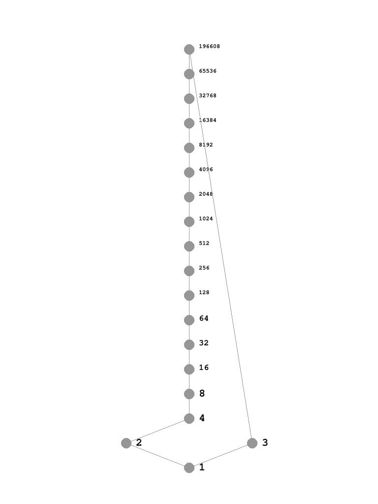
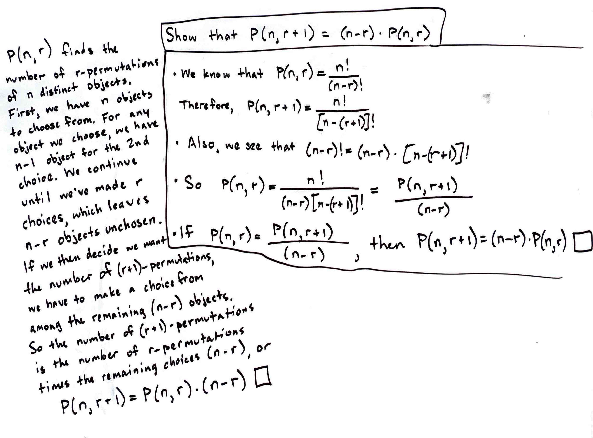

# Year: 2024

---
### Table of Contents
[January](#112023)  
[February](#212024)  
[March](#3132024)  
[April](#4182024)  
[May](#532024)  
[June](#622024)  
[July](#722024)  

### Resources
["The end of the 'Self-Taught Programmer'"](https://youtu.be/ro4oGwMb-T4?si=5SgKq55R36pFydau) [*1/1/2024*](#112024)  
[Programming an FPGA: An Introduction to How It Works](https://www.xilinx.com/products/silicon-devices/resources/programming-an-fpga-an-introduction-to-how-it-works.html) [*6/17/2024*](#6172024)  
[List of useful links for beginners and veterans](https://www.reddit.com/r/FPGA/comments/omrnrk/list_of_useful_links_for_beginners_and_veterans/) [*6/17/2024*](#6172024)  
[Hdlbits](https://hdlbits.01xz.net/wiki/Project:About) [*6/17/2024*](#6172024)  

### Programs
[Quicksort and Binary Search in Python](/files/dsa/sort_search.py) *[1/8/2024](#182024)*  
[Building a Stack with Two Queues](/files/dsa/stack_from_queues.py) *[1/16/2024](#1162024)*  
[Hasse Diagram Generator](https://github.com/seandavidreed/hasse-diagram-generator) [*3/31/2024*](#3312024)  

---
### 1/1/2024
#### GOALS
What are my main goals for this year? What follows is my attempt to answer that:  
1. Get a new job.
    * My good friend's dad got me in contact with a guy who needs a Python developer. We had a meetup a couple of weeks ago, and I reached out to him by email afterward to confirm I am interested in joining the project. I've yet to hear back, but I'm optimistic that this could become my first legitimate development job! It would be part-time, so I'd have to continue with my current job alongside it.
2. Pursue a Masters Degree from CU Boulder
    * Since the opportunity mentioned above came my way, I'm thinking this goal needs to be pushed to springtime or later. I'm still preparing for it by taking preliminary classes on Coursera, but I don't want to try to start the degree program this January while also starting the part-time job! Nevertheless, this goal still remains a priority!
3. Hone my interests / Build something robust
    * These two goals go hand in hand. I don't want to start any old project but something that will further my goals. I watched a video that inspired me to explore frontend frameworks like *React*. [This video](https://youtu.be/ro4oGwMb-T4?si=5SgKq55R36pFydau), "The end of the 'Self-Taught Programmer'," outlines important skills to learn if one wants to tand up an application from end-to-end while developing on demand skills. He bases his recommendations on the desired qualifications written in a job posting. Here they are:
      * React development, Javascript, Redux, RESTful APIs, authorization mechanisms, continuous integration and delivery techno\logies, agile scrum development methodo\logy.
    * I'm still interested in Artificial Intelligence and Deep Learning - I'd really like to continue with the fastai program, but I think it needs to be on hold for the moment while I see how the potential job opportunity pans out.
    * I really want to get back into writing stuff in the C language again, and that probably entails embedded systems, IoT, etc. If I explore that route, I want to do it right, with laser focus. I want to start on a project straight away and use it as a platform to become familiar with all the skills and techno\logies I need.
    * I'd like to get a more intuitive understanding of how the internet works. This is partly what makes me interested in IoT since it marries two arenas I'm interested in: embedded systems and the internet in general. 
    * Finally, my main focus is to get more proficient in the most marketable skills, and that probably means Python. I already am comfortable writing in Python, but I'd like to take my skills to the next level. Hopefuly this part-time job opportunity will be the vehicle for that goal!

### 1/2/2024
#### CU Boulder A\lgorithms Module 1
>Exercise 3.1-1  
>Let $f(n)$ and $g(n)$ be asymptotically nonnegative functions. Using the basic  definition of $\Theta$-notation, prove that max($f(n)$, $g(n)$) $= \Theta(f(n) + g(n))$.

$\text{let } \text{max}(f(n), g(n)) = f(n), \text{ and } f(n) = n^2,\, g(n) = n,\\ 
\text{so } \Theta(f(n) + g(n)) = \Theta(n^2 + n)$

When asymptotically evaluating a function such as $n^2 + n$, we only care about the highest-order term since it will dominate the growth of the function as $n$ increases.

$\text{therefore } \Theta(f(n) + g(n)) = \Theta(n^2 + n) = \Theta(n^2) = \Theta(f(n))\\
\text{and we know } f(n) = \Theta(f(n)),\\
\text{so } f(n) = \Theta(f(n) + g(n))$.

>Exercise 3.1-2  
>Show that for any real constants $a$ and $b$, where $b > 0$, $(n + a)^b = \Theta(n^b)$.

Let's expand $(n + a)^b$, let $c_i$ for all values of $i$ be some constant we don't care about:

$n^b + c_{b-1}n^{b-1}a^1 + c_{b-2}n^{b-2}a^2 + ... + c_2n^2a^{b-2} + c_1n^1a^{b-1} + a^b$

Since $a$ and $b$ are constants and we are generally not concerned about constants in asymptotic analysis, let's "absorb" $a$ and $b$ into $c$ where possible:

$n^b + c_{b-1}n^{b-1} + c_{b-2}n^{b-2} + ... + c_2n^2 + c_1n$

Let's remove the constants entirely now:

$n^b + n^{b-1} + n^{b-2} + ... + n^2 + n$

Here we see that the first term is the highest-order term since $b$ must be greater than itself minus any positive number. We know that the highest-order term will dominate the growth of the function, and that is the term we care about. We can remove all terms of lower orders than $n^b$. Therefore,

$(n + a)^b = \Theta(n^b)$.

>Exercise 3.1-3  
>Explain why the statement, "The running time of algorithm $A$ is at least $O(n^2)$," is meaningless.

Big-O notation describes an *asymptotically-tight* **upper bound** of a given function. As such, it describes the highest possible (worst-case) running time of the function. Therefore, the above statement says "The running time of a\lgorithm $A$ is at least its highest possible running time, which is a redundant way of saying $A$ has exactly one running time. It would be correct to say that the running time of a\lgorithm $A$ is *at most* $O(n^2)$.

>Exercise 3.1-4  
>Is $2^{n+1} = O(2^n)$? Is $2^{2n} = O(2^n)$?

To the first question, the answer is yes. We can provide a constant $K$:


$\text{let } f(n) = 2^{n+1}\\
\text{let } g(n) = 2^{n}\\
f(n) = O(Kg(n)) \iff K \geq 2$

When $K \geq 2$, $g(n) \geq f(n)$ for all $N_0 > 0$.

To the second question, the answer is no. No matter what constant $K$ we provide for $g(n)$, $f(n)$ will always eventually overtake $g(n)$ for all sufficiently large $n$, which means $g(n)$ is not an upper bound of $f(n)$.

>Exercise 3.1-5 
>Prove Theorem 3.1.

First, I'll state the theorem:

For any two functions $f(n)$ and $g(n)$, we have $f(n) = \Theta(g(n))$ if and only if $f(n) = O(g(n))$ and $f(n) = \Omega(g(n))$.

By definition, $f(n) = \Theta(g(n))$ means that $0 \leq c_1g(n) \leq f(n) \leq c_2g(n),\, \forall n > N_0 \text{ and } \forall c_1: c_1 \geq 0, \text{ and } \forall c_2: c_2 \geq 0$.

By definition, $f(n) = O(g(n))$ means that $0 \leq f(n) \leq cg(n),\, \forall n \geq N_0 \text{ and } \forall c: c \geq 0$.

By definition, $f(n) = \Omega(g(n))$ means that $0 \leq cg(n) \leq f(n),\, \forall n \geq N_0 \text{ and } \forall c:c \geq 0$.

We see that $\Theta$ is merely the combination of $O$ and $\Omega$. Therefore, if both $f(n) = O(g(n))$ and $f(n) = \Omega(g(n))$ hold, then $f(n) = \Theta(g(n))$ also holds.

>Exercise 3.1-7
>Prove that $o(g(n)) \cap \omega(g(n))$ is the empty set.

$o(g(n))$ is $g(n)$ as an upper bound (not *asymptotically tight*) to some other function (suppose $f(n)$) or set of functions. That is, $0 \leq f(n) < g(n)$. 

$\omega(g(n))$ is $g(n)$ as a lower bound (not *asymptotically tight*) to some other function or set of functions. That is $0 \leq g(n) < f(n)$.

Notice that in $f(n) = o(g(n))$, $f(n) \neq g(n)$. Additionally, in $f(n) = \omega(g(n))$, $f(n) \neq g(n)$. Therefore, $o(g(n)) \cap \omega(g(n)) = \emptyset$.

>Exercise 3.1-8
>We can extend our notation to the case of two parameters $n$ and $m$ that can go to infinity independently at different rates. For a given function $g(n,m)$, we denote by $O(g(n,m)) the set of functions

>$O(g(n,m)) = {f(n,m): \exists(c, n_0, m_0): 0 \leq f(n,m) \leq cg(n,m)\ \forall n \geq n_0 \text{ or } m \geq m_0}$

$\Omega(g(n,m)) = {f(n,m): \exists(c, n_0, m_0): 0 \leq cg(n,m) \leq f(n,m)\ \forall n \geq n_0 \text{ or } m \geq m_0}$.

$\Theta(g(n,m)) = {f(n,m): \exists(c_1, c_2, n_0, m_0): 0 \leq c_1g(n,m) \leq f(n,m) \leq c_2g(n,m)\ \forall n \geq n_0 \text{ or } m \geq m_0}$.

### 1/3/2024
#### CU Boulder A\lgorithms Module 1
>Exercise 3.2-1  
>Show that if $f(n)$ and $g(n)$ are monotonically increasing functions, then so are the functions $f(n) + g(n)$ and $f(g(n))$, and if $f(n)$ and $g(n)$ are in addition nonnegative, then $f(n) \cdot g(n)$ is monotonically increasing.

For a function to be monotonically increasing, $m \leq n \iff f(m) \leq f(n)$ must hold. If this rule holds for both $f(n)$ and $g(n)$, then it follows that $m_f + m_g \leq n_f + n_g$, where the subscript identifies the function to which the variable is input. Let's prove it:

$\text{let } m_f = 1,\ n_f = 2,\ m_g = 3,\ n_g = 4$  
$\text{since }1 \leq 2 \text{ and } 3 \leq 4$.  
$\text{combined } 1 + 3 \leq 2 + 4 \text{ the inequality is still true}$.

We can see that this will hold for all values of $m$ and $n$. We have an initial inequality $m_f \leq n_f$ and the value $m_g$ we add to $m_f$ by definition will be less than or equal to the value $n_g$ we add to $n_f$, otherwise $m_g \leq n_g$ is not true. We can prove that $f(n) \cdot g(n)$ is monotonically increasing by the same \logic with the additional constraint that $f(n)$ and $g(n)$ are nonnegative.

Given that $f(n)$ and $g(n)$ are monotonically increasing functions, let's prove $m \leq n \iff f(g(m)) \leq f(g(n))$.

$\text{We know that } m \leq n \iff g(m) \leq g(n) \text{ holds}$.  
$\text{We know that } m \leq n \iff f(m) \leq f(n) \text{ holds}$.  
$\text{In suppling } g(m) \text{ and } g(n) \text{ as inputs to } f,$  
$\text{we see that } g(m) \leq g(n) \text{ bear the same relation as } m \leq n,$  
$\text{so } g(m) \leq g(n) \iff f(g(m)) \leq f(g(n))$.

>Exercise 3.2-2  
>Prove equation (3.16) -> $a^{\log_b c} = c^{\log_b a}$
 
$a^{\log_b c} = c^{\log_b a}$  

Take $\log_a$ of both sides.  
$\log_a(a^{\log_b c}) = \log_a(c^{\log_b a})$  

Follow *\log of a power* rule.  
$\log_b c \cdot \log_a a = \log_b a \cdot \log_a c$  

Simplify.  
$\log_b c = \log_b a \cdot \log_a c$  

Rewrite.  
$\frac{\log_b c}{\log_b a} = \log_a c$ 

Follow change of base rule and we're done.  
$\log_a c = \log_a c$


>Exercise 3.2-5  
>Which is asymptotically larger: $\lg(\lg^*n)$ or $\lg^*(\lg\ n)$?

I got some help for this problem, and now I can confidently say I understand it!

First, I'll write the *recurrent equation* for iterated \log:

$
\lg^*n = \begin{cases}
            0 & \text{if } n \leq 1 \\
            1 + \lg^*(\lg\ n) & \text{if } n > 1
        \end{cases}
$

We'll use a limit to compare these two functions:

$\displaystyle\lim_{x \rightarrow \infty} \frac{\lg(\lg^*n)}{\lg^*(\lg\ n)}$

Let's supply $2^n$ to $n$.

$\displaystyle\lim_{x \rightarrow \infty} \frac{\lg(\lg^*2^n)}{\lg^*(\lg\ 2^n)}$

We find the following when we plug $2^n$ into the *recurrent equation*.  

$\lg^*2^n = 1 + \lg^*n$

We also know,

$\lg\ 2^n = n$

Putting it together, we get

$\displaystyle\lim_{x \rightarrow \infty} \frac{\lg(1+\lg^*n)}{\lg^*n}$

We can simplify $lg^*n$ to $n$ for both functions since it won't change how they relate to one another.

$\displaystyle\lim_{x \rightarrow \infty} \frac{\lg(1+n)}{n}$

Here we can see that as $n \rightarrow \infty$, the limit goes to $0$ since the denominator grows faster than the numerator. Therefore,

$\lg^*(\lg\ n) = \Omega(\lg(\lg^*n))$ and $\lg(\lg^*n) = O(\lg^*(lg\ n))$

### 1/5/2024
#### CU Boulder Algorithms Module 1
>Problem 3-1  
Let  
$p(n) = \displaystyle\sum_{i=0}^{d} a_i n^i$  
where $a_d > 0$, be a degree-$d$ polynomial in $n$, and let $k$ be a constant. Use the definitions of the asymptotic notations to prove the following properties.  
a. If $k \geq d$, then $p(n) = O(n^k)$.  
b. If $k \leq d$, then $p(n) = \Omega(n^k)$.  
c. If $k = d$, then $p(n) = \Theta(n^k)$.  
d. If $k > d$, then $p(n) = o(n^k)$.  
e. If $k < d$, then $p(n) = \omega(n^k)$.  

a. In a degree-$d$ polynomial, the highest-order term is $n^d$. In measuring asymptotic growth, we only care about the highest-order term, so for $n^k$ where $k \geq d$, $n^d = O(n^k)$.  
b. The logic in answer *a* holds here as well but with $n^k$ as a lower bound.  
c. $p(n) = \Theta(n^k)$ means $\exists c_1, c_2: 0 \leq c_1n^k \leq p(n) \leq c_2n^k,\ \forall n \geq n_0$. The highest-order term is what drives the growth of a polynomial. Suppose $p(n) = n^2 + 3n + 5$. We can think of $n^k$ as a degree-$k$ polynomial of the form $q(n) = n^k + 0n^{k - 1} + ... + 0$. Even though the lower-order terms are smaller than those of $p(n)$, provided a sufficiently small constant $c_1$ and a sufficiently large constant $c_2$, we can, respectively, cause $q(n)$ to be less than $p(n)$ and greater than $p(n)$ for all values beyond an overtake point $n_0$.  
d. With $p(n) = o(n^k)$, we are saying $p(n) \in o(n^k)$. Little $o$ is an upper bound that is not asymptotically tight. For example, a linear function, $n$, is well below the polynomial upper bound, $n^2$, but it is indeed bounded by it. For all $n \geq n_0$, as $n$ grows, the output of the linear function will far fall below that of $n^2$ so that they aren't growing at the same rate. This is true whenever $k > d$.  
e. We use the same logic as in answer *d*, but with $n^k$ as a lower bound.

### 1/8/2024
#### CU Boulder Algorithms Module 1 Exercises
>Problem 3-3  

In my own words, this problem presented me with 30 functions and tasked me with organizing them like so:

$g_{30} = \Omega(g_{29}),\ g_{29} = \Omega(g_{28}),\ ...\ ,\ g_2 = \Omega(g_1)$.

I was awfully close in my answer, but what I've provided here are all the correct answers, which I verified with the solutions manual. I have them here for my own reference:

$$
    2^{2^{n+1}},\ 2^{2^n}, (n+1)!,\ n!,\ n2^n,\ e^n,\newline 2^n,\ (\frac{3}{2})^n,\ (\lg n)!,\ (\lg n)^{\lg n},\ n^{\lg(\lg n)},\ n^3,\newline n^2,\ 4^{\lg n},\ \lg(n!),\ n\lg n,\ 2^{\lg n},\ n,\newline \sqrt{2}^{\lg n},\ 2^{\sqrt{2\lg n}},\ \lg^2n,\ \ln n,\ \sqrt{\lg n},\ \ln(\ln n),\newline 2^{\lg^*n},\ \lg^*n,\ \lg^*(\lg n),\ \lg(\lg^*n),\ n^{1/\lg n},\ 1
$$

There were a few interesting equivalences of which I took note while solving this problem. Here they are below:

$n^2 = 4^{\lg n}$  
$n^{\lg(\lg n)} = (\lg n)^{\lg n}$  
$n = 2^{\lg n}$  
$n^{1/\lg n} = 2$  

I also uncovered an interesting relationship, which I try my best to describe as follows:

We have a linear function $f(n) = n$.  
We have another function $g(n) = c^{\log_b n}$, where $\exists c: c > 0,\ c \in \mathbb{N}$ and $\exists b: b > 0,\ b \in \mathbb{N}$.   
$g(n) > f(n),\ \forall c > b,\ \forall n > N_0$.  
$g(n) = f(n),\ \forall n$.  
$g(n) < f(n), \forall c < b,\ \forall n > N_0$.

#### CU Boulder Algorithms Module 1 - Binary Search
Since I'm already well familiar with Binary Search, I decided to go beyond the material in the lecture and spin up my own implementation in Python, just to practice. Of course, for Binary Search to work, the array to be searched must be sorted, so I wrote a program that first sorts the array with Quicksort and then offers the user the option to search using Binary Search. 

I got the idea to try implementing Quicksort from a book I'm currently reading called *Algorithms*; it's one from *The MIT Press Essential Knowledge Series*. It's really an birds-eye view of the topic of algorithms, but I've found it helpful for organizing my knowledge on the subject. In chapter 4, it describes the function of Quicksort really well without using any pseudocode or math. I took that as a challenge to transform it from a concept to a program. It worked. As simple as this was in the grand scheme, it was still a thrill. I love working with algorithms. Below, I've included my program.

```
import random
import sys
import os

def quick_sort(nums: list) -> list:
    # Base case. Nothing to do here since lists
    # of size 1 are already sorted (trivially).
    if len(nums) < 2:
        return nums

    # Recursive case. Pick random element and
    # pivot all other elements around it.
    rand_idx = random.randint(0, len(nums) - 1)
    aux = [0] * len(nums)

    i, j, k = -1, 0, len(nums) - 1
    
    for i in range(len(nums)):
        if i == rand_idx:
            continue
        if nums[i] <= nums[rand_idx]:
            aux[j] = nums[i]
            j = j + 1
        else:
            aux[k] = nums[i]
            k = k - 1

    aux[j] = nums[rand_idx]

    nums = list(aux)
    del aux
    nums[:j] = quick_sort(nums[:j])
    nums[j+1:] = quick_sort(nums[j+1:])

    return nums

def binary_search(nums: list, a: int, b: int, find: int) -> int:
    if a > b:
        return -1

    mid = a + (b - a) // 2

    if find < nums[mid]:
        return binary_search(nums, a, mid-1, find)
    elif find > nums[mid]:
        return binary_search(nums, mid+1, b, find)
    else:
        return mid

def main():
    if len(sys.argv) != 2:
        print("Usage: python3 sort_search.py <INTEGER>")
        return -1

    try:
        find = int(sys.argv[1])
    except ValueError:
        print("Usage: python3 sort_search.py <INTEGER>")
        return -1

    nums = []
    for i in range(10):
        nums.append(random.randint(0, 20))
    new_nums = quick_sort(nums)
    print(new_nums)

    while True:
        print(f"Searching for {find}")
        result = binary_search(new_nums, 0, len(new_nums)-1, find)
        
        if result == -1:
            print("Not Found")
        else:
            print(f"{find} found at index {result}")

        choice = input(f"Do you want to search again? [y/n]: ")

        if choice.upper() != 'Y':
            return
        while True:
            find = input("Enter new integer: ")
            try:
                find = int(find)
                break
            except ValueError:
                print("Please provide an integer.")

if __name__ == "__main__":
    main()
seandavidreed ~/my_programs/algorithms_practice $
```

I had fun writing this; however, I do need to look up examples of Quicksort, on GeeksForGeeks for example, to see if there are any profound differences in implementation or if there are any optimizations to be made. My implementation does not sort the list in-place, as I would prefer it to do, so I might look into that more.

### 1/9/2024
#### Random Discovery
I was lying in bed unable to sleep last night because I kept thinking about algorithms and mathematics. Once my brain gets started on those topics it's hard to stop it! I was thinking about how logarithms are merely recursive division by the same divisor. This conception has helped me tremendously in making the damn things more intuitive. Further, I used the same form to understand the iterated log, which is recursively taking the log of a number. 

Then I thought what is the analog to all this with multiplication? It was a question to which I already knew the answer: exponentiation is recursively multiplying with the same multiplier. Logarithmic and exponential functions are inverse to one another. Finally, I asked, what is inverse to iterated log? The answer hit me almost immediately! I thought back to a YouTube video I watched about an abstruse mathematical artifact called *Tetration*. [This is the video](https://www.youtube.com/watch?v=Ea1_1aVfwl4). *Tetration* is the inverse of the iterated log! Here's a precise formulation:

$f(n)=\displaystyle{}^n2 \land g(n) = \lg^*n: \forall n > 0,\ f(n) = g^{-1}(n) \land g(n) = f^{-1}(n)$

Suppose I calculate $f(4) = \displaystyle{}^4{2}$. 

$\displaystyle{}^4{2} = \underbrace{2^{2^{2^2}}}_{n=4} = 65536$. We find that $f(4) = 65536$.  

Let's provide that output as input to $g(n)$, so $g(65536) = \lg^*65536$.  
The iterated log function is defined using a recurrent equation: 

$\lg^*(n) := 
    \begin{cases}
        0 & \text{if }n \leq 1\\
        1 + \lg^*(\lg n) & \text{if }n > 1
    \end{cases}$

$\lg^*(65536) = 16 \rightarrow \lg^*(16) = 4 \rightarrow \lg^*(4) = 2 \rightarrow \lg^*(2) = 1$

The function recursed $4$ times, so $g(65536) = 4$. Hence, $f(n)$ and $g(n)$ are inverses of each other!

I extended this concept of recursion throughout all basic arithmetical operations:

Division:

$divide(a,\ b) :=
    \begin{cases}
        0 & if\ a = 0\\
        1 + divide(a - b,\ b) & if\ a \geq 1
    \end{cases}$

Multiplication:

$multiply(a,\ b) := 
    \begin{cases}
        0 & if\ b = 0\\
        a + multiply(a,\ b - 1) & if\ b \geq 1
    \end{cases}$

Logarithm:

$log(b,\ n) :=
    \begin{cases}
        1 & if\ n \leq 1\\
        n \div log(b,\ n - b) & if\ n > 1
    \end{cases}$

Exponentiation:

$power(b,\ p) :=
    \begin{cases}
        1 & if\ p = 0\\
        b \times power(b,\ p-1) & if\ p \geq 1
    \end{cases}$

Iterated Logarithm:

$\lg^*(n) := 
    \begin{cases}
        0 & \text{if }n \leq 1\\
        1 + \lg^*(\lg n) & \text{if }n > 1
    \end{cases}$

Tetration:

$tetrate(t,\ b) := 
    \begin{cases}
        0 & if\ t = 0\\
        b^{tetrate(t-1,\ b)} & if\ t > 1
    \end{cases}$

#### CU Boulder Algorithms Module 1 - Binary Search
I tried to create a pivot algorithm for Quicksort that modifies the list in place. While I succeeded, the algorithm seems to be grossly inefficient, which I sort of expected given the way I designed it. I'll probably try to improve it later, but for now, here's what I came up with: [pivot.py](/files/dsa/pivot.py).

### 1/15/2024
#### CU Boulder Algorithms Module 1
I completed Module 1 today. I'd been working on it intermittently the past few days. I hope to move more quickly through module 2 - I'll probably do more skimming in the CLRS book to accomplish this (of course, I won't skim where I don't understand). Here's a few notes from the final optional lecture:

1. $1.5n^e + 2.2n\lg n + 3n \rightarrow \Theta(n^2)$
2. $f = 2^n,\ g = 2^{2n},\ f \neq \Theta(g),\ g = f^2$
3. $f = 2^n,\ g = 3^n,\ f \neq \Theta(g)$. Let's rewrite $3^n$ as $2^{(\log_2 3)n}$, so we can see that this is the same as example 2.
4. We have the rule $(\log_a b)(\log_b c) = \log_a c$. Suppose $f = \log_2 n$ and $g = \log_5 n$. We can rewrite $g \rightarrow g = \underbrace{\log_5 2}_{constant} \cdot \underbrace{\log_2 n}_{f}$. Therefore $f = \Theta(g)$.

Miscellaneous:
1. $2^{(\log n)^2}$ is an example of *poly-log time*. 
2. $\underbrace{2^{2^{2^{2^{...}}}}}_{n\ times}$ is an example running time for *non-elementary algorithms*. (This seems yet another example of *tetration*!)

### 1/16/2024
#### CU Boulder Algorithms Module 2 - Answering CLRS Questions
>Exercise 10.1-2  
>Explain how to implement two stacks in one array $A[1...n]$ in such a way that neither stack overflows unless the total number of elements in both stacks together is $n$. The $\text{Push}$ and $\text{Pop}$ operations should run in $O(1)$ time.

Stack 1 ($S1$) will grow with increasing index values starting from index 1 and Stack 2 ($S2$) will grow with decreasing index values starting from index $n$. The data structure $A$ will have two attributes, $S1.top$ and $S2.top$. The $\text{Push}$ method will have two parameters, `PUSH(stack, element)`; I don't include $A$ in the parameters since I'm conceiving of $A$ as a class, of which `PUSH()` is a method. The programmer specifies which stack on which to push, `PUSH(S2, -6)`, and the method will check against overflow in the following way:

```
PUSH(stack, element):
    if ABSOLUTE_VALUE(s1.top - s2.top) == 1:
        error "overflow"
    if stack == s1:
        s1.top += 1
        A[s1.top] = element
    else:
        s2.top += 1
        A[s2.top] = element
```

>Exercise 10.1-4  
>Rewrite $\text{Enqueue}$ and $\text{Dequeue}$ to detect underflow and overflow of a queue.

```
ENQUEUE(Q, x):
    if Q.head == (Q.tail % Q.length) + 1:
        error "overflow"
    
    Q[Q.tail] = x
    if Q.tail == Q.length:
        Q.tail = 1
    else:
        Q.head = Q.head + 1

DEQUEUE(Q):
    if Q.head == (Q.tail % Q.length) + 1:
        error "underflow"

    x = Q[Q.head]
    if Q.head == Q.length:
        Q.head = 1
    else:
        Q.head = Q.head + 1

    return x
```

>Exercise 10.1-5  
>Whereas a stack allows insertion and deletion of elements at only one end, and a queue allows insertion at one end and deletion at the other end, a ***deque*** (double-ended queue) allows insertion and deletion at both ends. Write four $O(1)$-time procedures to insert elements into and delete elements from both ends of a deque implemented by an array.

```
ENQUEUE-TAIL(Q, x):
    if Q.head == (Q.tail % Q.length) + 1
        error "overflow"
    
    Q[Q.tail] = x
    Q.tail = (Q.tail == Q.length) ? 1 : Q.tail + 1

ENQUEUE-HEAD(Q, x):
    if Q.head == (Q.tail % Q.length) + 1
        error "overflow"
    
    Q.head = (Q.head == 1) ? Q.length : Q.head - 1
    Q[Q.head] = x

DEQUEUE-TAIL(Q):
    if Q.head == Q.tail:
        error "underflow"
    
    Q.tail = (Q.tail == 1) ? Q.length : Q.tail - 1
    return Q[Q.tail]

DEQUEUE-HEAD(Q):
    if Q.head == Q.tail:
        error "underflow"

    x = Q[Q.head]
    Q.head = (Q.head == Q.length) ? 1 : Q.head + 1

    return x
```

>Exercise 10.1-6  
>Show how to implement a queue using two stacks. Analyze the running time of the queue operations.

To implement a queue with two stacks, we will call one stack our "enqueueing" stack and the other our "dequeueing" stack. When `ENQUEUE()` gets called, it first checks whether the *dequeueing* stack is empty. If it is, the new element is simply pushed to the *enqueueing* stack, provided there's no overflow. However, if the *dequeueing* stack is not empty, the method first pops and pushes each element one at a time from the *dequeueing* stack to the *enqueueing* stack. Then, it pushes the new element to the *enqueueing* stack. This whole process is exactly inverted when `DEQUEUE()` is called.

This implementation will run somewhat efficiently if enqueueing and dequeueing tend to happen in batches. However, if they alternate frequently, the queue will be less efficient. Therefore, the worst case for a single `ENQUEUE()` or `DEQUEUE()` call is $O(n)$ since all elements must be transferred from one stack to the other. The best case is $\Omega(1)$.

>Exercise 10.1-7  
>Show how to implement a stack using two queues. Analyze the running time of the stack operations.

I had some fun answering this question. The obvious answer was to follow these rules:

1. To push onto the "stack," always enqueue a new element to whichever queue is non-empty. If they are both empty, either is fine.
2. To pop from the "stack," dequeue $n - 1$ elements from the non-empty queue and enqueue them in the other queue one at a time, where $n$ is the total number of elements in the "stack." Finally, dequeue and return the $nth$ element.

Every `push()` will take $\Theta(1)$ time. Every `pop()` will take $\Theta(n)$ time. This isn't terrible, but I wanted to see if I could reduce the running time of the `pop()` operation. I tried to devise a strategy where the `push()` operation alternates enqueueing the two queues and the `pop()` operation alternates dequeueing the two queues. I had a fairly structured idea for how to keep track of the order of insertion so as to make sure the right element was always popped. However, once I coded the thing, I realized there was not really an advantage to my design.

Suppose we instantiate a new stack with this design and push several elements to it. The very first `pop()` operation would take precisely $\Theta(\lfloor n/2 \rfloor)$ time. Each subsequent `pop()` would take the ordinary $\Theta(n)$ time. I suppose there would be a marginal benefit if the stack were used in such a way where pushes and pops frequently alternated - in that specific circumstances, `pop()` could run with $\Theta(1)$ time. All in all, the extra complexity in my design produced optimizations only for very particular situations. Probably not worth it!

I decided to go ahead and implement the simplest idea in Python. Here is the program: [stack_from_queues.py](/files/dsa/stack_from_queues.py).

### 1/21/2024
#### CU Boulder Algorithms Module 2 - Exercises
>Exercise 6.1-1  
>What are the minimum and maximum numbers of elements in a heap of height $h$?  

The maximum is $2^h$ and the minimum is $2^{h + 1} - 1$.  

>Exercise 6.1-2  
>Show that an $n$-element heap has height $\lfloor \lg n \rfloor$.

Every heap has a single node for a root and for each complete level of the tree, the number of nodes is double that of the previous level. Therefore, we may demonstrate that, for a given height $h$, the number of nodes in the tree is $n \leq \displaystyle \sum_{i = 0}^{h} 2^h$. 

For a tree of height $0$, we have $2^0 = 1$, this is clearly true since a tree of 1 node is without edges and therefore has no height. We can show in this case that $h = \lg n$ is true: $0 = \lg 1$. For a tree of height 1, we have $2^0 + 2^1 = 3$, which s the maximum number of nodes for a tree of height $1$. We can see that $1 = \lfloor \lg 3 \rfloor$ is true. In this case, if the number of nodes exceeds $3$, an additional edge must be added, increasing the height of the tree since $2 = \lg 4$. The next number of nodes for which we must increase the height is 8 since $3 = \lg 8$ and $2 = \lfloor \lg 7 \rfloor$. All together, we see that the rule holds $h = \lfloor \lg n \rfloor$.

>Exercise 6.1-3  
>Show that in any subtree of a max-heap, the root of the subtree contains the largest value occurring anywhere in that subtree.  

Given the max-heap property, $A[\text{parent}(i)] \geq A[i]$, we know that the child nodes of any given parent node will be smaller than the parent. Therefore, it's simple to see that if we choose any parent node as a point of division from the rest of the tree, it will be the root and largest node of the resulting subtree.

>Exercise 6.1-4  
>Where in a max-heap might the smallest element reside, assuming that all elements are distinct?

In a max-heap, the smallest element would reside anywhere in the bottom layer of leaf nodes.

>Exercise 6.1-5  
>Is an array that is in sorted order a min-heap?

Yes, and a simple experiment can prove it. Take the index of any element $p$ that has child nodes; by definition of a min-heap, its child nodes $l$ and $r$ must both be greater than or equal to their parent, $p \leq l \land p \leq r$. The sorted array satisfies this condition. An array in ascending order is always a min-heap.

It is worth noting that the consequent is not also true: a min-heap is not necessarily a sorted array. $l$ comes before $r$ in the min-heap array, yet $l \leq r$ is _not_ a required condition, yet it _is_ required for a sorted array. A min-heap is not always a sorted array.

>Exercise 6.1-6  
>Is the array with values $\langle 23, 17, 14, 6, 13, 10, 1, 5, 7, 12 \rangle$ a max-heap?

It is not. The 4th element, 6, has as its child nodes, 5 and 7. 5 satisfies the max-heap property, but 7 does not.

>Exercise 6.1-7  
>Show that, with the array representation for storing an $n$-element heap, the leaves are the nodes indexed by $\lfloor n/2 \rfloor + 1, \lfloor n/2 \rfloor + 2, ..., n$.  

Let's have an example min-heap of size $n = 7$: $\langle 2, 4, 3, 6, 6, 4, 5 \rangle$. The leaf nodes are $\langle 6, 6, 4, 5 \rangle$ and their indices are 4, 5, 6, and 7. Let's perform the calculations:

$\lfloor 7/2 \rfloor + 1 = 4$  
$\lfloor 7/2 \rfloor + 2 = 5$  
$\lfloor 7/2 \rfloor + 3 = 6$  
$\lfloor 7/2 \rfloor + 4 = 7$

This makes sense because a heap is organized as a binary tree, the completed levels of which double the size of their previous levels. We can therefore expect the final level of the heap, that of the leaf nodes, to begin at exactly halfway through the array.

### 1/22/2024
#### CU Boulder Algorithms Module 2 - Exercises
>Exercise 6.2-2  
>Starting with the procedure MAX-HEAPIFY, write pseudo code for the procedure MIN-HEAPIFY(A, i), which performs the corresponding manipulation on a min-heap. How does the running time of MIN-HEAPIFY compare to that of MAX-HEAPIFY?

```
MIN-HEAPIFY(A, i):
    l = LEFT(i)
    r = RIGHT(i)
    
    if A[l] < A[i]:
        smallest = l
    else:
        smallest = A[i]

    if A[r] < smallest:
        smallest = r

    if smallest != i:
        SWAP(A, i, smallest)
        MIN-HEAPIFY(A, smallest)   
```

The running time of MIN-HEAPIFY is identical to that of MAX-HEAPIFY at $O(\lg n)$.

>Exercise 6.2-3  
>What is the effect of calling MAX-HEAPIFY(A, i) when the element A[i] is larger than its children?

The function will take six steps, evaluating each condition as false, and exit without making any changes to $A$.

>Exercise 6.2-4  
>What is the effect of calling MAX-HEAPIFY(A, i) for $i > A.heap-size/2$?

This is effectively called MAX-HEAPIFY on a leaf node, which by definition has no child nodes. Therefore, there is nothing to be done, and the algorithm should have a function to check for this case before making the $l = \text{LEFT}(i) \text{ and } r = \text{RIGHT}(i)$ assignments.

>Exercise 6.2-5  
>The code for MAX-HEAPIFY is quite efficient in terms of constant factors, except possibly for the recursive call in line 10, which might cause some compilers to produce inefficient code. Write an efficient MAX-HEAPIFY that uses an iterative control construct (a loop) instead of recursion.

```
MAX-HEAPIFY(A, i):
    while True:
        if i >= A.heap-size // 2:
            break
    
        if A[LEFT(i)] > A[i]:
            largest = LEFT(i)
        else:
            largest = i

        if A[RIGHT(i)] > largest:
            largest = A[RIGHT(i)]

        if largest == i:
            break

        SWAP(A, i, largest)
        i = largest    
```

### 1/23/2024
#### CU Boulder Algorithms Module 2 - Exercises
>Exercise 6.3-2  
>Why do we want the loop index $i$ in line 2 of `BUILD-MAX-HEAP` to decrease from $\lfloor A.length / 2 \rfloor$ to 1 rather than increase from 1 to $\lfloor A.length / 2 \rfloor$?

We know that all indices greater than $\lfloor A.length / 2 \rfloor$ are those of leaf nodes, and as such, they are trivially max heaps. Therefore, we loop descending from $\lfloor A.length / 2 \rfloor$ so as not to touch these leaf nodes. If `BUILD-HEAP-MAX` were to operate the other way, then we would have to perform checking operations for every leaf node. In fact, this extra checking would occur all the way down the heap.

>Exercise 6.3-3  
>Show that there are at most $\lceil n/2^{h+1} \rceil$ nodes of height $h$ in any $n$-element heap.

The height of a node is the number of edges of the longest simple path from it to a leaf node in its sub-heap. In a heap, each level with no leaf nodes is double that of the previous level. 

A heap of size $n=1$ has a height of $h=0$. As soon as we increase it to $n=2$, a power of 2, a new level is created, thereby increasing the height of the tree to $h=1$.

A heap of size $n=3$ has a height of $h=1$ and is a perfect binary tree, meaning all parents have exactly two children. As soon as we increase it to $n=4$, a power of 2, a new level is created, thereby increasing the height of the tree to $h=2$.

One more example.

A heap of size $n=7$ has a height of $h=2$ and is a perfect binary tree. As soon as we increase it to $n=8$, a power of 2, a new level is created, thereby increasing the height of the tree to $h=3$.

The height of a heap always increases when we reach a power of 2. This means that $n/2^{h+1}$ will always be bounded thus:

$1/2 \leq n/2^{h+1} < 1$  
Therefore, it will always evaluate $\lceil n/2^{h+1} \rceil = 1$.

This is what we expect since only the root node of a heap has a height of $h$, which is the height of the tree.

### 1/24/2024
#### CU Boulder Algorithms - Module 2
>Exercise 6.4-2  
>Argue the correctness of `HEAPSORT` using the following loop invariant:  

>At the start of each iteration of the **for** loop of lines 2-5, the subarray $A[1...i]$ is a max-heap containing the $i$ smallest elements of $A[1...n]$, and the subarray $A[i+1...n]$ contains the $n-i$ largest elements of $A[1...n]$, sorted.

Here's the pseudocode from the book as a reference:  
```
1   HEAPSORT(A):
2       BUILD-MAX-HEAP(A)
3       for i = A.length down to 2:
4           exchange A[1] with A[i]
5           A.heap-size = A.heap-size - 1
6           MAX-HEAPIFY(A, 1)
```

Initialization: Before the first iteration of the for loop, `A[1...n]` is a max-heap and trivially the non-existent subarray `A[i+1...n]`, the last $n$ being exclusive, is sorted in ascending order, containing the largest elements of array $A$.

Maintenance: After the first iteration, `A[1...i]` is still a max-heap because of `MAX-HEAPIFY` and now `A[i+1...n]` is, still trivially, a sorted array in ascending order of size 1; moreover, it contains the largest elements of array $A$ since it always receives the root of the max-heap, which will always be the largest element after the call to `max-heapify`. After the next iteration, we still have a max-heap in `A[1...i]` and now `A[i+1...n]` is of size 2 and non-trivially sorted in ascending order.

Termination: The loop terminates when $i < 2$, at which point our sorted array is now the size of the original array.

>Exercise 6.4-3  
>What is the running time of `HEAPSORT` on an array $A$ of length $n$ that is already sorted in increasing order? What about decreasing order?

When the array is already in increasing order, `HEAPSORT` will run with the usual $O(n \lg n)$ since to build the max-heap, we will have to rearrange most of the elements. When the array is in decreasing order, `BUILD-MAX-HEAP` will run in $\Theta(\lg n)$ instead of linear time since it will merely step up each level of the tree without calling `BUBBLE-DOWN` or `BUBBLE-UP`. However, this won't be enough to change the overall running time of `HEAPSORT` from $\Theta(n \lg n)$.

>Exercise 6.4-5  
>Show that when all elements are distinct, the best-case running time of `HEAPSORT` is $\Theta(n \lg n)$.

The first part of `HEAPSORT`, `BUILD-MAX-HEAP`, runs in $\Theta(n)$ time, which means it is lower bounded, $\Omega(n)$. This running time will not change no matter what the state of the input array.

The second part of the `HEAPSORT` algorithm is given below:

```
for i = A.length down to 2:         # c1 * (n / 2)
    swap(A[1], A[i])                # c2
    A.heap-size = A.heap-size - 1   # c3
    MAX-HEAPIFY(A, 1)               # C4 * lg n
```

This second part runs in $\Theta(n \lg n)$ - its running time is lower bounded by $\Omega(n \lg n)$. In other words, the running time in the best case is the same as in $\Theta$ since the max-heap must still be unpacked into a sorted array regardless of whether is was already sorted to begin with.


### 1/26/2024
#### CU Boulder Algorithms Module 2 - 6.4 Exercises
>Exercise 6.5-3  
>Write pseudocode for the procedures `HEAP-MINIMUM`, `HEAP-EXTRACT-MIN`, `HEAP-DECREASE-KEY`, and `MIN-HEAP-INSERT` that implement a min-priority queue with a min-heap.

```
HEAP-MINIMUM(A):
    return A[1]

HEAP-EXTRACT-MIN(A):
    if A.heap-size < 1:
        error "underflow"

    min = HEAP-MINIMUM(A)
    A[1] = A[A.heap-size]
    A.heap-size = A.heap-size - 1
    MIN-HEAPIFY(A, 1)

HEAP-DECREASE-KEY(A, i, key):
    if key > A[i]:
        error "new key is greater than current key"

    A[i] = key

    while i > 1 and A[i] < A[PARENT(i)]:
        SWAP(A, i, PARENT(i))
        i = PARENT(i)
    
MIN-HEAP-INSERT(A, key):
    A.heap-size = A.heap-size + 1
    A[A.heap-size] = inf
    HEAP-DECREASE-KEY(A, A.heap-size, key)
```

>Exercise 6.5-4  
>Why do we bother setting the key of the inserted node to $-\infty$ in line 2 of `MAX-HEAP-INSERT` when the next thing we do is increase its key to the desired value?

When we increase `heap-size`, we add another index to our heap, within the scope of `A.length`. If this index has never been used before, it will contain a garbage value; if it has been used, it likely contains a previously deleted value that is unknown to us. Therefore, we set it to $-\infty$ to make sure that `HEAP-INCREASE-KEY` works properly; otherwise, it might throw the error, "new key is smaller than current key."

>Exercise 6.5-5  
>Argue the correctness of `HEAP-INCREASE-KEY` using the following loop invariant:

>At the start of each iteration of the **while** loop of lines 4-6, the subarray $A[1...A.\text{heap-size}]$ satisfies the max-heap property, except that there may be one violation: $A[i]$ may be larger than $A[PARENT(i)]$.

>You may assume that the subarray $A[1...A.\text{heap-size}]$ satisfies the max-heap property at the time `HEAP-INCREASE-KEY` is called.

Initialization: at the start of the first iteration, we have a max-heap with one element $k$ out of place. We check to see if $k$ is greater than its parent and exchange them if it is.

Maintenance: if the loop begins again, we know we still have a max-heap with element $k$ out of place. By definition of the max-heap, when we swapped $k$ with its parent in the first iteration, we gave $k$ a new parent that is closer to $k$ in value than the previous parent, or else we moved it to the root. So with every iteration of the loop where $k < parent(k)$, the distance between $k$ and its parent shrinks.

Termination: when $k \geq parent(k)$, the loop terminates. Each iteration of the loop brings us closer to this result or else places the element at the root, which also terminates the loop.

>Exercise 6.5-6  
>Each exchange operation on line 5 of `HEAP-INCREASE-KEY` typically requires three assignments. Show how to use the idea of the inner loop of `INSERTION-SORT` to reduce the three assignments down to just one assignment.

For reference, I'll write pseudocode for `INSERTION-SORT`:

```
INSERTION-SORT(A):
    for i = 1 to A.length - 1:
        j = i + 1
        key = A[j]
        while A[j - 1] > key and j > 1:
            A[j] = A[j - 1]
            j = j - 1
        A[j] = key
```

In the above pseudocode, we're holding on to $key$ while we shift all larger elements to the right; then we insert it into the resulting empty space. This is more efficient than constantly swapping $key$ with each element.

```
HEAP-INCREASE-KEY(A, i, key):
    if key < i:
        error "key is smaller than current key"

    while key > A[PARENT(i)] and i > 1:
        i = PARENT(i)

    A[i] = key
```

>Exercise 6.5-8  
>The operation `HEAP-DELETE(A, i)` deletes the item in node $i$ from heap $A$. Give an implementation of `HEAP-DELETE` that runs in $O(\lg n)$ time for an $n$-element max-heap.

```
HEAP-DELETE(A, i):
    A[i] = A[A.heap-size]
    A.heap-size = A.heap-size - 1

    while True:
        l = LEFT(i)
        r = RIGHT(i)

        largest = i
        if A[l] > largest:
            largest = l
        
        if A[r] > largest
            largest = r

        if largest == i:
            break
```

>Exercise 6.5-9  
>Give an $O(n \lg k)$-time algorithm to merge $k$ sorted lists into one sorted list, where $n$ is the total number of elements in all the input lists. (Hint: use a min-heap for $k$-way merging). 

To answer this question, I wrote a program in C++. [Here it is](/files/dsa/k_way_merge/k_way_merge.cpp).

### 1/29/2024
#### CU Boulder Algorithms - Module 2
>Exercise 11.1-2  
>A bit vector is simply an array of bits (0s and 1s). A bit vector of length $m$ takes much less space than an array of $m$ pointers. Describe how to use a bit vector to represent a dynamic set of distinct elements with no satellite data. Dictionary operations should run in $O(1)$ time.

Since there is to be no satellite data in this implementation, the keys themselves are the data, and we use them to index into the table, which simply stores a $1$ is the data is present in and a $0$ if the data is absent from the table.

#### CU Boulder Algorithms - Module 2 Programming Assignment
Over the course of the day, I completed each task in the final assignment of this module only to find that when I submitted it, some of my work hadn't saved properly, and I got a 10/45. The last tests I had run were all correct, so that score couldn't have been right. Sure enough, I checked the notebook and found that a portion of my hard work was missing. I was able to find a saved checkpoint in the file tree where my work was still intact. I downloaded it, opened it in VSCode and copy/pasted my answers back into the notebook. It was painstaking and annoying, but it's done. Apart from that headache, I did enjoy the project.

### 1/31/2024
#### Learning How to Learn - Coursera
This course is not strictly related to computer science, but I know the principles I learn from it will help me tremendously if I choose to pursue a Masters Degree in Computer Science. Here, I'll answer the questions a the end of Chapter 2:

>How would you recognize when you are in the diffuse mode? How does it feel to be in the diffuse mode?

It feels spacious, like I can easily direct my attention all around but without narrowing it. I most notice I'm in the diffuse mode when I'm improvising on guitar or playing a song I've practiced extensively. In general, I recognize I'm in the diffuse mode the most right after an prolonged period in the focused mode.

>When you are consciously thinking of a problem, which mode is active and which is blocked? What can you do to escape this blocking?

The focused mode is active and the diffuse mode is blocked. To facilitate the transition to diffuse mode, one can divert their attention away from the focused task and go for a walk, take a shower, make lunch, etc. This will get the mind out of focused mode.

>Recall an episode where you experienced the _Einstellung Effect_. How were you able to change your thinking to get past the preconceived, but erroneous, notion?

Recently, I was coding up an implementation of the Heapsort algorithm. Specifically, I was working on the `Heapify()` procedure. The task was to cause some element at the bottom of the heap to jump up the levels of the heap tree until it arrived at its correct location. To iterate through the heap from the bottom to the top, I was using this line of code `i = i - 1`, which works if one is trying to iterate through an array contiguously. The problem is that heaps, though implemented as an array, aren't organized contiguously. Instead, they are organized according to levels of a binary tree. I needed to code up `i = parent(i)` to solve the problem. My mind was stuck on a loop and I didn't even comprehend that I'd made this error - my brain saw that I was working with an array and automatically thought of contiguity. Hence, Einstellung Effect.

### 2/1/2024
#### CU Boulder Algorithms - Module 3
>Exercise 7.1-1 …illustrate the operation of `partition()` on the array $A = \langle 13,19,9,5,12,8,7,4,21,2,6,11 \rangle$.

[My answer in PDF form.](/documents/quicksort_partition.pdf)

>Exercise 7.1-2 What value of $q$ does `Partition()` return when all elements in the array $A[p...r]$ have the same value? Modify `Partition()` so that $q = \lfloor (p+r)/2 \rfloor$ when all elements in the array $A[p...r]$ have the same value.

If all elements in the array have the same value, `Partition()` will continuously return the same index, $r$, which means that the `Quicksort` algorithm will run in an inefficient $O(n^2)$ time. We can modify `Partition()` to check for this state with the following:

```
PARTITION(A,p,r):
    x = A[r]
    i = p - 1
    larger_than = False
    for j = p to r - 1:
        if A[j] <= x:
            i = i + 1
            exchange A[i] with A[j]
        else:
            larger_than = True
    exchange A[i + 1] with A[r]
    
    if larger_than == True:
        return i + 1
    else:
        return (p + r) // 2
```

>Exercise 7.1-3 Give a brief argument that the running time of `Partition()` on a subarray of size $n$ is $\Theta(n)$.

The for loop causes each element to be visited exactly once starting at the first element $p$ and terminating at index $r$, which is the end of the subarray. There is no condition that will cause the loop to exit early, so no matter the state of the subarray (e.g. already organized correctly around the pivot before execution (best case), every element is in the wrong place (worst case)), the loop will iterate over the whole subarray. $Partition() = \Omega(n)$ and $Partition = O(n)$, so $Partition = \Theta(n)$.

>Exercise 7.1-4 How would you modify `Quicksort()` to sort into nonincreasing order?

```
PARTITION(A,p,r):
    x = A[r]
    i = p - 1
    for j = p to r - 1:
        if A[j] >= x:
            i = i + 1
            exchange A[i] with A[j]
    exchange A[i + 1] with A[r]
    return i + 1
```

#### BIG NEWS - I'm Now a Freelance Developer
Today was a watershed moment for me. I had my first official meeting as a freelance developer! The pay is humble and the project simple, but I'm thrilled to finally have my start in this industry. At the very least, this is a resume building opportunity, but I do hope that the connections I make can lead to even bigger opportunities in the future.

### 2/5/2024
#### Mobile App Idea
A couple weeks ago, I was thinking about my habits surrounding my finances. I realized that it was time yet again to shore up my resources and get things in order. In the past, I've used budgeting apps to keep track of things, and I often found that I wanted the app to give me more freedom with setup. I thought, what if I built my own budget app? That's exactly what I hope to do. Either I'll do that, or I'll revamp my student log console app and turn it into a mobile app. I'm more keen on the first idea, but I'm also trying to consider how much time and energy I actually have for a project like this. We'll see! I'm planning to use React Native to build this app. Today, I went through the React Native Introduction and it made me really excited to use this framework!

### 2/9/2024
#### CU Boulder Algorithms - Module 3
>Exercise 7.2-2 What is the running time of `QUICKSORT()` when all elements of array $A$ have the same value?  

For each comparison of $A[j]$ to $A[x]$, where $j$ is an index that increments for every loop and $x$ is the index of the pivot element, $A[j] \not < A[x]$, which means the if condition in the loop is not satisfied. $i$ is therefore never incremented and the pivot is swapped with $i + 1$, the first element of the array, which is returned to `QUICKSORT()` to divide the next subarrays into $size = 0$ and $size = n - 1$. This occurs with every call to `PARTITION()`, yielding $\Theta(n^2)$ running time.

>Exercise 7.2-3 Show that the running time of `QUICKSORT()` is $\Theta(n^2)$ when the array $A$ contains distinct elements and is sorted in decreasing order.

Every element will be greater than the pivot element, which means that when the loop terminates, the pivot element will be swapped with the first element of the array, so `PARTITION()` will return the index of the first element, causing the next subarrays to be $size = 0$ and $size = n - 1$. This occurs with every call to `PARTITION()`, yielding $\Theta(n^2)$ running time.

### 2/11/2024
#### CU Boulder Algorithms - Module 3
>Exercise 7.3-1 Why do we analyze the expected running time of a randomized algorithm and not its worst-case running time?

The advantage conferred by randomization in an algorithm is not present if the algorithm is run only one time, which is what worst-case analysis would demonstrate. In other words, randomized algorithms are only beneficial if they are used repeatedly, which is what expected running time considers, so in practice, we wouldn't use a randomized algorithm where it would be used once.

>Exercise 7.3-2 When `RANDOMIZED-QUICKSORT` runs, how many calls are made to the random-number generator `RANDOM` in the worst case? How about in the best case? Give your answer in terms of $\Theta$-notation.

Worst-Case: $\Theta(n)$  
Best-Case: $\Theta(n)$

### 2/16/2024
#### CU Boulder Algorithms Module 3
Yesterday, I finished this module. I realized I've been spending too much time on answering exercise questions at the end of CLRS chapters. While they are important, I don't need to answer all of them - especially since some of the questions touch on topics that aren't in the scope of the course. I'm going to be more economical in my approach to module 4!

#### My App Idea - Budge
I might delay this project a bit. While I certainly think I can do it, I want to build more web programming foundations first. I'm actually thinking of returning to EdX and completing Harvard's CS50W. Last year, it was between CS50AI and CS50W, and I chose the former. I'm happy with my choice, but I'm reminded that the path of least resistance into tech-related jobs is through web development. I already have good experience with web technologies since I built that Inventory manager app, but I sense I'm missing some core skills. I know CS50W will provide them.

My current plan is to finish my Coursera courses, CU Boulder Algorithms and Learning How to Learn, and then begin CS50W. I hope to continue CU Boulder courses alongside it; I still believe it may be a good idea to get my Master's Degree. All in all, I'm trying to increase my odds of getting a new job around summertime. I have this freelancing gig in which I'm developing with the Stream Deck, but so far I've been given little direction on this project; I think it's going to be slow-going, so I don't want to rely on it alone as a pathway to a new job.

### 2/20/2024
#### CU Boulder Algorithms Module 4
>Exercise 11.4-2 Write pseudocode for `HASH-DELETE()` as outlined in the text, and modify `HASH-INSERT()` to handle the special value _deleted_.

```
HASH-DELETE(T, k):
    i = 0
    while i < m:
        j = h(k, i)
        if T[j] == k:
            T[j] = DELETED
            return j
        i = i + 1
```

```
HASH-INSERT(T, k):
    i = 0
    while i < m:
        j = h(k, i)
        if T[j] == NIL or T[j] == DELETED:
            T[j] = k
            return j
        i = i + 1
```

>Exercise 11.4-3 Consider an open-address hash table with uniform hashing. Give upper bounds on the expected number of probes in an unsuccessful search and on the expected number of probes in a successful search when the load factor is $3/4$ and when it is $7/8$

Unsuccessful:
When $\alpha = \frac{3}{4}$, the upper bound on the expected number of probes is $\frac{1}{1-\alpha} = 4$.

When $\alpha = \frac{7}{8}$, $probes = 8$.

Successful:
When $\alpha = \frac{3}{4}$, the upper bound on the expected number of probes is $\frac{4}{3}\ln(4)$.

When $\alpha = \frac{7}{8}$, $probes = \frac{8}{7}\ln(8)$.

### 2/28/2024
#### UPDATES
I haven't been diligent in updating this log lately, so I want to give a brief overview of what I've been up to and what I'm planning to do.

What I've been doing:
1. Coursera Learning How to Learn (including book: A Mind for Numbers)
    - The course and the book have both been eye-opening. I've come to find many flaws in my study habits and _illusions of competence_ in my thinking. I plan on finishing this course (and the book) soon, so I can refocus my efforts on other things. However, I plan to keep the principles I've learned fresh; perhaps I'll make flashcards. The following points are a brief list of some practices I've adopted while reading this book: 
    - Keep a to-do list that is manageable and clear.
    - Use the pomodoro technique, setting a timer to 25 minutes and committing to a focused study session for that time, rewarding myself after.
    - Avoid illusions of competence by not mistaking the ability to follow the points in a lecture for knowing the material myself, unguided.
    - Clear my space of distractions; find a new environment if need be.
    - Recognize that procrastination is a pain response: we procsrastinate because starting the task at hand is uncomfortable. Instead, I must remind myself that the pain will wear off once I actually begin the task and allow myself to become absorbed - especially if I know I only need to focus for 25 minutes (pomodoro).
    - Pause and recall the content I've just consumed after a lecture, video, chapter, etc. Also do this as a _spaced repetition_ exercise, where I periodically try to recall content from days ago.
    - Use flashcards as another _spaced repetition_ exercise.
    - Interleave, that is, mix up my topics of focus. This helps the brain to learn more deeply, even if at first it seems like things are harder to learn this way.
    - Recognize the _Einstellung Effect_. If I'm stumped by a problem, I might be on a loop, trying to apply the same strategy over and over when I really need an entirely different strategy.
    - Prime the brain with the focused mode, and let the diffuse mode take over and work on the problem in the background.
2. Coursera CU Boulder Algorithms for Searching, Sorting, and Indexing
    - I finished this course today. It's the first of five in CU Boulders **Foundations of Data Structures and Algorithms Specialization**. It took me much longer than it should have because I was answering every single exercise question at the end of the chapters in the CLRS book ([here's the entry](#2162024)). I became more selective toward the end of this course. I'm preparing to begin the second course in the specialization. Once I'm done with that, I'll be set up to begin the actually entry courses (the remaining three courses in the specialization) for CU Boulders MS-CS program, if I so choose. I found this course challenging but rewarding. I was especially challenged by Average Case complexity analysis, which involved extensive proofs, untangling summations, recurrence relations, and probability theory. In general, it required a lot of Discrete Mathematics, a discipline I had little exposure to previously.
3. Stream Deck Freelancing Project
    - This one has been slow to roll out. I expect that things will get moving soon, but for now it has mostly been experimentation with the Stream Deck and waiting for further information.

What I plan to do:
1. Harvard EdX: CS50's Web Programming with Python and JavaScript
    - Woohoo! Back to Harvard EdXs amazing online courses! As stated earlier in this log ([here](#252024)), I planned to make a Budgeting app for mobile. I explored the React Native documentation and followed the tutorial to prepare. Ultimately, I decided to furlough this project; I decided I want to get a stronger web programming foundation before building a mobile app. Truthfully, I could make the app now. However, taking a web programming course in which I'll build projects will better prepare me for building an app _and_ for rounding out my skills listed on my resume. Enter CS50W! I hope to get a basic foundation, build my own website and web apps, and bring myself closer to getting a new job.
2. CU Boulder Trees and Graphs: Basics
    - This is the next installment in the previously-mentioned specialization. I plan to work on this and CS50W simultaneously. Hopefully I can finish them at similar times and be to start the CU Boulder MS-CS degree by late Spring! I still haven't completely decided if I'll do it, but I'm leaning toward yes.
3. Introduction to Discrete Mathematics
    - No, this isn't another course: I think I'll have my plate full enough with CU Boulder and CS50W! Instead, it's a book. I'm going through it casually and slowly, creating flash cards in the process. I believe it will be a much needed primer for Discrete Mathematics that will benefit me in CU Boulder's MS-CS program. I plan to give some of my answers to end-of-chapter exercises in this log.
4. Stream Deck Freelancing Project
    - No doubt this will be a big part of my schedule as well, but I'm not sure yet all that it will entail!
5. Job Hunting
    - Finally, I plan to get serious about applying for jobs. I've set a goal for myself to find one interesting job everyday. I need to set another goal, such as _apply to two jobs each week_. I'm using the platforms **Indeed** and **Dice** so far, but I hope to use others too.

### 3/4/2024
#### CS50W
I watched Lecture 0 today. Here's a quick list of the topics covered:  
1. HTML - tags, elements, attributes, DOM (Document Object Model)
2. CSS - selectors (id, class, tag), specificity (precedence of selectors), responsive design, pseudoclasses (a:hover, button:hover)
3. Sass (Syntactically Awesome Style Sheets) - extending CSS, allows inheritance and variables, must be compiled to CSS using `sass` in the command line

I'm eager to deepen my knowledge of front-end design; it's a topic I've often been reluctant to tackle when I'm coming up with application ideas, but it is absolutely essential, and I want whatever apps I make in the future to have excellent design. Sass is completely new to me, so I'm interested in developing proficiency with it.

### 3/5/2024
#### Introductory Discrete Mathematics
I was excited to find out that _Obsidian_ has Latex built in! I shouldn't be surprised since Obsidian is clearly the brainchild of developers and technically-minded people. To experiment with it, I wrote out this little proof:

Prove  $A \oplus B =(A-B) \cup (B-A)=(A \cup B)-(A\cap B)$:  
First, that $A \oplus B = (A-B) \cup (B-A)$:
1. Let $p \in (A-B): p \in A,\ p \not\in B$.
2. Let $p \in (B-A): p \not\in A,\ p \in B$.
3. This is a contradiction; therefore, if $p \in (A-B) \cup (B-A)$, then $p \not\in (A \cap B)$, but $p \in A$ OR $p \in B$, which is the definition of $A \oplus B$.

Second, that $A \oplus B = (A \cup B) - (A \cap B)$:
1. Let $p \in (A \cap B):$ $p \in A,\ p \in B,\ p \in (A \cup B)$.
2. Let $p \in (A \cup B) - (A \cap B):$ $p \not\in (A \cap B)$
3. This is a contradiction; therefore, if $p \in (A \cup B) - (A \cap B)$, then $p \not\in (A \cap B)$, but $p \in A$ OR $p \in B$, which is the definition of $A \oplus B$.

I'm thoroughly enjoying this exploration of Discrete Mathematics, and I'm certain that if I proceed with a Masters Program at CU Boulder, this introduction will be very valuable.

### 3/9/2024
#### Update
The past few days I've been working on CS50W Project 0, called Search, and Introductory Discrete Mathematics. I'm thoroughly enjoying Project 0, which tasked me with writing my own HTML and CSS to emulate the Google's search page. I'm using Sass a lot, which I find very intuitive - it's an excellent addition to CSS, in my opinion. This project has helped me get more comfortable with using the inspector tool that can be found in a browsers developer tools. I've been using it to find out the colors, sizing, fonts, layouts, and the structure of the GET and POST requests that Google uses on its page.

For Introductory Discrete Mathematics, I'm continuing to write flashcards in Anki as I read the material. It helps my retention tremendously! Moreover, I work on a few practice problems at the end of the chapter each day. I can plainly tell that this will aid my understanding of algorithm analysis. Here's an example problem I worked on today:

>0.31 If $\mathbb{N}$ is the set of all natural numbers and if $f: $\mathbb{N} \longrightarrow \mathbb{N}$ is defined by $f(n) = 2n + 5$, show that $f$ is an injection and find the inverse function. Is $f$ a surjection? Is the inverse function a surjection?

1. $\forall n_i,\ n_i < n_{i+1}\ and\ f(n_i) < f(n_{i+1})$, which means $f$ is strictly increasing, so every mapping is unique and the domain is mapped entirely, making $f$ an injection.
2. The inverse function is $f^{-1}(n) = \frac{n - 5}{2}$.
3. For $f(n)$, the smallest value of $\mathbb{N}$, $n=1$, has an image of $f(n) = 7$. This means that the subset $S$ of the codomain, where $S \subset \mathbb{N}$ and $S = \{1,2,3,4,5,6\}$ is not in the range of $f(n)$. Therefore, $f(n) is _not_ a surjection.
4. The codomain of $f^{-1}(n)$ is entirely mapped onto by the functions domain. That is, with the interval [7, $\infty$] on the domain, the entire codomain $\mathbb{N}$ is mapped. Therefore, $f^{-1}(n)$ is a surjection.

I had some trouble with answer number 4; initially I thought the answer was no, that it is not a surjection, since some elements in the domain map to elements not in the codomain, numbers less than 1. However, I found a good explanation on [GeeksForGeeks](https://www.geeksforgeeks.org/injective-functions/) along with a handy diagram, which I've added below:


For a function to be a surjection, the codomain must be mapped entirely by the domain; however, the inverse does not also need to be true.

### 3/13/2024
#### CS50W
Yesterday I finished Project 0 entirely and made a screencast demonstrating the interface I created. It was a ton of fun to build it and I gained a new appreciation for front-end web development. I found _Sass_ to be very intuitive to use, and some of the old formatting problems I faced, like centering a div, were a lot easier to figure out this time around. It goes to show that one of the chief skills I've developed throughout this programming journey is a technical mindset - the ability to think programmatically, algorithmically, etc. Up next, I'm going to complete Lectures 1 and 2. I noticed that Project 0 is supposed to be completely over the span of three lectures. Since I finished it early, I can relax a little bit. I plan to watch Lecture 1 on Monday next week.

### 3/17/2024
#### Introductory Discrete Mathematics
>0.62 Let $R$ be the relation on the set $\mathbb{N}$ of all positive integers defined by $(a,b) \in R$ if $b$ is divisible by $a$. Determine whether $R$ is reflexive, symmetric, antisymmetric, or transitive.

Whenever $a = b,\  (a,b) \in R$ since every $n \in N$ is divisible by itself. 

$\therefore\ R$ is reflexive.

If $a = 1$, $b$ is any $n \in \mathbb{N}$ since every $n \in \mathbb{N}$ is divisible by 1. The inverse is only true when $a = b = 1$.

$\therefore\ R$ is **not** symmetric.

$\forall \frac{b}{a} \in \mathbb{N}$, the reciprocal $\frac{a}{b} \not\in \mathbb{N}$ unless $a = b$, which itself doesn't violate the condition for antisymmetry.

$\therefore\ R$ is antisymmetric.

$\forall (a,b) \in \mathbb{N}$, there is $(b,c) \in \mathbb{N}$. It follows that $(a,c) \in \mathbb{N}$ since if $b$ is divisible by $a$, and $c$ is divisible by $b$, then $c$ is also divisible by $a$.

$\therefore\ R$ is transitive.

### 3/20/2024
#### A Mind for Numbers
This book not only transformed my approach to studying, it transformed my approach to life. Since reading it and completing the Coursera course that it accompanies, my productivity has improved, I've learned more effective learning techniques, I don't procrastinate as much, and I'm far more organized. This only scratches the surface of the benefits. I intend to reread this book in the future. Moreover, I plan to comb through the book and make flashcards out of all the major points to ensure I never forget them. 

After finishing the book, I did an exercise, using the Pomodoro Technique, where I summarized as much as I could of the book from memory. Below is the result.

- The mind toggles between two basic modes: focused and diffuse.
- When learning and studying, it's important to access both modes. This helps avoid Einstellung, where the focused mode traps the mind in a familiar, but unproductive thought pattern. The diffuse mode can crunch problems in the background when it has been primed by the focused mode.
- Chunking is an important memory mechanism. By linking similar concepts together, we use less of the limited working memory when we call upon the information.
- The Pomodoro Technique is an excellent way to train the focused mode.
- Effective learning strategies include recall, spaced repetition, deliberate practice, mini-tests, flashcards, and more.
- The above techniques help chunk information & move it from working to long-term memory. Repetition is the key!
- Overlearning is when you continue to practice in the same study session a thing you've grasped. It can be useful, but it easily becomes a waste of time - diminishing returns.
- Procrastination is poison! It comes about as a strategy to avoid pain. The thought of completing a difficult task makes it hard to start.
- Thinking _process_, not product, helps defeat procrastination.
- Habits have four components: cue, routine, reward, belief. They can be good (i.e. exercise) and bad (i.e. procrastination). To beat the latter, redirect the cue or avoid it altogether.
- Willpower has surprising limitations in terms of mental resources. Find ways to use very little of it.
- Keep a to-do list. This frees up working memory, which no longer has to keep track of tasks.
- Highlighting and rereading are generally not the most effective learning strategies.
- In test-taking, start with the hard problems to load them into your diffuse mode. Then, when tackling easy problems, your mind can continue to crunch the hard ones.
- Law of Serendipidity - lady luck favors the one who tries.
- Repetition is important because your brain has helpful metabolic "vampires" that prune back budding neural connections if they aren't expected to be reused. Repetition signals to the mind that the connection is important.
- Metaphor and analogy are very helpful in creating chunks, moving knowledge to long-term storage, and memorization.
- Visuospatial memory is the superpower of the human brain. Tap into it with word pictures (i.e. $F = ma \rightarrow$ Flying Mule's Ass), method of loci, and metaphors and analogies.
- Trying to learn too quickly can inhibit one from learning altogether.
- Learning is paradoxical: sometimes focused mode produces Einstellung, other times it's a powerful ally; memorization is essential, but it can be easily misused; repetition is necessary, but not always when it is in the form of overlearning.
- Illusions of competence are easy to fall into. They arise when a student mistakes the following for knowledge: a ha moments, tracking with a lecture, having read the chapter, seeing a problem worked out and understanding it, practicing only the problems that are easiest. Except the last one, these are all good things, but if a student stops there thinking they've got it, they will likely forget and be surprised when they don't understand the next time they encounter it. You **must** make the material your own by practicing with it regularly.

### 3/23/2024
#### Introductory Discrete Mathematics
I've been having a lot of fun learning Discrete Math. I enjoyed math as a kid, but I never enjoyed it this much. In the past several years, I've found a lot of satisfaction in studying Calculus, Linear Algebra, Trigonometry, and now Discrete. Here's two problems I solved from the book _Introductory Discrete Mathematics_.

>0.67. Let $\mathbb{Z}$ be the set of all integers and let m be any positive integer greater than 1.  Show that the relation R on $\mathbb{Z}$ defined by the set $\{(a, b) : a = b \pmod m\}$ is an equivalence relation. This relation is called the congruence modulo m relation on the set of integers. The equivalence classes of this relation are called congruence classes modulo m. The congruence class of an integer x modulo m is denoted by $[x]_m$. 

**My Answer**
$R= \{(a, b): a \equiv b \pmod m\}$

- Suppose $(a,b) \in R$ and $(b, c) \in R$. It follows that $(a, c) \in R$. Since $|a-b| = |b-c|$, $|a-c|$ is also a multiple of $m$ and thus in the relation. *R is transitive.*
- a = b: this can always be true since zero is a multiple of every integer, so *R is reflexive.*
- $|a-b| = |b-a|$ : this is always true since rearranging terms in subtraction simply changes the sign of the difference. Thus it follows $|a-b|$ is divisible by $m$, $|b-a|$ is too. *R is symmetric.*

### 3/31/2024
#### Update 0
It was a busy March! This month, I made the decision to pursue a BS in Computer Science instead of an MS. It took a lot of thought, and I realized that I was getting ahead of things by pursuing an MS in Computer Science at CU Boulder. The Masters degree would have been very difficult even though I've done a tremendous amount of preparation. Contrarily, I'll be able to complete a Bachelors relatively quickly since I've already satisfied nearly all the gen ed requirements with my BA in Business. 

The ultimate goal is to launch a new career, likely by starting an internship, and being an undergraduate student should open some of those doors for me. Further, I can always go back to school again and pursue a Masters degree. At that point, an employer might even pay for it, and I can specialize further, i.e. MS in Robotics, or the like.

I'm already in the admissions process at Western Governor's University, a fully online program! It's safe to say that I'll be enrolled and studying by May or June! I'm really excited.

As part of the preparation process, I'll continue to self-study Discrete Mathematics, and I'll double down on my Calculus 1 review. I'm so glad I've been brushing up on Calculus with Khan Academy for the past year or more. I feel very equipped to take on Calculus 1 again!

#### Update 1
I've been continuing to self-study Discrete Mathematics. This month, I decided I would put myself out there and participate more fully in online communities such as Reddit and stackoverflow. I asked for help on a Discrete Math proof in r/mathhelp on Reddit, and I received very pointed, critical feedback. I was happy to have the feedback, and the redditor was genuinely interested in helping, but I found their blunt style a bit too much of a confidence killer. Oh well! This is why I need practice: I should be able to receive criticism better.

As a means to learn more about Discrete Math _and_ the Rust programming language, I decided to build a CLI App that takes a partially-ordered set as input and outputs a Hasse Diagram. I've actually made quite a bit of progress, and I'm thoroughly enjoying learning Rust in the process. I've long been drawn to the language, and I want an excuse to learn it. I wouldn't be disappointed if my future new job requires me to code with Rust.

### 4/18/2024
#### Update
I have no been diligent in updating this log. It's ironic that at a time when I'm extremely busy and overflowing with things to write in this log, I'm the least likely to write anything at all. A lot has been happening this month!

I'm on track to start at WGU on June 1st. I've filed my FAFSA, had numerous phone calls with my enrollment advisor, and I've been continuing to pre-study Discrete Mathematics (with _Introductory Discrete Mathematics by VK Balakrishnan) and Calculus I (with Khan Academy). Preparation for starting the BS in CS has been my top priority this month.

My second priority has been continuing my [Hasse Diagram Generator](https://github.com/seandavidreed/hasse-diagram-generator) CLI app that I'm building with Rust. I started it as an excuse to learn Rust and also to get a deeper understanding of certain Discrete mathematics topics such as Partially-Ordered Sets and Hasse Diagrams. I've learned a TON about Rust in the process! I feel comfortable with the syntax now, but I still get tripped up with the concept of ownership from time to time.

#### Hasse Diagram Generator: Breakthrough Moment
Near the beginning of this month, I had a breakthrough in the implementation of my Hasse Diagram Generator. Below is the barely-intelligible whiteboarding process I went through to arrive there.


At this point in the development process, I had designed rudimentary structs and impl blocks that could take user input, store it as a set, and finally prompt the user to build a relation out of it. Moreover, I had learned how to use Rusts [_imageproc_](https://docs.rs/imageproc/latest/imageproc/) crate to draw circles, text, and lines on a blank JPEG image. The most crucial step, that of actually building the hasse diagram from the data provided, had yet to be implemented.

My main concern was figuring out in what order to draw the vertices so as to preserve the upward orientation that is an important part of the Hasse Diagram. I needed to make some simple algorithm that could accomplish this task. It occurred to me that given any partially-order set, the minimal elements would always need to be drawn first at the base of the diagram. Using the definition of a minimal element ($u$ is a minimal element if $\forall x \in S,\ (x, u) \in R \implies x = u$), I wrote a method that could extract the minimal elements from a given instance of the _Relation_ struct I designed. Then, I figured I could create a procedure out of finding minimal elements. Here's what I came up with:

1. Find minimal elements and array them as vertices horizontally on the image above the most recently drawn vertices if they exist.
2. Remove all ordered pairs from Relation that have a minimal element as the left element $(min,\ x)$.
3. Repeat steps 1 and 2 until there are no pairs left in the Relation.

I proved to myself that all Hasse Diagrams could be thus drawn and I was elated! However, I quickly realized this implementation did not account for the connections between vertices. I needed a way keep track of the connections. At first, I thought of using a _HashMap_ I called `tree_map`, which I wrote on the board, but I found that wouldn't work.

I decided to pull a strategy from the _graph_ implementation playbook, the _Adjacency Matrix_. What I built is essentially the same concept. Since Rust didn't have an easy way to initialize a 2d-array like C, `int array[][10]`, I made a _Matrix_ struct that used a basic vector initialized to some value `row * col` where `row` acts as a _stride_ to scale `col` and index the proper location in the vector, simulating two dimensions. 

When the user inputs the set elements and builds a relation, a _Relation_ struct is instantiated which contains the matrix: every ordered pair is represented with the first element as the row index and the second element as the column index. The actual value stored is a boolean to tell the program whether or not the given pair exists in the relation.

With the _Matrix_ data structure, the algorithm had everything it needed:

1. Find minimal elements. To check if an element is minimal, simply find its column and iterate downward across the rows looking for a `true` value at any row index other than that which matches the column index (partially-ordered sets are reflexive, so they will always contain pairs with duplicate elements). If any other `true` value is found, the given element is not minimal. In this way, all minimal elements are found and returned. 
   1. Draw the minimum elements as the next layer from the bottom of the image.
   2. Iterate through `previous_min_elts`, indexing the matrix, to see which elements in the previous layer the current minimum elements connect to. Draw lines between the adjacencies.
   3. Save a copy of the minimal elements as `previous_min_elts`.
2. Remove the minimum elements from the matrix by indexing from the `row` and setting the value at every `column` index to false.
3. Repeat steps 1 and 2 until all values in the matrix are false.

Done! What I stumbled upon while workshopping with the whiteboard evolved into the final implementation outlined above, which works wonderfully! Here's a screenshot of the CLI app in action with the resulting image:


### 4/24/2024
#### Hasse Diagram Generator
I've been poking around in the code and refactoring things. Generally, I've gotten everything to be much cleaner looking, replacing nesty if-else blocks with match statements, reducing typecasting, and removing various redundancies and dead code. In the course of this cleanup, I discovered a bug: my program iterates through the elements in layers, where each layer is the set of minimal elements of a set minus the previous minimal elements. This works great for the majority of cases. However, in the event that an element ought to connect to another element that is more than one layer away, the program cannot _see_ that connection and therefore fails to make it. The screenshot below demonstrates the problem:


What we have here is a _divisibility relation_. As such, **18** ought to connect to **72** since it divides it four times. However, since the two elements are more than one layer away from one another, the program does not know to connect them. This occurs because the element **24** also divides **72**, and since **18** does not divide **24**, the program assumes **18** does not divide **72**. It only knows to relate elements more than a layer apart (**72**) by an intermediary element (**24**), which in this case isn't divisible by **18**.

I have not yet determined if this bug is a minor inconvenience or a fundamental flaw in my design. Do I need to completely redesign the build mechanism? We'll see.

### 4/25/2024
#### Hasse Diagram Generator debugged!
I spent nearly every spare moment during work yesterday to debug this program, and I succeeded! Looking at the faulty diagram above, I tried to solve the problem with two mechanisms: I gave the program the ability to see the next next layer (in others words, allowing **18** to see **72**) only if the vertex appeared to be terminal. In the diagram above, the program would see that **18** appears not to go anywhere, which would trigger a search of the next next layer. Indeed, this did solve the problem evident in the diagram above, but when I ran a series of tests, it still failed. Here's an example below (note that the program is working in the image, so I'll highlight what wasn't working before):


Colored in purple is the connection that failed initially, and it's plain why. The fix I devised only allows the program to probe the next next layer if it has no apparent outgoing connections. Here, **18** already has **108** (the connection colored in green), so the program ignored the next next layer.

For my second attempt at a solution, I decided to do two things: I split up the drawing of vertices and edges in the `draw_hasse_diagram()` method, and I added a new method called `remove_transitivity()`. The latter was the most important change: hasse diagrams leave transitivity implied, so when $(a, b)$ and $(b, c)$ are both present in the matrix, $(a, c)$ can be removed. The fact that $a$ connects to $c$ _through_ $b$ is enough to demonstrate transitivity.

Below is a before and after of the `draw_hasse_diagram()` method to show the changes I made for the second solution:

```
// BEFORE
pub fn draw_hasse_diagram(set: &mut Set, matrix: &Matrix, img: &mut ImageBuffer<Rgb<u8>, Vec<u8>>) {
    let mut prev_min_elts = Vec::new();
    let mut matrix_copy = matrix.clone();
    let mut layer = 950;
    loop {
        // TESTING
        matrix_copy.print();

        // Draw layer of hasse diagram and make connections to previous layer
        let min_elts = matrix_copy.find_minimal_elements();
        let mut spacing = img.width() / (min_elts.len() + 1) as u32;
        let increment = spacing;
        for curr in min_elts.iter() {
            // Write coordinates to element
            set.elements[*curr].coord = (spacing as f32, layer as f32);

            for prev in prev_min_elts.iter() {
                if matrix.get(*prev, *curr) == Some(true) {
                    draw_line_segment_mut(
                        img,
                        set.elements[*curr].coord,
                        set.elements[*prev].coord,
                        LINE_COLOR
                    );
                }
            }

            draw_vertex(img, spacing as i32, layer, &mut set.elements[*curr]);
            spacing += increment;
        }

        matrix_copy.remove_minimal_elements(&min_elts);
        if matrix_copy.is_empty() {
            break;
        }

        prev_min_elts = min_elts.clone();
        layer -= 100;
    }
}
```

```
// AFTER
pub fn draw_hasse_diagram(set: &mut Set, matrix: &mut Matrix, img: &mut ImageBuffer<Rgb<u8>, Vec<u8>>) {
    // Draw vertices and write coordinates to elements.
    let mut matrix_copy = matrix.clone();
    let mut layer = 950;
    loop {
        let min_elts = matrix_copy.extract_minimal_elements();
        let mut spacing = img.width() / (min_elts.len() + 1) as u32;
        let increment = spacing;
        for min_elt in min_elts.iter() {
            // Write coordinates to element
            set.elements[*min_elt].coord = (spacing as f32, layer as f32);
            draw_vertex(img, spacing as i32, layer, &mut set.elements[*min_elt]);
            spacing += increment;
        }

        if matrix_copy.is_empty() {
            break;
        }
        layer -= 100;
    }

    // Draw edges with coordinates in elements.
    matrix_copy = matrix.clone();

    // TESTING
    matrix_copy.print();

    let mut min_elts = matrix_copy.extract_minimal_elements();
    loop {
        // TESTING
        matrix_copy.print();
        let next_min_elts = matrix_copy.extract_minimal_elements();
        for curr in min_elts.iter() {
            for next in next_min_elts.iter() {
                if matrix.get(*curr, *next) == Some(true) {
                    draw_line_segment_mut(
                        img,
                        set.elements[*curr].coord,
                        set.elements[*next].coord,
                        LINE_COLOR
                    );
                }
            }

            let next_next_min_elts = matrix_copy.find_minimal_elements();
            for next_next in next_next_min_elts.iter() {
                if matrix.get(*curr, *next_next) == Some(true) {
                    draw_line_segment_mut(
                        img,
                        set.elements[*curr].coord,
                        set.elements[*next_next].coord,
                        LINE_COLOR
                    );
                }
            }
        }
        if matrix_copy.is_empty() {
            break;
        }
        min_elts = next_min_elts;
    }
}

```

After ALL this, I found today that the bug I fixed can still occur between a vertex in one layer and that of the next next _next_ layer. My program only probes the next next layer, so it is blind to the one that comes after. I knew this could be a problem in the back of my head when working on my solution, but I ignored it for some reason. Thankfully, with my new method `remove_transitivity()`, I think I have a solution that will once for all fix this sort of problem. Stay tuned; I hope to come back here today or tomorrow with the solution.

### 4/28/2024
#### Hasse Diagram Generator Update
I'm late to make this update since I solved the problem a couple days ago. The solution was actually rather simple, and it came about as an artifact of a different change I'd already made that improved the design overall. I love it when that happens, when a crucial improvement is made to a design and problems that you didn't even anticipate are solved by proxy.

**The Problem** - a given layer of minimal elements were unable to _see_ elements more than two layers away. I'd previously solved the problem of one-layer-away visibility, but the solution was short-sighted and didn't expand to layers beyond.

**The Solution** - with my recent changes, namely the `remove_transitivity()` method and splitting up the drawing of vertices and edges, I was able to make a minor change to the second loop of the `draw_hasse_diagram()` method. Observe below:

```
// BEFORE
let next_next_min_elts = matrix_copy.find_minimal_elements();
for next_next in next_next_min_elts.iter() {
    if matrix.get(*curr, *next_next) == Some(true) {
        draw_line_segment_mut(
            img,
            set.elements[*curr].coord,
            set.elements[*next_next].coord,
            LINE_COLOR
        );
    }
}
```

```
// AFTER
let min_elts = matrix_copy.extract_minimal_elements();
for curr in min_elts.iter() {
    for next in 0..matrix.size() {
        if matrix.get(*curr, next) == Some(true) {
            draw_line_segment_mut(
                img,
                set.elements[*curr].coord,
                set.elements[next].coord,
                LINE_COLOR
            );
        }
    }
}
```

Because the vertices were already drawn, and the coordinates of each element written to the element struct themselves, and transitivity removed from the Matrix data structure, this second loop merely needed to iterate through the Matrix for each minimal element in each layer to find every node with which it needed to connect, no matter how many layers removed. I was quite happy with this result! Below is an extreme example of connecting across multiple layers:



### 5/3/2024
#### Conway's Game of Life and Turing Completeness
A couple weeks ago, I watched a video about the old internet. It introduced an interesting search engine called [wiby.me](https://wiby.me/) that only indexes webpages that were written withou any JavaScript. The result is that the majority of results are a couple decades or more old. Using the _Surprise Me_ button, I found a page about building a CPU in Conway's Game of Life. I was immediately intrigued.

Later, I watched a [YouTube video](https://youtu.be/Kk2MH9O4pXY?si=sBiLVF0EGeBokMxm) that elaborated on the subject. I was stunned by the last example in the video, where someone built the Game of Life within the Game of Life.

For a brief moment, I thought I might try to write my own implementation of Game of Life using Rust. While I certainly believe I could do it, I decided to wait since I'm starting my Bachelors in CS on June 1st. My time would be better spent preparing for that. However, I would love to do such a project later. This is a nice segue to my update.

#### Update
I'm starting my Bachelors in CS at WGU on June 1st, and to prepare, I've been focusing heavily on Calculus I and Discrete Mathematics, effectively prestudying so that I can hit the ground running when the program starts, maybe get both of those math classes out of the way. I've almost completed Khan Academy's Calculus I curriculum. I aim to complete it AND chapter Two of my Introductory Discrete Mathematics before the month is out. I've been making flashcards on Anki App like a fiend for the Discrete Mathematics book. I'll upload the cards to this repo when I'm done with Chapter Two!

### 5/7/2024
#### Proofs: A Long-Form Mathematics Textbook


I couldn't resist purchasing a book on Proofs. I've had my eye on it for a bit, and even though I have a degree program coming up and probably little time to touch this book once I've started, I want to get what I can from it this month before I start. I read a large portion of chapter one yesterday, and I now know this is a great addition to my library. 

I was inspired to buy this book by all the times I encountered a practice problem in Introductory Discrete Mathematics that required writing a proof. Moreover, I asked for help with proofs on a Reddit sub and was summarily chastened for my unsuccessful attempts. No one was rude persay: they were merely direct and candid, saying things like "I don't think you understand what you're trying to prove." Ouch. I decided it's time to build this skill. Hopefully, it will aid me in my degree program as well.

### 5/9/2024
#### Proofs
At the end of every chapter of this book, there are exercises that give me a chance to practice writing proofs. I chose to work on Exercise 1.4 on page 31. I will paraphrase the exercise below as well as provide an image of my whiteboard process and a transcription.

>Exercise 1.4 Is it possible to perfectly cover a 4 x 5 chessboard using each of these shapes (pictured on the whiteboard below) exactly once? Prove that it is impossible, or show by example that is it possible. Every shape can be reflected across the y-axis before being placed.


#### Proposition
It is not possible to perfectly cover a 4 x 5 chessboard, placing each of the five shapes, reflected across the y-axis or not, exactly once.

#### Proof
- Let each shape be a member of the set $P$ as presented in the picture. The shapes are indexed 0 through 4 thus $P_0 ... P_4$.
- Note that shapes $P_0..P_2$ are symmetrical and will not change if reflected across the y-axis.

##### Lemma 1: $P_0$ must go in column 0 or 4.
- If $P_0$ is placed in column 2, two 2-columns wide regions are created, neither of which is wide enough for $P_2$ or $P_3$.
- If $P_0$ is placed in column 1 or 3, two regions are created, one of width 1 and the other of width 3. No other shapes will fit in the region of width 1. Collectively, the remaining shapes take up 16 cells, and the region of width 3 has only 12 cells available.
- We therefore place $P_0$ in column 0 or 4.

##### Lemma 2: $P_1$ must go in an upper corner of the remaining 4 x 4 grid..
- If $P_1$ is not placed in a corner, at least two regions of two horizontal or 2 vertical contiguous, isolated cells will be created. $P_4$ could fill one such vertical region, but there would always be one more that no other shape could fill.
- If $P_1$ is not placed in rows $a$ and $b$, then $P_2$ must be placed in those rows, creating an unfillable cell no matter how it is placed in those rows.
- We therefore place $P_1$ in either the upper-right or upper-left corner; let's choose upper-right as an example.

##### Lemma 3: $P_2$ has three possible placements, all of which result in unfillable cells.
- 1 unfillable cell if placed in rows $c$ and $d$ on the right, 2 if placed in rows $c$ and $d$ on the left, and 3 if placed in rows $b$ and $c$.

##### Conclusion: with $P_0$ and $P_1$ placed where they must go, $P_2$ cannot be placed anywhere without creating an unfillable region, so a perfect cover is not possible with all five shapes. $\Box$

### 5/10/2024
#### Proofs
Today, I found out that I was interpreting Exercise 1.4 incorrectly. I thought 4 x 5 meant 4 cells tall and 5 cells wide when in fact it meant the opposite. I found this out while writing a proof for an 8 x 5 chessboard. Nevertheless, I'm glad to have proofs for all four possible board arrangements as it provided me more chances to practice.

Here's my scratchwork for the 5 x 8 proof, for which the question didn't ask.


However, when the question is interpreted correctly, there is in fact a way to make a perfect cover. Below is a sketch of the successful perfect cover.


### 5/19/2024
#### Proofs
About a week ago, I had a breakthrough in proof writing. It was a simple, small victory, but a victory nonetheless. I set about proving the following _combinatorial identity_ - ${2n \choose 2} = 2{n \choose 2} + n^2$. Here’s my work, which includes two iterations of the proof, the second of which I think is the clearest.


I transcribed the second one and rewrote it a bit:

Prove ${2n \choose 2} = 2{n \choose 2} + n^2$ 

Let $A$ be a set of $n$ elements and let $B$ be a set of $n$ elements such that $A \cap B=\phi$. Suppose we want to choose two elements from the set $A \cup B$; there are $2n \choose 2$ ways to do this, but let’s split up the options into three scenarios: 1) we choose one element from $A$ and the other from $B$, 2) we choose both from $A$, and 3) we choose both from $B$. Together, these three scenarios account for all $2n \choose 2$ ways to choose two elements from $A \cup B$. 

1. There are $n$ ways to choose one element from $A$, and for each choice from $A$ there are $n$ ways to choose one element from B, so there are $n \cdot n$ ways in this scenario. 
2. There are $n \choose 2$ ways to choose two elements from $A$.
3. There are $n \choose 2$ ways to choose 2 elements from $B$.
By the addition rule, if we sum up the ways of choosing two elements from $A \cup B$ in these three scenarios, we will get a total of $2n \choose 2$ ways, giving us the following identity:

${2n \choose 2} = {n \choose 2} + {n \choose 2} + n^2$

${2n \choose 2} = 2{n \choose 2} + n^2$

### 5/29/2024
#### UPDATE 1
This whole month, I've been studying Discrete Mathematics and Calculus I like a madman, to the exclusion of all else. I've started to feel more like a mathematician and less like a programmer and CS student. Things will balance out. The main thing is I'm trying to prepare to take Calculus I at WGU. I worked it out with my Program Mentor to take Calculus I as my very first class. I'm almost entirely finished with the Khan Academy curriculum, and that's a lot of content! I'm eager to see how all my reviewing this month has paid off.

#### UPDATE 2
On June 1st, I'll officially start my Computer Science Bachelor's Degree at WGU. At it happens, June 1st is also the first day of a four-day trip to Leavenworth. I plan to find a small amount of time to do some coursework while we're there. Things will probably look a bit different in this Programming Log once I officially start the program. For one thing, I'm sure I won't be able to post some of the work I do for classes; I'll have to get clear on that. I might change the focus of this log to personal projects and my solution to Leetcode exercises. In other words, I can have my academic pursuits be separate and devote this log to my professional preparations - preparing for interviews (Leetcode, rehearsing my story, etc.), building a project, debugging previous projects (I'm looking at you, Inventory Manager), and more.

#### Combinatorial Proof
Chapter One of Introductory Discrete Mathematics has proven quite the challenge. It wasn't at the beginning, but once I encountered theorems such as the Multinomial Theorem, I started to get a headache. I'm still greatly interested in the subject matter, but it definitely takes it out of me if I study for too long. Nevertheless, I push forward. I decided to take a break from gaining new ground in the chapter itself and instead focus on working some of the practice problems at the end of the chapter. Here's one I worked on below:

>1.19 Show that $P(n, r+1) = (n-r) \cdot P(n,r)$ and use this result to find the value of $n$ if $P(n, 9) = 15 \cdot P(n,8)$.

MY ANSWER


Then, I answered the secondary question:

Applying the identity, we know

$n - r = 15 \\ n = 15 + r \\ r = 8$

Therefore,

$n = 15 + 8 = 23$.

### 6/2/2024
#### Calculus on Khan Academy
On May 31st I finished the Khan Academy Calculus I curriculum! I was quite proud of that accomplishment since it contained a lot of content and numerous exams. Since completing it, I’ve moved on to the book pictured below to brush up on additional concepts such as integration. I found the book at Half Price Books for $5. It was a hidden gem - it explains things very clearly and plainly.


#### Official WGU Student
Perhaps the most exciting development is that yesterday I officially began my BS in Computer Science program at WGU! It feels a little strange to be on vacation for the first day of school, but as soon as I’m back from this trip, I’ll hit the ground running. Calculus is the first course in which I’m enrolled. I asked to take it first since I’ve done so much preparation. I think I’ll be able to complete it quickly! That said, I do actually want to absorb the content, so I won’t rush through anything I’m not completely comfortable with.

### 6/17/2024
#### WGU Calculus
Today, I took the pre-assessment for Calculus. I'm pleased to say that I scored 96%. It was the confidence boost I needed! I used up nearly all the time I was allotted, but that was mainly because I triple-checked many of my answers. This means that soon I'll take the objective assessments. I need to brush up on Integrals and Differential Equations and a handful of the Applications of Derivatives.Hopefully, in less than two weeks, I'll be done with Calculus. We'll see!

#### Discovering FPGA (Field-Programmable Gate Array)
The past several days, I've been fretting over what kind of work I want to do in technology. I'm earnestly trying to define my pathway: I want to be able to see the tangible steps I must take to get where I want to be. To accomplish all this, I'm compiling a list with Obsidian of all the companies, positions, jobs, skillsets, and industries that interest me. Soon I'll add my list to this log, but as yet it is still in flux. In the course of my exploration, I remembered how I wanted to explore the embedded systems realm more - a desire that was kindled by the C programming language and a book from No Starch Press called [Bare Metal C](https://nostarch.com/bare-metal-c). My interest faded when it seemed that the road to embedded systems was much more challenging than other specializations. I wrote it off as unachievable for the nonce. Now that I'm a Computer Science student, things are different. I inadvertently have been trudging on that challenging road all along! I've been feeling more free to reconsider my original interests.

Reading this and that about embedded systems programming, I ran into something I'd heard about in passing - FPGAs, or Field-Programmable Gate Arrays. I read an article published on [xilinx.com]() called [Programming an FPGA: An Introduction to How It Works](https://www.xilinx.com/products/silicon-devices/resources/programming-an-fpga-an-introduction-to-how-it-works.html) and I was absolutely fascinated. The fact that you could program hardware and manipulate its circuitry with software (specifically, things like HDLs, Hardware Description Languages) attracted me. The article talks about how FPGA development has become much more accessible to software developers in recent years whereas it was previously regarded as the exclusive domain of hardware engineers. I began thinking that this could be a road into embedded systems.

That's where I'm at. I'll continue to explore other specializations as well, but I want to see what's possible with FPGA development and what sort of jobs it could make available to me. I found an excellent resource in the [r/FPGA](https://www.reddit.com/r/FPGA/) subreddit: [List of useful links for beginners and veterans](https://www.reddit.com/r/FPGA/comments/omrnrk/list_of_useful_links_for_beginners_and_veterans/). I clicked on [Hdlbits](https://hdlbits.01xz.net/wiki/Project:About) in that list and was ecstatic to find such a resource! Here is a site that is dedicated to making a challenging discipline much more accessible to someone like me. What's more, as I complete the practice problems, I'm so grateful for my coding experience up to this point - I can tell it will make learning all this more easy, if I stick with it, and I hope I do!

### 7/2/2024
#### WGU Calculus
Yesterday, in fear and trepidation, I took the Calculus Objective Assessment, the final benchmark of the course. The last exam I took before this one was the DSA Exam for University of Illinois, an exam on which I didn't do so great. On that exam, I felt the usual stress and anxiety I've always felt. I felt it again for this Calculus exam; however, having gleaned valuable study and test-prep skills from Dr. Barbara Oakley's book __[A Mind for Numbers](https://barbaraoakley.com/books/a-mind-for-numbers/)__, I felt much more prepared for this one. I studied hard the whole month of June, I created a test preparation checklist, I practiced positive self-talk (i.e. "this exam is an exciting opportunity to prove to myself how well I know the material"), and I practiced stress management techniques while taking the test (e.g. deep breathing, closing my eyes to refresh my working memory, loading difficult problems into my brain and letting the diffuse mode tackle them while working on easier problems). All this hard work paid off and I passed the exam with an A! I'm so pleased with my results. I've finally started to gain confidence in my academic abilities again. Since this is the best score I've received in a Calculus class before, I feel like I've redeemed my performance of 14 years ago as George Fox University, where I passed both Calculus I and II, but not with the grades I wanted. Moreover, I'll never forget that fateful moment I walked out of a Physics with Calculus exam having answers nearly none of the questions. So much was riding on that exam - it determined whether I would be set back a whole semester in my Engineering program. I ended up switching majors because of that experience. Here I am years later completing a Computer Science degree, and I passed my first exam with an A. I'm so grateful to have found this path.

#### RTL Design
I've been continuing to solve problems on [Hdlbits](https://hdlbits.01xz.net/wiki/Project:About), and I love it. I'm hoping I found a potential career pathway! I'm reading all I can online about FPGAs, HDLs, and the applications of this technology. I found that the general name for this line of work is RTL Design - *Register Tranfer Level* Design. There isn't a whole lot I can say about how it all works yet, but there seems to be a generally two disciplines in this space: Design Engineers and Verification Engineers. I know that is probably a major simplification, but for now it's how I understand it. The design engineers are responsible for implementing the hardware on an FPGA or another integrated circuit. They take the specification of the problem and convert it into HDL code using Verilog, VHDL, or a higher-level language with the *High-Level Synthesis* design process. Verification engineers examine this implementation and verify that it actually accomplishes what the specification requires. In essence, they seems to be doing a lot of debugging, smoke testing, etc., but I'm sure it's much more complicated than that. That's the extent of my research so far.

After discovering [nandland.com](https://www.nandland.com) through [List of useful links for beginners and veterans](https://www.reddit.com/r/FPGA/comments/omrnrk/list_of_useful_links_for_beginners_and_veterans/) on Reddit, I decided to buy the book *Getting Started with FPGAs* and the Go Board! I will receive it all on my birthday, July 9th. I'm beyond excited to dive in. I will have plenty to share once I get up and running.

### 7/4/2024
#### Embedded FM - Embedded Software Engineering 101
I found another gem of a resource while perusing Reddit. On the website of [embedded.fm](https://embedded.fm), a podcast I've listened to a few times, there's a free resource called [Embedded Software Engineering 101](https://embedded.fm/blog/ese101) that goes over the basics of MCUs and gives a foundation for using a specific MCU, the [MSP430F5529LP from Texas Instruments](http://www.ti.com/tool/MSP-EXP430F5529LP). I couldn't resist and bought one to follow along with the tututorial. Soon I'll be experimenting with both and FPGA board and this Texas Instruments MCU. I'm sure I'll have more updates on this soon!

#### Leetcode
Today, I returned to Leetcode after sometime. I picked up the problem [finding the middle of a singly-linked list]() and tried my hand at it. My first solution wasn't terrible: it basically iterated through the linked list counting the nodes as it went and then used that count divided by two to get back to the middle node. 

My second solution was much better. I remembered that slow and fast pointer technique that can be used to iterate through a circular linked list without getting stuck in a loop and figured it would work perfectly for this problem. The fast pointer would iterate through two nodes at a time while the slow pointer would iterate through one. When the fast pointer arrived at the final node, the loop would terminate and the node pointed to by the slow pointer would be the middle node. It made perfect sense! Since the fast pointer moves twice as fast as the slow pointer, at any given moment it has traveled twice as far as the slow pointer, so when it arrived at the end of the linked list, the slow pointer is right at the middle. Here's the code I wrote to solve the problem:

```
/**
 * Definition for singly-linked list.
 * struct ListNode {
 *     int val;
 *     ListNode *next;
 *     ListNode() : val(0), next(nullptr) {}
 *     ListNode(int x) : val(x), next(nullptr) {}
 *     ListNode(int x, ListNode *next) : val(x), next(next) {}
 * };
 */

// my solution vvv

class Solution {
public:
    ListNode* middleNode(ListNode* head) {
        struct ListNode* fast_ptr = head;
        struct ListNode* slow_ptr = head;

        while (1) {
            if (!fast_ptr->next) break;
            fast_ptr = fast_ptr->next;
            slow_ptr = slow_ptr->next;
            if (!fast_ptr->next) break;
            fast_ptr = fast_ptr->next;
        }
        head = slow_ptr;
        return head;
    }
};
``` 

I had a lot of fun solving this problem. I plan to continue solving Leetcode problems for a while!
