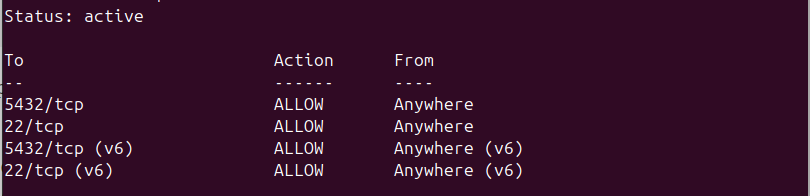
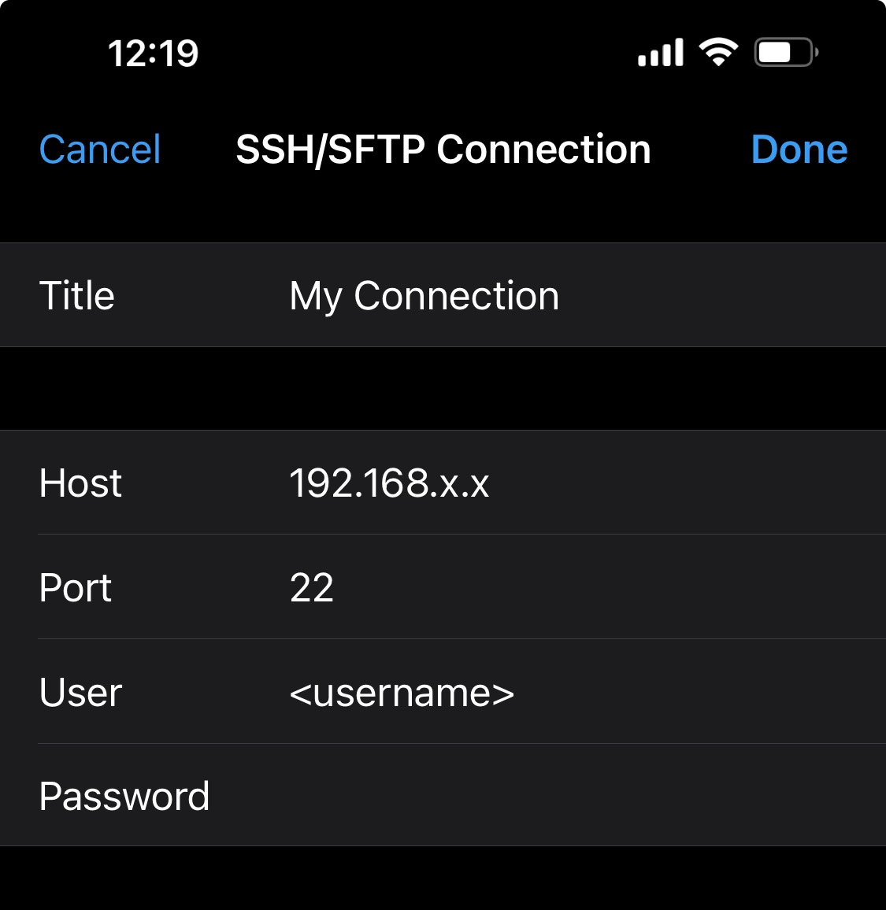
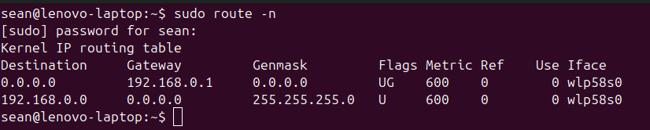

# Configure Remote SSH Connection to Server

---

Date: 2025-01-11  
OS/Distro: Ubuntu 24.04.1 LTS  
Resources Used:  
- [Quick Guide to Enabling SSH on Ubuntu](https://linuxconfig.org/quick-guide-to-enabling-ssh-on-ubuntu-24-04)  

---

## Get SSH running on your server machine for WLAN

### Install OpenSSH
1. OpenSSH is usually automatically installed on Ubuntu, but we'll go ahead with the installation commands. This will install openssh-server. You can also run `sudo apt install openssh-server`.
```bash
$ sudo apt update
$ sudo apt upgrade
$ sudo apt install ssh
```

2. Enable and start the SSH service and verify it is running.
```bash
$ sudo systemctl enable ssh
$ sudo systemctl start ssh
$ sudo systemctl status ssh
```

## Configure SSH in the firewall (UFW)
1. For this step, if you want to run your SSH through the default port 22, then enter the following commands and continue to the next section. Otherwise, skip this step and proceed to step 2.
```bash
$ sudo ufw allow ssh
$ sudo ufw enable
```
This will add an allow rule for `22/tcp` to your firewall:


2. _Explanation:_ For added security, we can change the default SSH port. Why does this improve security? Port 22 is the default SSH port on most machines; as such, there are innumerable malicious bots pinging random IP addresses at port 22 to see if they can gain access to a system via SSH. Once they do, they can install a virus, spyware, or malware, or simply steal sensitive information. By changing the default port, we can add a small measure of security against some of the more blatant attack strategies, like bots knocking on port 22.

3. To change your default port, [follow this guide](change-ssh-default-port.md).

### Attempt to connect to our machine from a client on the same network
1. Let's find the ip address of our server machine. If you have not configured a static ip address on your server, your ip will be subject to DHCP and could spontaneously change. To ensure a reliable connection, [set up a static ip](static-ip-setup.md).
```bash
$ hostname -i
```

2. If you elected not to change the default SSH port, you can SSH into your server machine in the typical way. A Linux Terminal example:
```bash
$ ssh <username>@<ip-address>
```
A Generic GUI example:
    
    

3. If you changed the default SSH port, simply indicate it in the command, or specify it in the _port_ field in your GUI.
```bash
$ ssh <username>@<ip-address> -p <port>
```

## Get SSH running on your server machine for WAN

This section has **Get SSH running on your server machine for WLAN** as a preqrequisite.

### Port Forwarding from the router
1. Some routers may not require this step, i.e. they use a VPN, which doesn't require port forwarding from the router. 
2. To set up port forwarding, find the default gateway (probably `192.168.x.x`) associated with your router. There are two methods.
	i. Find it printed on the device itself.
	ii. Open a terminal windows and run the command `route -n`. I'm using wifi, so the device name I'm looking for will be something like `wlan0` or `wlp`. If I were using ethernet, it would probably be `eth0`.
	iii. Once you've identified your router, note the ip address under `Gateway`: 
3. Open your browser and enter the IP address into the address bar.
4. The login credentials for you router will be printed on the device.
5. To set up port forwarding for SSH on my router, I navigated to _Network Setting_, then _NAT_, where I added the following entry: 

### Configure a DDNS domain
1. At this point in the setup, you can run `curl ip.me` in the terminal to find your routers public IP address and use it to remotely access your server with `ssh <username>@<public-ip-address> -p <port>`. However, this is a tenuous connection; since the IP address is subject to change under DHCP (Dynamic Host Configuration Protocol), you may spontaneously lose connection if connected this way.
2. We can configure a DDNS (Dynamic Domain Name System) domain in the router settings. For my router, I went to _Network Setting_, _DNS_, _Dynamic DNS_.
3. Setup of DDNS from here is typically straightforward. We enable it, select a service (I selected www.dynu.net), make an account and domain name, and enter all that information into the fields in Dynamic DNS of our router settings. When creating my domain, I chose to give it a long, obscure name to add just that little extra bit of security.

### (Optional) Configure RSA Key Access for SSH
1. Using a public and private key pair to authenticate SSH connection between two devices is more secure than merely using a password. It isn't absolutely necessary, but highly recommended. 
2. Follow this walkthrough, [Setting Up SSH Key Access](setup-SSH-key-access.md).

### Final Step
1. When configuring connections on your devices, create one for WLAN access that uses the static, private IP address of your server, and another for WAN access that uses the DDNS domain your chose.
2. You'll need to store the private RSA key somewhere on your client device. In my case, I use the program FE File Explorer to connect, and when configuring my connection, I simply indicated that I would _access by key_. I was then prompted to point the configuration to the private key, which I had placed in a folder named _ssh_.
3. Done!
