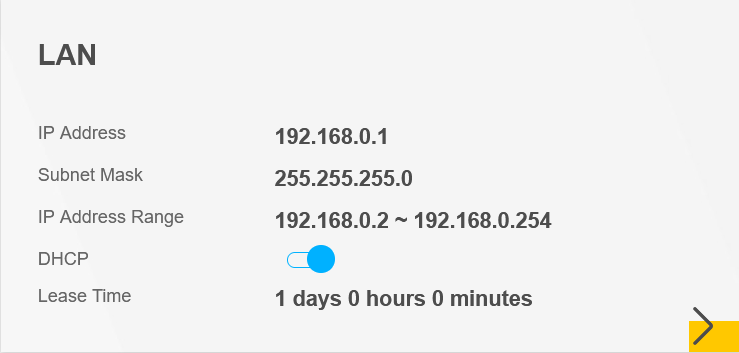

# Find Your Router IP Range

---

Date: 2025-01-09  
OS/Distro: Agnostic  

---

1. Find your router and note the _Username_, _Password_, and _Gateway_. 
   
   - If the gateway is not written on the router, open up the terminal and run the command `$ route -n` to find your routers gateway. It will probably be something like _192.168.0.1_.

2. Open a browser and enter the IP in the address bar.

3. Enter the Username and Password.

4. Every router interface will be different. Mine opens to a dashboard with a variety of useful information. My IP range was listed in the _LAN_ box on the dashboard:
   
   

5. There are several IP addresses to choose from. However, it is possible that an address you select won't work. If things aren't working, try using a different address.
