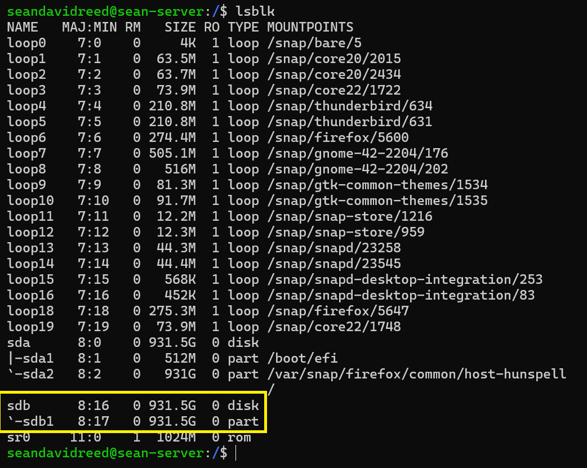

# How to Mount/Unmount an External Storage Device from the Command Line

---

Date: 2025-02-02  
OS/Distro: Ubuntu 24.04.1 LTS  
Resources Used:  
- [What is the command line equivalent of safely remove drive](https://askubuntu.com/questions/532586/what-is-the-command-line-equivalent-of-safely-remove-drive)  

---

## Mount

1. Connect the drive to your machine and open the terminal.
2. Navigate to `mnt/` and make sure there is an empty directory to act as the mount point.
	
    ```bash
	$ cd /mnt
	$ mkdir externaldrive
	```

3. Determine the name of your device with `lsblk` (if you need to know the format of your drives filesystem, you can run `lsblk -f`). In my case, these were the results:
	

4. Mount the drive to your empty directory. Note: when I first tried this step I ran `sudo mount /dev/sdb /mnt/externaldrive`, which didn't work. I had to specify the partition, not the disk.

	```bash
	$ sudo mount /dev/sdb1 /mnt/externaldrive
	```

4. Done! You can now navigate to your mount point and access your external drive.

	```bash
	$ cd /mnt/externaldrive
	$ ls
	```

## Unmount

1. Unmount the drive. This is not the same as safely removing the drive, which comes next.

	```bash
	$ sudo umount /mnt/externaldrive # OR the next command
	$ udisksctl unmount -b /dev/sdb1
	```

2. Power off the drive. This command will safely eject the drive and spin down the platters. Note: the command uses `/dev/sdb` not `/dev/sdb1` since we are powering down the whole device, not just a partition - powering down a partition doesn't make sense anyway.

	```bash
	$ udisksctl power-off -b /dev/sdb
	```

3. Done! You can now detach the usb connection.
