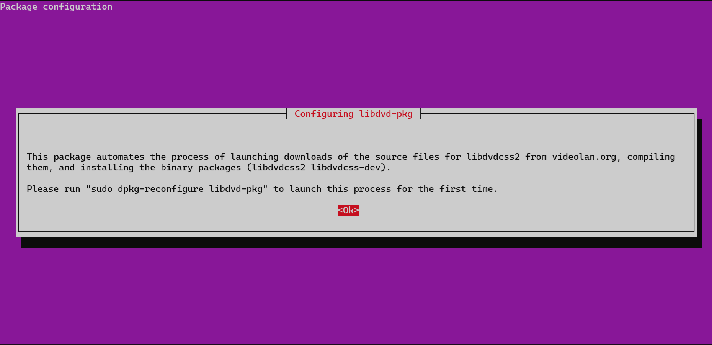

# Using Handbrake to Backup DVDs

---

Date: 2025-03-26  
OS/Distro: Ubuntu 24.04.2 LTS (Ubuntu Server)  
Resources Used:  
- [Installing Plugins Codecs libdvdcss](https://www.cyberciti.biz/faq/installing-plugins-codecs-libdvdcss-in-debian-ubuntu-linux/)  
- [handbrake: "No title found" on some DVDs](https://bbs.archlinux.org/viewtopic.php?id=33528)  

---

1. Open the terminal and run:

	```
	$ sudo apt install handbrake-cli
	$ sudo apt install libdvd-pkg
	```

2. The second command will bring up a prompt:

	
	
	- Select Ok, then No to automatic upgrades

3. Run `sudo dpkg-reconfigure libdvd-pkg`.
	- Select Ok, then No to automatic upgrades.

4. Install regionset with `sudo apt install regionset`.

5. Install libavcodec-extra with `sudo apt install libavcodec-extra`.

6. Set the region code for your device, in my case `/dev/sr0` so that it matches that of the DVD firmware. This mismatch is the reason a DVD locks up when you go to rip it - it's a part of DRM protection.

	```
	$ sudo regionset /dev/sr0
	```

	- Select [1] for North America (USA and Canada)

7. Finally we can insert the DVD and run Handbrake with:

    ```
    $ HandBrakeCLI -i /dev/sr0 -o ~/desired/path/to/your/movie.mp4
    ```

8. Done! Grab a beer or something.
 
## If you don't want to be done... 

9. Try adding custom presets for more control. i used the following command for Fiddler on the Roof, which is in Standard Definition:

    ```
    $ HandBrakeCLI /dev/sr0 -o ~/server-files/plex/Movies/fiddler_on_the_roof.mkv -e x264 -q 19.5 -B 160 --crop-mode none
    ```

## Troubleshooting

10. If you get the error, "No Titles found," run `HandBrakeCLI -i /dev/sr0 -t 0` to have a look at the titles. Chances are, the first title or two are blank. Once you find the first title that is not blank, enter that into your command like so:

    ```
    HandBrakeCLI -i /dev/sr0 -t <non-blank-title> -o ~/server-files/plex/Movies/<movie>.mkv
    ``` 
