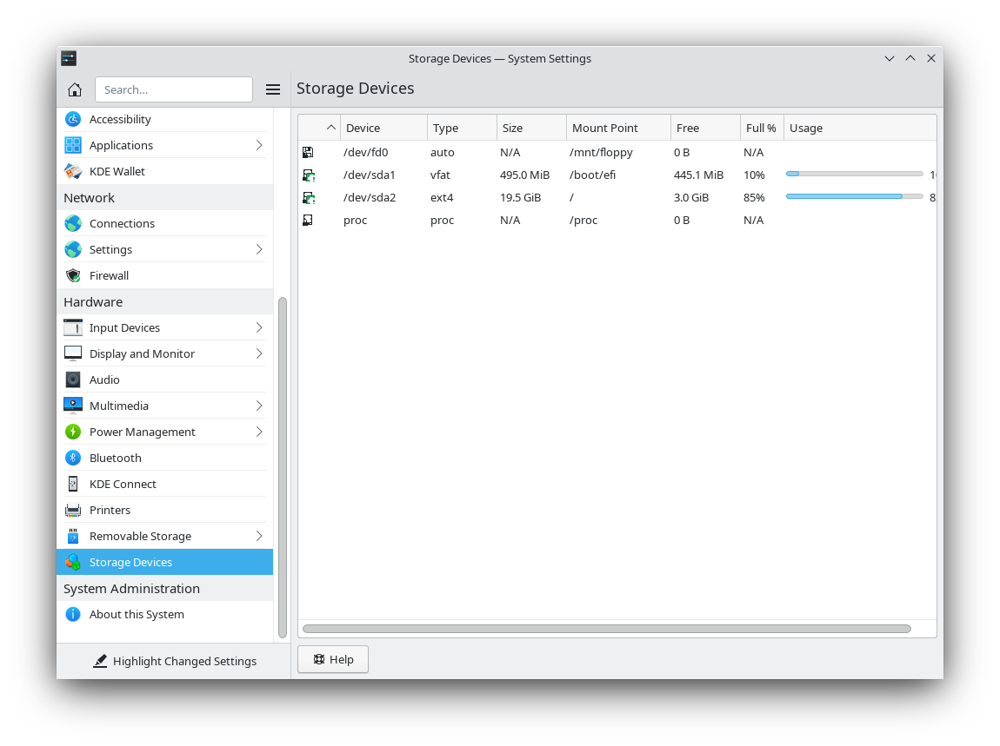

# 2025-04-18

OS/Distro: Slackware 15.0

Resources Used:  
[slackware.com](http://www.slackware.com)  
[download.liveslak.org](https://download.liveslak.org)  
[rufus.ie](https://rufus.ie/en/) 


## Testing Slackware with the Live CD

1. Navigate to [slackware.com](http://www.slackware.com) and there should be a link to Slackware Live on the index page. Currently, it is [download.liveslak.org](https://download.liveslak.org). Once there, select the United States mirror for liveslak. Currently, it is found at [us.liveslak.org](https://us.liveslak.org).
2. At the bottom of the page, select `slackware64-live-<version>.iso` to begin the download.
3. Make sure rufus is installed and ready to go. You can get it at [rufus.ie](https://rufus.ie/en/). You'll likely want the x86 version.
4. Once the iso image is downloaded, open rufus and burn it to a USB drive. 

# 2025-04-22

OS/Distro: Slackware 15.0

Resources Used:
[linuxiac.com](linuxiac.com/install-slackware-linux)  _--beware of this guide! It left out an important detail regarding the partition scheme_  
[In Pursuit of "Slack" - Slackware UEFI Plus Grub Install](https://m.youtube.com/watch?v=OZeJd5JPQro&pp=0gcJCdgAo7VqN5tD)  
[Best Practise in Partitioning Slackware](https://www.linuxquestions.org/questions/slackware-14/best-practise-in-partitioning-slackware-874007/)  
[Slackbook - Partitioning](https://www.slackbook.org/html/installation-partitioning.html)  
[Reddit - Giving sudo access to /sbin](https://www.reddit.com/r/slackware/comments/tvvzdw/comment/i3djzos/?utm_source=share&utm_medium=mweb3x&utm_name=mweb3xcss&utm_term=1&utm_content=share_button)  

## Installing Slackware Round One - Linuxiac Guide

1. **Linuxiac:** Follow steps 1 and 2 from the guide, but I used _rufus_ to burn the ISO image to my USB drive.
2. Restart Thinkpad T480 and hit _Enter_ followed by _F1_ to access the BIOS setup menu. There, disable secure boot and change startup order, putting the connected USB drive with the Slackware ISO image at the top. Exit the BIOS setup.
3. Select the top option from the following menu:
    ```
    Slackware 15.0 huge.s kernel <--
    Slackware 15.0 huge.s kernel (use KMS console)
    Detect/Boot any installed operating system
    ```
4. **Linuxiac:** Follow the rest of step 3 (3.1 - 3.3)
5. **Linuxiac:**`cfdisk` or `cgdisk` will open a disk partitioning tool. Following the guide, create a 20G Linux Filesystem and a 4G Linux Swap. I was greeted with a message after entering _setup_ saying an EFI System Partition is needed of size 100MB and type EF00. I returned to to `cfdisk`, deleted partitions and started with EFI, then added the previous ones back.
6. **Linuxiac:** Complete steps 6 and 7. I encountered an extra window `FAT or NTFS PARTITIONS DETECTED` since I'm replacing a Windows install. I selected no, making them not visible in Linux and not added to `/etc/fstab`.
7. **Linuxiac:** Complete steps 8 and 9.
8. Skip `create bootable USB stick`. Got some other prompts:
    - Recommended skip LILO install since machine has UEFI firmware.
    - Suggested to install ELILO instead, whihc is compatible with UEFI.
    - Asked to select mouse device: selected PS/2.
    - Opted to install a boot menu entry to easily select Slackware when booting.
    - Load gpm at boot time to enable mouse usage.

<u>My Thoughts</u>
This was the first time I had to create the partition scheme myself in a Linux install. I'm already beginning to see how Ubuntu has babied me in some ways!



I opened system settings and looked at `storage devices`, which showed the partitions I had created. I was struck by the fact that my 500GB disk was barely used. Allegedly, only 3 GiB were available in my whole system! The guide I followed did not specify anything beyond 4GB for swap space and 20GB for the filesystem; it did seem odd to me. I needed to allocate the remaining 480GB! I'm going to watch a video, read up on common partition schemes, and then do a fresh install.

## Installing Slackware Round Two - In Pursuit of "Slack" YouTube Video

1. Using same USB stick, boot into Slackware ISO.
2. Find disk name: `fdisk -l`. My disk is `/dev/sda 476.94 GiB`.
3. Create Partitions: `cfdisk /dev/sda`. You may need to delete partitions so that only `FREE SPACE` is left. I used this partition scheme.
    ```
    /dev/sda1   500M    EFI System          /boot
    /dev/sda2   4G      Linux Swap          swap
    /dev/sda3   25G     Linux Filesystem    /
    /dev/sda4   447.5G  Linux Filesystem    /home
    ```

    The partition scheme outlined by the video was different. I took my cue from _Gerard Lally's_ comment in [Best Practise in Partitioning Slackware](https://www.linuxquestions.org/questions/slackware-14/best-practise-in-partitioning-slackware-874007/) and [Slackbook - Partitioning](https://www.slackbook.org/html/installation-partitioning.html). Both recommended separate partitions for `/` and `/home`; the latter even suggested a separate partition for `/usr/local`, but that may be explored another day.
4. Check bad blocks: `no`; select root partition: `/dev/sda3`; format /dev/sda3: `ext4`.
5. Select other partitions for /etc/fstab; `/dev/sda4: ext4`; select mountpoint for /dev/sda4: `/home`.
6. FAT or NTFS detected: select _no_ for visible in Linux.
7. Install from USB stick; package series selection: keep defaults; select prompting mode: full. _--Wait for installation to complete_
8. Skip USB boot disk creation; skip LILO and ELILO install (important concept from YouTube video).
9. Select imps2 for mouse. _I wonder if this was the right choice_
10. Load GPM: _yes_; config network: _yes_; Domain name: _localdomain_; connect via VLAN: _no_.
11. Network Manager
12. Confirm startup services: default
    - rc.atd, rc.crond, rc.fuse, rc.messagebus, rc.syslog, rc.sshd
13. No custom fonts; hardware clock local time: _US/Pacific_; default ex/vi editor: _vim_; desktop environment: _xfce_.
14. Set root password
15. <div style="color:red">DON'T REBOOT SYSTEM!</div> We haven't installed LILO or ELILO, so there is no bootloader currently. Exit setup. Unplug USB.
16. Open shell. Again, do NOT reboot or power off!
    - `mount` to find out where the system is mounted. In my case `/mnt`.
    - `chroot /mnt /bin/bash`
    - `source /etc/profile`
    - `grub-install --target=x86_64-efi --efi-directory=/boot/efi --bootloader-id=grub`
    - `grub-mkconfig -o /boot/grub/grub.cfg`
    - `mkdir -p /boot/efi/EFI/boot`
    - `cp /boot/efi/EFI/grub/grubx64.efi /boot/efi/EFI/boot/bootx64.efi`
17. Encountered error running `shutdown -r now`: `shutdown: /dev/initctl: No such file or directory`.
    - "Solved" by forcing reboot with `reboot -f`. Not ideal solution.
18. Login with root and add new user:
    - `adduser` sean
    - User ID: leave blank and hit enter
    - Initial Group: hit enter then up arrow. Add "wheel" to group list.
    - Home directory [ /home/sean ]: hit enter
    - Shell [ /bin/bash ]: hit enter
    - Expiry Date (YYYY-MM-DD): leave blank and hit enter
19. Set up `sudo`
    - `visudo` uncomment `%wheel ALL=(ALL:ALL) ALL`
    - Exit root and login to new user
20. `startx` to start xfce display manager.
21. To change how xfce comes up, open the shell and run:
    - `su` then `vim /etc/inittab`
    - change `id:3:initdefault` to `id:4:initdefault`
22. DONE!

## Further Configuration

1. Apropos wasn't working
    - Run `sudo mandb -c` to create the manual database from scratch. This solves the problem.
2. Shutdown and reboot commands not working though they are found in system binaries `/sbin`.
    - Run with root authority `visudo` and uncomment line below `hard-coded PATH instead of the user's`.
3. Missing .ssh directory in `/home/<user>.
    - Simply create it `cd ~ & mkdir .ssh & touch .ssh/known_hosts`
4. Configure slackpkg
    - Uncomment one mirror (top one) in `/etc/slackpkg/mirrors` and run `slackpkg update`. Instructions found in slackpkg man entry.
5. Figure out package management in general (slackpkg seems underpowered)
    - See [Slackware Package Management](slackware-package-management.md).
6. Find out that **/** partition is too small. Take steps to make it larger. [Here is an account](expand-root-partition.md).
7. Installed UFW (Uncomplicated Firewall). The default firewall config tool is `iptables`.
