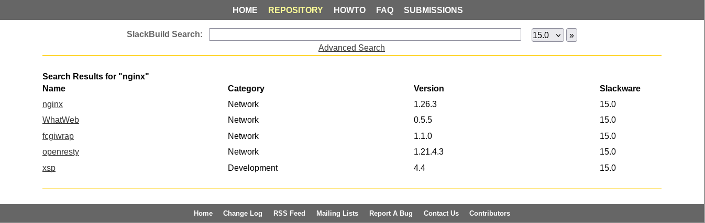

# Slackware Package Management

---

Date: 2025-04-23  
OS/Distro: Slackware 15.0  
Resources Used:  
- [slackbuilds.org - How to Install Packages](http://slackbuilds.org/howto/)  

---

## Slackware Philosophy
It's in the name: *Slack*ware. New kernel releases are often years in the making, and this is by design: stability and simplicity are fundamental to Slackware. These attributes are harder to achieve with a rolling release cycle. Having started in 1993, it's the oldest still maintained linux distribution, so they are doing something right!

The Slackware approach to package management is just as odd as the release cycle. Distributions have their dedicated package managers: Debian-based distros have _apt_, Red Hat has _yum_, and Arch has _pacman_, to name a few. 

Slackware has _slackpkg_ and _pkgtool_, but they don't resemble package managers as one knows them from other distributions. For one, _slackpkg_ only manages packages present on the machine, for instance those that came with the installation. It's good for upgrading and removing unwanted packages. 

_pkgtool_ is similar, but it offers a more GUI-like experience in the terminal. However, neither of them do what, for instance, _apt_ does. With _apt_, I can search the Linux repositories for a package that is neither installed nor on my machine, and I can download and install it right there:

```
sudo apt-cache search <package-name>
sudo apt install <package-name>
```

Further, all the necessary dependencies will be managed with those commands. Slackware has a more old school approach. You find the package you want at [slackbuilds.org](http://slackbuilds.org), download both the source file (.deb) and the tarball file (.tar.gz), untar the tarball and `mv` the source file into the resulting directory, edit the Slackbuild file (i.e. version) and make sure it's executable with `chmod`, run the SlackBuild file with `./<file>.SlackBuild`, and find the resulting output in `/tmp`, where you run `installpkg <output>`. Whew! Quite a process. What's more, you may have to do these steps again to make sure the dependencies are installed.

The reasoning goes that every install ought to be completely deliberate. An administrator should always be making a conscious choice about what goes on their machine. I have to say, I do find this philosophy compelling.

## Install Process
Everything here is outlined in [slackbuilds.org - How to Install Packages](http://slackbuilds.org/howto/), but I'll paraphrase it as well.  
1. Navigate to [slackbuilds.org](http://slackbuilds.org) and search for the package you require.
2. Select the package. For example, _nginx_.
    
3. Download both the the Source Download _nginx-1.26.3.tar.gz_ and the SlackBuild _nginx.tar.gz_.
    
4. Untar the SlackBuild directory, and a directory appears.
    ```
    tar -xvf nginx.tar.gz
    ```
5. Do an integrity check on the Source File. Then, move it into the SlackBuild directory.
    ```
    md5sum nginx-1.26.3.tar.gz
    mv nginx-1.26.3.tar.gz nginx/
    ```
6. Enter the SlackBuild directory. Edit the SlackBuild file if necessary, modifying the version number etc.
    ```
    cd nginx
    vim nginx.SlackBuild
    ```
7. Make the SlackBuild file executable.
    ```
    chmod 700 nginx.SlackBuild
    ```
8. Run the SlackBuild script _with root authority_.
    ```
    sudo -i
    ./nginx.slackbuild
    ```
9. Navigate to the resulting output file in `/tmp` and install it.
    ```
    cd /tmp
    installpkg nginx-1.26.3-x86_64-1_SBo.tgz
    ```
10. Done!

## Uninstall Process
This process is much more straightforward.  
1. In a terminal, launch pkgtool.
    ```
    sudo pkgtool
    ```
2. Navigate to remove and type the first letter of the package to get a headstart. Scroll from there.
3. When found, hit space to select it, then enter. _Note: if you cannot find the package, it is likely you did not install it with root authority `su` to begin with, which means it is not listed in `/var/packages` even though it is installed._
4. Done!
